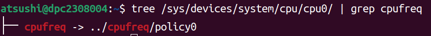

---
hide:
- navigation
- toc
---

# CPU Performance Scaling

## はじめに

本資料は、次の公式ドキュメントを要約し、補足を入れたものである：
https://www.kernel.org/doc/html/v4.12/admin-guide/pm/cpufreq.html

- Goal：awkernelにDVFSを実装するために必要十分な情報を得る
- Scope：`intel_pstate` は使用する予定が無いため、`intel_pstate` に関する情報は割愛する。

## The Concept of CPU Performance Scaling

最近のプロセッサの大半は、CPUを異なる周波数/電圧構成間で切り替えたり、異なるP-stateにしたりできるハードウェアインターフェースがある。このインタフェースは通常、CPUをどのP-stateにするかを決定するために、必要なCPU能力を推定するアルゴリズムとともに使用される。システムの利用率は一般に時間とともに変化するため、これは定期的に繰り返し実行されなければならない。これを実現する活動は、CPUパフォーマンススケーリングまたはCPU周波数スケーリングと呼ばれる。

## CPU Performance Scaling in Linux

{ width="30%" }
 (引用：[linux cpufreq framework(1)_概述](https://www.google.com/url?sa=i&url=http%3A%2F%2Fwww.wowotech.net%2Fpm_subsystem%2Fcpufreq_overview.html&psig=AOvVaw2F_88QpKQobZZbLFOliaVL&ust=1710277140631000&source=images&cd=vfe&opi=89978449&ved=0CBUQjhxqFwoTCLD65P2M7YQDFQAAAAAdAAAAABAD))

Linuxカーネルは、CPUFreq core、scaling governor、scaling driverの3層のコードで構成されるCPUFreq (CPU Frequency scaling) サブシステムによって、CPUパフォーマンスのスケーリングをサポートしている。

- **CPUFreq core**：CPUパフォーマンススケーリングをサポートする全てのプラットフォームに対して、共通のコードインフラストラクチャとユーザ空間インターフェースを提供する。CPUFreq coreは、他のコンポーネントが動作するための基本的なフレームワークを定義する。

- **scaling governor**：必要なCPU能力を見積もるアルゴリズムを実装する。原則として、各governorは1つのスケーリングアルゴリズムを実装する。

- **scaling driver**：ハードウェアと通信する。scaling driverは、利用可能なP-stateに関する情報をscaling governorに提供し、プラットフォーム固有のハードウェアインターフェースにアクセスして、scaling governorの要求に応じてCPUのP-stateを変更する。

## CPUFreq Policy Objects

P-state制御用のハードウェアインターフェースは複数のCPUで共有される可能性がある。例えば、同じレジスタが複数のCPUのP-stateを同時に制御するために使用される場合である。ハードウェアのP-state制御インターフェースを共有するCPUのセットは、 struct `cpufreq_policy` オブジェクトとして表現される。一貫性を保つため、指定されたセット内にCPUが1つしかない場合にも `cpufreq_policy` が使用される。

CPUFreq coreは、現在オフラインになっているCPUを含め、システム内の全てのCPUに対して `cpufreq_policy` オブジェクトへのポインタを保持する。複数のCPUが同じハードウェアP-state制御インタフェースを共有している場合、それらに対応する全てのポインタは同じ `cpufreq_policy` オブジェクトを指す。

CPUFreqは `cpufreq_policy` を基本データ型として使用し、ユーザ空間インターフェースの設計はポリシーの概念に基づいている。

## CPU Initialization

!!! note
    以下では、明示的に別段の記載がない限り、"CPU "は常に "論理CPU "を意味し、"プロセッサ "という単語は、複数の論理CPUを含む可能性のある物理的な部分を指すために使用される

CPUFreqが動作するためには、scaling driverが登録されていなければならない。CPUがreadyになるとscaling driverを登録するためにCPUFreq coreが呼び出される。
CPUFreq coreが呼び出されると、与えられたCPUに対してポリシーポインタがすでに設定されているかどうかをチェックし、もしそうであれば、ポリシーオブジェクトの作成をスキップする。
そうでなければ、新しいポリシーオブジェクトが作成され、初期化される。
この時、同時にsysfsに新しいポリシーディレクトリが作成される。
与えられたCPUに対応するポリシーポインタは、メモリ内の新しいポリシーオブジェクトのアドレスに設定される。

次に、scaling driverの `init()` コールバックが、引数として渡された新しいCPUのポリシーポインタとともに呼び出される。このコールバックは、指定されたCPUのパフォーマンススケーリングハードウェアインターフェイスを初期化し、呼び出されたポリシーオブジェクトが新しい場合、ハードウェアによってサポートされる最小および最大周波数、利用可能な周波数のテーブル、および同じポリシーに属すCPUのマスクなどのパラメータが設定される。

その後、ポリシーオブジェクトのポインタがgovernorの `init()` コールバックに渡され、与えられたポリシーを処理するために必要な全てのデータ構造が初期化される。governorは `start()` コールバックを呼び出すことで開始される。`start()` コールバックは与えられたポリシーに属す全てのオンラインCPUのCPU毎の利用率更新コールバックをCPUスケジューラに登録する。

利用率更新コールバックは、タスクのenqueue/dequeueのような重要なイベント時や、scheduler tickの各反復時、CPUの使用状況が変わる可能性がある時などに、スケジューラによって呼び出される。
利用率更新コールバックは、ポリシーに基づいてP-stateを決定するために必要な計算を行い、ハードウェアに変更を加えるようscaling driverを呼び出す。

<!-- 同様の手順が、新しいポリシーオブジェクトではなく、以前に「非アクティブ」であったポリシーオブジェクト、つまり、それらに属す全ての CPU がオフラインであったポリシーオブジェクトに対しても取られる。この場合の唯一の実際的な違いは、CPUFreq coreがデフォルトのgovernorではなく、「非アクティブ」になった (そして現在再初期化されている)ポリシーで以前使用されていたscaling governorを使用しようとすることである。

一方、以前オフラインだった CPU をオンラインに戻すが、その CPU とポリシーオブジェクトを共有する他の CPU がすでにオンラインになっている場合、ポリシーオブジェクトを再初期化する必要はまったくない。その場合、scaling governorを再起動して、新しいオンライン CPU を考慮できるようにするだけでよい。これは、governorの->stop と->start() コールバックを、ポリシー全体に対してこの順序で呼び出すことによって達成される。

CPUの初期化中に作成されたポリシーオブジェクトと、それに関連するその他のデータ構造は、scaling driverが登録解除されたとき (例えば、それを含むカーネルモジュールがアンロードされたときに起こる)、または与えられたポリシーに属す最後のCPUが登録解除されたときに破棄される。 -->

## Policy Interface in sysfs

{width="30%"} {width="50%"}

カーネルの初期化中に、CPUFreq coreは `sys/devices/system/cpu/` の下に `cpufreq` ディレクトリを作成する。そのディレクトリには、CPUFreqコアによって管理されている各ポリシーオブジェクトに対する `policyX` サブディレクトリが含まれている。各 `policyX` ディレクトリは、 `/sys/devices/system/cpu/cpuY/` 内のポリシーに紐づくCPUからcpufreqシンボリックリンクによって指されている。

各 `policyX` ディレクトリは、それぞれ対応するポリシーオブジェクトのCPUFreq動作を制御するためのポリシースペシフィックな属性 (ファイル) を含んでいる。
以下の表はそれらの属性の概要を説明したものである：

|          Attributes           | Descriptions                                                                                                                                       |
| :---------------------------: | :------------------------------------------------------------------------------------------------------------------------------------------------- |
|        `affected_cpus`        | このポリシーに属すオンラインCPUのリスト                                                                                                          |
|         `bios_limit`          | BIOSがOSにCPU周波数に上限を適用するように指示した場合、その上限が格納される                                                                        |
|      `cpuinfo_max_freq`       | このポリシーに属すCPUの最大動作周波数 [$\mathrm{kHz}$]                                                                                             |
|      `cpuinfo_min_freq`       | このポリシーに属すCPUの最小動作周波数 [$\mathrm{kHz}$]                                                                                             |
| `cpuinfo_transition_latency`  | このポリシーに属すCPUをあるP-stateから別のP-stateに切り替えるのにかかる時間 [ns]                                                                   |
|        `related_cpus`         | このポリシーに属す全ての(オンライン&オフライン)CPUのリスト                                                                                       |
| `scaling_available_governors` | このポリシーにアタッチできるCPUFreq scaling governorのリスト                                                                                       |
|      `scaling_cur_freq`       | このポリシーに属す全てのCPUの現在の周波数 [$\mathrm{kHz}$]                                                                                         |
|       `scaling_driver`        | 現在使用中のscaling driver                                                                                                                         |
|      `scaling_governor`       | このポリシーに現在アタッチされているscaling governor。書き込み可能で、書き込むと、このポリシーに新しいscaling governorがアタッチされる             |
|      `scaling_max_freq`       | このポリシーに属すCPUの最大動作周波数 [$\mathrm{kHz}$]。書き込み可能で、書き込むと、新しい上限が設定される                                         |
|      `scaling_min_freq`       | このポリシーに属すCPUの最小動作周波数 [$\mathrm{kHz}$]。書き込み可能で、書き込むと、新しい下限が設定される                                         |
|      `scaling_setspeed`       | この属性は、`userspace` scaling governorがこのポリシーにアタッチされている場合にのみ機能する。書き込み可能で、書き込むと、新しい周波数が設定される |

## Generic Scaling Governors

CPUFreqは、全てのscaling driverで使用できる汎用scaling governorを提供する。scaling governorはポリシーオブジェクトにアタッチされ、異なるポリシーオブジェクトを異なるscaling governorで同時に処理できる。ポリシーオブジェクトのscaling governorは、sysfs の `scaling_governor` 属性によっていつでも変更できる。

governorによっては、実装されているスケーリングアルゴリズムを制御したり、微調整したりするために sysfs 属性を公開しているものがある。governorチューナブルと呼ばれるこれらの属性は、使用するscaling driverによって、グローバルまたはポリシーごとに設定できる。ドライバがgovernorチューナブルをポリシー単位で必要とする場合、governorチューナブルは各ポリシーディレクトリのサブディレクトリに配置される。そうでない場合は、`/sys/devices/system/cpu/cpufreq/` 以下のサブディレクトリに配置される。いずれの場合も、governorチューナブルを含むサブディレクトリの名前は、それらを提供するgovernorの名前である。
以下では各汎用scaling governorの詳細を説明する。

### performance

ポリシーオブジェクトにアタッチされると、このgovernorは、そのポリシーの `scaling_max_freq` 属性の制限内で、最も高い周波数を要求する。
このリクエストは、 `scaling_max_freq` または `scaling_min_freq` ポリシーのリミットが変更される度に行われる。

### powersave

ポリシーオブジェクトにアタッチされると、このgovernorは、そのポリシーに対して、 `scaling_min_freq` ポリシー制限内の最低周波数を要求する。
このリクエストは、 `scaling_max_freq` または `scaling_min_freq` ポリシーのリミットが変更される度に行われる。

### userspace

このgovernorはそれ自身では何もしない。その代わり、ユーザがポリシーの `scaling_setspeed` 属性に書き込むことで、アタッチされているポリシーの CPU 周波数を設定できるようにする。

### schedutil

このgovernorは、CPUスケジューラから利用可能なCPU利用率データを使用する。一般にCPUスケジューラの一部とみなされるため、スケジューラの内部データ構造に直接アクセスできる。

これは完全にスケジューラコンテキストで実行されるが、場合によっては、与えられたポリシーに対してCPU周波数を変更すべきだと判断したときに、scaling driverを非同期で呼び出す必要がある可能性がある (これは、ドライバがスケジューラコンテキストからCPU周波数を変更できるかどうかに依存する)。

特定のCPUに対するこのgovernorの動作は、そのCPUの利用率更新コールバックを呼び出すスケジューリングクラスに依存する。RT スケジューリングクラスまたはデッドラインスケジューリングクラスから呼び出された場合、governorは、許容される最大値 (つまり、scaling_max_freq ポリシーの制限値)まで頻度を増やする。一方、CFSスケジューリングクラスによって呼び出された場合、governorはCPU利用率の推定値として、指定されたCPUのルート制御グループのPELT (Per-Entity Load Tracking)メトリックを使用する (PELTメカニズムについては、Per-Entity Load Tracking LWN.netの論文を参照してください)。次に、適用する新しいCPU周波数が、以下の式に従って計算される。

\[
\mathrm{f}=1.25^{*} \mathrm{f}_{2}{ }^{*}{ }^{*} \text { util } / \max
\]

ここで、utilはPELT数、 $\max$ はutilの理論上の最大値、 $f_{-} \theta$ は与えられたポリシーで可能なCPU周波数の最大値 (PELT数が周波数不変の場合)、または現在のCPU周波数 (そうでない場合)のいずれかである。

このgovernorはまた、「IO-wait boosting」と呼ばれる、直近でI/O待ちをしていたタスクのCPU周波数を一時的に引き上げるメカニズムも採用している。これは、SCHED_CPUFREQ_IOWAITフラグがスケジューラからgovernorコールバックに渡されたときに発生するもので、このフラグによって、頻度がすぐに許容最大値まで上がり、その後、時間の経過とともに上記の式で返される値に引き戻される。

このgovernorは、1つのチューナブルだけを公開する：

## rate_limit_us

governor計算の2つの連続した実行の間に経過しなければならない最小時間 (マイクロ秒単位) (デフォルト：scaling driverの遷移レイテンシの1000倍)。

このスケジューラビリティの目的は、それがないと過大になる可能性のあるgovernorのスケジューラコンテキストオーバーヘッドを減らすことである。

このgovernorは、一般に、旧来のオンデマンドgovernorやコンサバティブgovernor (後述)に取って代わると考えられている。なぜなら、このgovernorは、よりシンプルでCPUスケジューラと緊密に統合されており、CPUコンテキストスイッチなどのオーバーヘッドが少なく、スケジューラ独自のCPU利用率メトリックを使用するため、原則的に、このgovernorの決定が、スケジューラの他の部分の決定と矛盾することはないからである。

このgovernorは、CPU周波数の選択指標としてCPU負荷を使用する。

現在の CPU 負荷を推定するために、ワーカールーチンを連続して呼び出す間の経過時間を測定し、その時間のうち、与えられた CPU がアイドル状態でなかった時間の割合を計算する。全 CPU 時間に対する非アイドル (アクティブ)時間の比率が、負荷の推定値として取られる。

このgovernorが複数のCPUで共有されるポリシーにアタッチされている場合、全てのCPUの負荷が推定され、最大の結果がポリシー全体の負荷推定値となる。

このgovernorのワーカールーチンはプロセスコンテキストで実行されなければならないので、 (ワークキューを介して)非同期に呼び出され、必要に応じてそこからCPUのP-stateが更新される。その結果、このgovernorによるスケジューラコンテキストのオーバヘッドは最小になるが、CPUコンテキストの切り替えが比較的頻繁に発生し、CPU P-stateの更新が比較的不規則になる。また、CPUアイドル時間を短縮するコードを実行することで、自身のCPU負荷メトリックに影響を与える (CPUアイドル時間はそれによってごくわずかにしか短縮されないが)。

cpuinfo_max_freq ポリシー属性の値は負荷 1 (または 100%) に対応し、 cpuinfo_min_freq ポリシー属性の値は負荷 0 に対応する。ただし、負荷が (設定可能な) スピードアップ閾値を超える場合は例外で、使用することが許可されている最高周波数 (scaling_max_freq ポリシー制限) をそのまま使用する。

このgovernorは以下のチューナブルを公開する：

## sampling_rate

これは、governorワーカールーチンの実行頻度をマイクロ秒単位で示したものである。

通常、10000 (10 ms) のオーダーの値に設定される。デフォルト値は、このgovernorがアタッチされている各ポリシーの cpuinfo_transition_latency の値に等しくなる (ただし、ここでの単位は1000倍であるため、デフォルトでは sampling_rate で表される時間は遷移レイテンシの1000倍であることを意味する)。

このチューナブルがポリシーごとに設定されている場合、次のシェルコマンドはこのチューナブルが表す時間をトランジションレイテンシの750倍に設定する：

sampling_rate の最小値。

CONFIG_NO_HZ_COMMONとtick_nohz_activeの両方が設定されている場合は10000 (10ms)、そうでない場合はマイクロ秒単位のjiffiesの値の20倍。

## up_threshold

CPU負荷がこの値(パーセント)を上回ると、governorは周波数をポリシーで許可された最大値に設定する。そうでなければ、選択された周波数は推定CPU負荷に比例する。

1 (デフォルト0)に設定すると、CPU負荷推定コードは、「nice」レベルが0より大きいタスクの実行に費やされたCPU時間をCPUアイドル時間として扱うようになる。

これは、CPUの動作周波数を決定する際に考慮すべきでないタスクがシステム内にある場合に有用である。その場合は、それらのタスクの "nice "レベルを0より上げて、この属性を1に設定すればよい。

## sampling_down_factor

CPU負荷がup_thresholdを超えた場合にsampling_rate値に適用する、1 (デフォルト)から100までの一時的な乗数。

これにより、governorワーカールーチンの次の実行 (周波数を許容最大値に設定した後)が遅れ、周波数が最大レベルにとどまる時間が長くなる。

一部のバースト的なワークロードにおける周波数変動は、CPUの最大能力を維持するために費やされる追加エネルギーと引き換えに、この方法で回避できる可能性がある。

## powersave_bias

AMD 周波数感度パワーセーブバイアスドライバ (drivers/cpufreq/amd_freq_sensitivity.c)の、governor本来の周波数ターゲット (CPU負荷の見積もりによってup_threshold値を超えた場合に使用される最大値を含む)または感度閾値に適用する削減係数。

AMD周波数感度パワーセーブバイアスドライバがロードされていない場合、適用する実効周波数は次式で与えられる。

\[
f^{*}(1-\text { powersave_bias / 1000) }
\]

ここで、 $f$ はgovernorオリジナルの周波数ターゲットである。この属性のデフォルト値は0である。

AMD周波数感度パワーセーブバイアスドライバがロードされている場合、この属性の値はデフォルトで400であり、異なる方法で使用される。

ファミリ 16h (およびそれ以降)の AMD プロセッサには、0 から $100 \%$ までのワークロード感度をハードウェアから取得するメカニズムがある。この値は、CPU上で実行されるワークロードの性能が周波数の変化に応じてどのように変化するかを推定するために使用できる。

 $\mathrm{O}$  ( メモリバインドまたは IO バインド)の感度を持つワークロードの性能は、CPU 周波数を増加させた結果、まったく増加しないことが予想される一方、 $100 \%$  (CPU バインド)の感度を持つワークロードは、CPU 周波数を増加させた場合、性能が大幅に向上することが予想される。

ワークロードの感度がpowersave bias値で表される閾値よりも低い場合、感度のpowersave biasドライバは、より高いCPU周波数で実行してもメリットのないワークロードの過剰なプロビジョニングを回避するように、governorに本来のターゲットよりも低い周波数を選択させる。

このgovernorは、CPU周波数の選択指標としてCPU負荷を使用する。

これは、前述のオンデマンドgovernorと同じ方法でCPU負荷を推定するが、それによって実装されるCPU周波数選択アルゴリズムは異なる。

すなわち、電源容量が限られたシステム (バッテリー駆動など)には適さない可能性のある、短い時間間隔での周波数の大幅な変更を回避する。そのために、 (設定可能な)閾値を推定CPU負荷が超えたかどうかに応じて、周波数を比較的小さなステップで、一度に1ステップずつ、上下させる。

このgovernorは以下のチューナブルを公開する：

## freq_step

周波数ステップgovernorが設定できる最大周波数 (scaling_max_freq ポリシーリミット)のパーセンテージで、0 から 100 の間 (デフォルトでは 5)。

これは、周波数が一度にどの程度変化することを許容するかを示す。0に設定すると、デフォルトの周波数ステップ (5パーセント)が使用され、100に設定すると、governorはscaling_min_freqとscaling_max_freqポリシーの制限の間で周期的に周波数を切り替えます。

## down_threshold

周波数変更の方向を決定するために使用される閾値 (単位：パーセント、デフォルトでは20)。

推定CPU負荷がこの値より大きければ、周波数は (freq_stepだけ)上がる。負荷がこの値より小さい場合 (sampling_down_factorメカニズムが有効でない場合)、周波数は下がる。それ以外の場合、周波数は変更されない。

## sampling_down_factor

頻度減少レイテンシ係数。1 (デフォルト)～10 (10を含む)。

これは事実上、周波数がサンプリング_down_factor倍遅くなることを意味する。

## Frequency Boost Support

## Background

プロセッサの中には、チップ全体が十分に利用されておらず、意図した熱や電力のバジェットを下回っている場合など、特定の条件下で、マルチ coreパッケージ内の一部の coreの動作周波数を一時的に (パッケージ全体の持続可能な周波数の閾値を超えて)引き上げるメカニズムをサポートしているものがある。

この機能については、ベンダーによって異なる名称が使われている。インテルプロセッサでは「ターボブースト」、AMDでは「ターボ core」または (技術文書では)「 coreパフォーマンスブースト」などと呼ばれている。また、原則として、ベンダーによっても実装方法が異なる。ここでは簡潔にするため、「周波数ブースト」という単純な用語を使用し、これら全ての実装を指す。

周波数ブーストメカニズムには、ハードウェアベースとソフトウェアベースがある。ハードウェアベース (x86など)の場合、ブーストをトリガするかどうかの判断はハードウェアが行う (ただし一般的には、ハードウェアがCPU周波数を一定の範囲内で制御できる特別な状態にする必要がある)。ソフトウェアベース (ARMなど)の場合は、scaling driverがブースティングをトリガするかどうか、またそのタイミングを決定する。

## The boost File in sysfs

このファイルは/sys/devices/system/cpu/cpufreq/の下にあり、システム全体の「ブースト」設定を制御する。基礎となるscaling driverが周波数ブーストメカニズムをサポートしていない (またはサポートしているが、intel_pstateのような、周波数ブーストを制御するためのドライバ固有のインターフェースを提供している)場合は、このファイルは存在しない。

このファイルの値が 1 の場合、周波数ブーストメカニズムが有効になる。これは、ハードウェアがブーストをトリガできる状態 (ハードウェアベースの場合) になるか、ソフトウェアがブーストをトリガできる状態 (ソフトウェアベースの場合) になることを意味する。これは、システム内のCPUで現時点でブーストが実際に使用されていることを意味するものではない。あくまでも、周波数ブーストメカニズムの使用許可を意味する (他の理由で使用されることはない可能性がある)。

このファイルの値が0の場合、周波数ブーストメカニズムは無効となり、まったく使用できない。

このファイルに書き込める値は0と1だけである。

## Rationale for Boost Control Knob

周波数ブーストメカニズムは一般的に、ソフトウェア解像度以下 (例えばスケジューラのティック間隔以下)の時間スケールで最適なCPU性能を達成するのを助けることを意図しており、多くのワークロードに適していることが実証されているが、特定の状況では問題につながる可能性がある。

このため、多くのシステムではプラットフォームファームウェア (BIOS)のセットアップで周波数ブーストメカニズムを無効にすることが可能だが、この場合、設定を希望通りに調整するためにシステムを再起動する必要があり、少なくとも場合によっては実用的ではない。例えば

1.ブーストとは、制御された条件下ではあるが、プロセッサのオーバークロックを意味する。一般的に、プロセッサの周波数と電圧を一時的にでも上げると、プロセッサのエネルギー消費量が増加する。バッテリーのような容量が限られた電源に切り替えるシステムでは好ましくないため、システム稼働中にブーストメカニズムを無効にする機能が役立つ (ただし、これもワークロードに依存する)。

2.状況によっては、パフォーマンスやエネルギー消費量 (あるいはその両方)よりも、決定論的な動作の方が重要であり、システム稼働中にブーストを無効化する機能が有用な場合もある。

3.周波数ブーストメカニズム自体の影響を調べるには、ブーストの有無にかかわらず、できればその間にシステムを再起動することなくテストを実行できることが有効である。

4.ベンチマークの実行において、再現性のある結果は重要である。ブースト機能はパッケージ全体の負荷に依存するため、シングルスレッドの性能はそれによって変化し、再現性のない結果になることがある。この問題は、この問題に敏感なベンチマークを実行する前に、周波数ブーストメカニズムを無効にすることで回避できる。

## Legacy AMD cpb Knob

AMD powernow-k8scaling driverは、グローバルブーストとよく似たsysfsノブをサポートしている。これは、一部のAMDプロセッサの「 coreパフォーマンスブースト」機能を無効化/有効化するために使用される。

もし存在すれば、そのノブはsysfsの各CPUFreqポリシーディレクトリ (/sys/devices/system/cpu/cpufreq/policyx/)にあり、cpbと呼ばれ、より細かいコントロールインターフェースを示す。しかし、実際の実装はシステム全体で動作し、1つのポリシーにこのノブを設定すると、他の全てのポリシーにも同時に同じ値が設定される。

このノブは、基本的なハードウェア機能をサポートするAMDプロセッサではまだサポートされているが、 (CONFIG_X86_ACPI_CPUFREQ_CPB設定オプションによって)カーネルの外で設定することができ、グローバルブーストノブは関係なく存在する。そのため、 $\mathrm{cpb}$ ノブの代わりにブーストノブを使用することは常に可能であり、その方が他の全てのシステムとの整合性が高いため、強く推奨される ( $\mathrm{cpb}$ ノブは将来的にサポートされなくなる可能性がある)。

 $\mathrm{cpb}$ ノブは、CONFIG_X86_ACPI_CPUFREQ_CPBコンフィギュレーションオプションが設定されていても、基本的なハードウェア機能を持たないプロセッサ (例えば、全てのインテル製プロセッサ)には存在しない。
