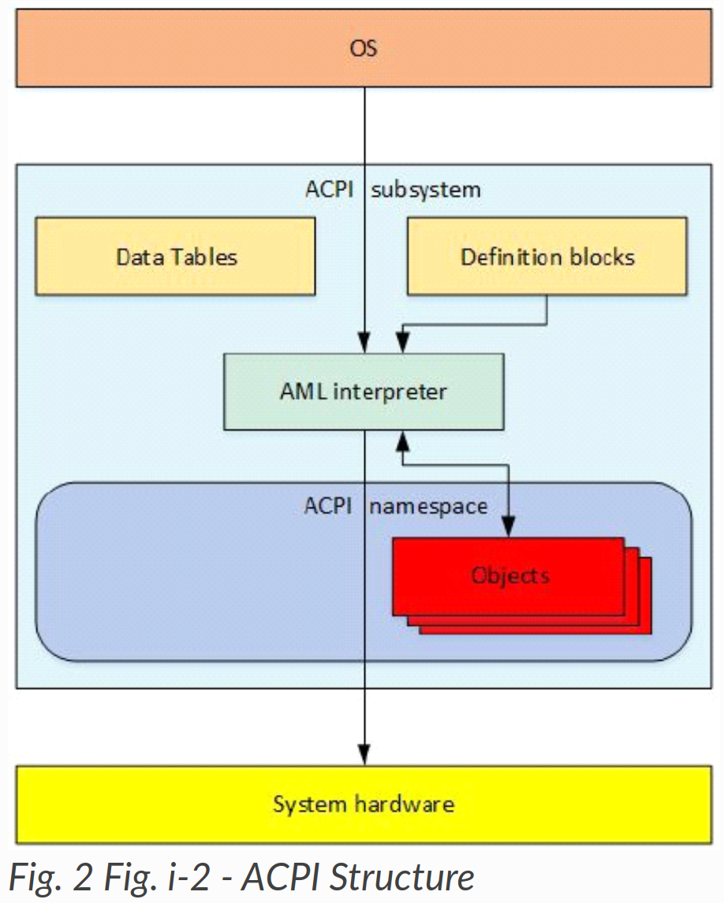
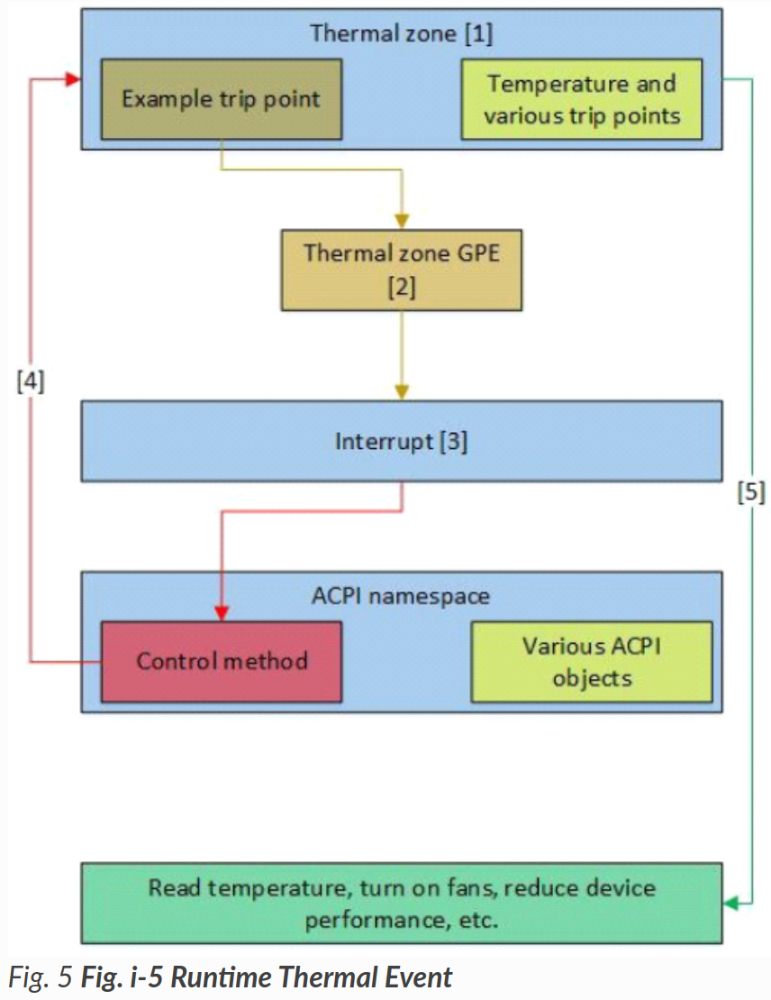

---
hide:
- navigation
- toc
---

# Overview

以下は、Advanced Configuration and Power Interface (ACPI)のハイレベルな概要である。ACPI を理解しやすくするために、このセクションは ACPI に関する大まかで一般的な記述に重点を置き、ACPI に関する全ての可能な例外や詳細については説明しない。

## History of ACPI

ACPIは、1990年代半ばにインテル、マイクロソフト*、東芝*、HP*、フェニックス*の協力によって開発された。ACPIが開発される以前は、オペレーティングシステム (OS)は主にBIOS (Basic Input/Output System)インターフェイスを電源管理およびデバイスの検出と設定に使用していた。この電源管理アプローチは、OSがシステムBIOSをネイティブに呼び出して電源管理を行う機能を利用していた。BIOSはまた、システムデバイスを発見し、入出力 (I/O)のプローブに基づいてドライバをロードし、正しいドライバを正しいデバイスに一致させようとする (プラグアンドプレイ)ためにも使われた。また、プラットフォーム自体が非列挙型であるため、BIOS内でデバイスの位置をハードコーディングしてもいた。これらの解決策には、3つの重要な点で問題があった。

- 第一に、OSアプリケーションの動作がBIOSで設定された電源管理設定によって悪影響を受け、プレゼンテーション中やその他の不都合な時間にシステムがスリープしてしまう可能性があった。
- 第二に、電源管理インターフェイスがシステムごとに独自仕様であった。そのため、開発者は個々のシステムごとに電源管理の設定方法を学ぶ必要があった。
- 最後に、さまざまなデバイスのデフォルト設定が互いに衝突し、デバイスがクラッシュしたり、挙動がおかしくなったり、発見できなくなったりすることもあった。

ACPIは、こうした問題やその他の問題を解決するために開発された。

## What is ACPI?

ACPIはまず、ホストOS内のサブシステムを形成する、アーキテクチャに依存しない電源管理および設定フレームワークとして理解できる。このフレームワークは、電源状態 (スリープ、ハイバネート、ウェイクなど)を定義するためのハードウェアレジスタセットを確立する。ハードウェアレジスタセットは、専用ハードウェアおよび汎用ハードウェアの操作に対応できる。

標準ACPIフレームワークとハードウェアレジスタセットの主な意図は、OSから直接ファームウェアをネイティブに呼び出すことなく、電源管理とシステム設定を可能にすることである。ACPI は、オペレーティングシステムとハードウェアシステムの間のインターフェイス層として機能する。

{width="30%"} {width="30%"}

ACPI は、ACPI サブシステムを介してシステムファームウェアと OS 間で共有される 2 種類のデータ構造を定義している：

- Data tables
- Definition blocks

これらのデータ構造は、ファームウェアと OS 間の主要な通信メカニズムである。Data tablesは生データを格納し、デバイスドライバによって消費される。Definition blocksは、インタプリタが実行可能なバイトコードで構成される。

初期化時に、AML インタプリタはDefinition blocks内のバイトコードを列挙可能オブジェクトとして抽出する。この列挙可能なオブジェクトの集合は、ACPI namespaceと呼ばれる OS の構成要素を形成する。ACPI namespace内のオブジェクトは、直接定義された値を持つか、AML インタプリタによって評価される。AMLインタプリタは、OSの指示によりオブジェクトを評価し、システムハードウェアとインターフェイスして必要な処理を実行する。

Definition blocksのバイトコードは、ACPI Source Language (ASL)コードからコンパイルされる。ASL は、ACPI オブジェクトの定義と制御メソッドの記述に使用される言語である。ASLコンパイラは、ASLをACPI  Machine Language (AML)バイトコードに変換する。AML は、図 i-3 に示すように、AML インタプリタによって処理される言語である。

AML インタプリタはバイトコードを実行し、Definition blocks内のオブジェクトを評価することで、バイトコードにループ構成、条件評価、定義されたアドレス空間へのアクセス、およびアプリケーションが必要とするその他の操作を実行させる。AMLインタプリタは、システムメモリ、I/O、PCIコンフィギュレーションなど、定義されたアドレス空間への読み取り/書き込みアクセスが可能である。オブジェクトと呼ばれるエントリーポイントを定義することで、これらのアドレス空間にアクセスする。オブジェクトは直接定義された値を持つか、AML インタプリタによって評価され解釈される必要がある。

この列挙可能なオブジェクトの集まりが、ACPI namespaceと呼ばれるOSの構成要素である。namespaceは、システム上の ACPI デバイスを階層的に表現したものである。システムバスは、これらのACPIデバイスの列挙のルートである。PCIやUSBデバイスのように、他のバスで列挙可能なデバイスは通常、namespaceには列挙されない。代わりに、それぞれのバスがデバイスを列挙し、ドライバをロードする。

しかし、全ての列挙可能なバスは、ACPIが通常これらのデバイスのドライバをロードしないにもかかわらず、ACPIがデバイスのバス固有アドレスをエンコードできるようにするエンコード技術を持っている。

一般に、_HIDオブジェクト (ハードウェア識別オブジェクト)を持つデバイスは列挙され、そのドライバはACPIによってロードされる。ADRオブジェクト (物理アドレスオブジェクト)を持つデバイスは通常、ACPIによって列挙されず、一般にACPIによってドライバがロードされることはない。_ADRデバイスは通常、ACPIを介さずに必要な全ての機能を実行できるが、デバイスドライバが機能を実行できない場合、またはドライバがシステムファームウェアと通信する必要がある場合、ACPIは必要な機能を実行するためにオブジェクトを評価できる。

この例として、 $\mathrm{PCl}$ はネイティブホットプラグをサポートしていない。しかし、 $\mathrm{PCI}$ はACPIを使用してオブジェクトを評価し、ACPIが $\mathrm{PCl}$ でホットプラグを実行するために必要な機能を補うメソッドを定義できる。

ACPIの付加的な側面として、システム動作中に発生するACPI割り込みイベントを処理するランタイムモデルがある。ACPI は、これらのイベントを処理するために、必要に応じてオブジェクトを評価し続けます。この割り込みベースのランタイムモデルについては、後述のランタイムモデルのセクションで詳しく説明する。

## ACPI Initialization

ACPIがどのように機能するかを理解する最良の方法は、時系列で説明することである。ユーザがシステムの電源を入れた瞬間、システムファームウェアはセットアップ、初期化、セルフテストを完了する。

その後、システムファームウェアは、ブートストラップローダーに制御を渡す前に、ファームウェアの初期化中に得られた情報を使用して、さまざまなプラットフォーム構成と電源インターフェースデータで、必要に応じてACPIテーブルを更新する。拡張ルートシステム記述テーブル (XSDT)は、ACPIサブシステムによって使用される最初のテーブルであり、システム上の他のほとんどのACPIテーブルのアドレスを含んでいる。XSDTは、固定ACPI記述テーブル (FADT)や、OSが初期化中に処理する他の主要なテーブルを指す。FADTは、OSが初期化した後、ACPIサブシステムにDSDT (Differentiated System Description Table)を指示す。DSDTはDefinition blocksを含む最初のテーブルであるため、namespaceの始まりとなる。

次にACPIサブシステムはDSDTを処理し、ACPIDefinition blocksからnamespaceの構築を開始する。XSDTはまた、セカンダリシステム記述テーブル (SSDT)を指し示し、それらをnamespaceに追加する。ACPIData tablesは、OSにシステムハードウェアに関する生データを与える。

OSはACPIテーブルからnamespaceを構築した後、namespaceのトラバースを開始し、namespace内で出会った全ての_HIDデバイスのデバイスドライバをロードする。図i-4を参照のこと。

{width="30%"}

上のACPI初期化図では、システムファームウェアは、ブートストラップローダーに制御を渡す前に、実行時にのみ利用可能な情報を使って、必要に応じてACPIテーブルを更新する。XSDTは、OSのACPIサブシステムによって使用される最初のテーブルであり、システム上の他のほとんどのACPIテーブルのアドレスを含んでいる。XSDTは、FADT、SSDT、およびその他の主要なACPIテーブルを指す。FADTはACPIサブシステムにDSDTを指示し、DSDTはDefinition blocksを含む最初のテーブルであるため、namespaceの始まりとなる。その後、ACPIサブシステムはDSDTを消費し、Definition blocksからACPInamespaceの構築を開始する。また、XSDTはSSDTを指し、それらをnamespaceに追加する。

## Runtime Model

システム起動後、ACPI は OS と連携し、割り込みによって発生する ACPI イベントを処理する。この割り込みは、固定イベントと汎用イベント (GPE)の2つの一般的な方法のいずれかでACPIイベントを呼び出す。

固定イベントは、ACPI仕様であらかじめ定義された意味を持つACPIイベントである。これらの固定イベントには、電源ボタンの押下やACPIタイマのオーバーフローなどのアクションが含まれる。これらのイベントはOSハンドラによって直接処理される。

GPE は、ACPI 仕様で事前に定義されていない ACPI イベントである。これらのイベントは通常、namespace内のオブジェクトであり、システムハードウェアにアクセスできる制御メソッドを評価することで処理される。ACPI サブシステムが制御メソッド
メソッドを AML インタプリタに渡すと、GPE オブジェクトは OS の実装に従ってイベントを処理する。一般的には、デバイスに通知を発行してデバイスドライバを起動させ、機能を実行させることがある。

このランタイムモデルの一般的な例については、次のセクションで説明する。

## Thermal Event Example

ACPI には、システムが能動的に (ファンをオンにするなどのアクションを実行することによって)、または受動的に (プロセッサのスロットルなどのアクションを実行することによって)システムの使用電力量を削減することによって、システム温度を制御できるようにするための熱モデルが含まれている。図 i-5 に示す一般的な熱イベントの例を使用して、ACPI ランタイムモデルがどのように動作するかを示すことができる。

{width="30%"}

ACPIサーマルゾーンには、現在のシステム温度とトリップポイントを読み取る制御方法が含まれている。

OSは最初にnamespaceでサーマルゾーンを見つけると、サーマルゾーンドライバをロードし、サーマルゾーンを評価して現在の温度とトリップポイントを取得する。

システムコンポーネントがトリップポイントをトリガするほど加熱すると、サーマルゾーンGPEが発生する。

GPE は割り込みを発生させる。ACPI サブシステムは割り込みを受信すると、まず固定イベントが発生したかどうかをチェックする。この例では、サーマルゾーンイベントが GPE であるため、固定イベントは発生していない。

ACPI サブシステムは次に、割り込みの GPE 番号に一致する制御メソッドをnamespaceで検索する。それが見つかると、ACPIサブシステムは制御メソッドを評価し、ハードウェアにアクセスしたり、サーマルゾーンハンドラーに通知したりする。

その後、オペレーティングシステムのサーマルゾーンハンドラーは、ハードウェアへのアクセスを含め、イベント処理に必要なあらゆるアクションを実行する。

ACPIは非常に堅牢なインターフェイス実装である。サーマルゾーントリップポイントは、ファンに電源を入れたり、デバイスの性能を低下させたり、温度を読み取ったり、システムをシャットダウンしたり、あるいは必要性に応じてこれらやその他のアクションの組み合わせをシステムに通知できる。

このランタイムモデルは、システム動作中に発生する全てのACPIイベントを管理するために、システム全体で使用される。

## Summary

ACPI は、ホスト OS 内でサブシステムを形成するために実装される概念とインタフェースのフレームワークとして説明するのが最も適切である。ACPIテーブル、ハンドラ、インタプリタ、namespace、イベント、および割り込みモデルは、ホストOS内にACPIサブシステムを作成し、ACPIのこの実装を一緒に形成する。この意味で、ACPIはシステムハードウェア/ファームウェアと、コンフィギュレーションや電源管理のためのOSおよびOSアプリケーションとの間のインターフェイスである。これにより、ACPInamespaceを介して、さまざまなOSに電源管理とコンフィギュレーションをサポートする標準化された方法が提供される。

ACPInamespaceは、システム上の全てのACPIデバイスを列挙可能で階層的に表現したもので、システム上のACPIデバイスのドライバを検索し、ロードするために使用される。namespaceは、OS がネイティブシステムファームウェアコードを呼び出す必要なく、リアルタイムでオブジェクトを評価し、割り込みを送信することでダイナミックに動作できる。これにより、デバイスメーカーは独自の命令やイベントをデバイスにコード化できる。また、標準化された電源管理インターフェイスを実装することで、非互換性と不安定性を低減する。
