---
hide:
- navigation
- toc
---

# Processor Configuration and Control

[Definition of Terms](https://uefi.org/specs/ACPI/6.5/02_Definition_of_Terms.html)

プロセッサの電力とパフォーマンスに対する主な制御 (できること) は以下 ([出典](https://uefi.org/specs/ACPI/6.5/08_Processor_Configuration_and_Control.html#processor-configuration-and-control))

- Processor power states: C0, C1, C2, C3, … Cn
- Processor clock throttling
- Processor performance states: P0, P1, … Pn

## Global Status [[参考](https://uefi.org/htmlspecs/ACPI_Spec_6_4_html/02_Definition_of_Terms/Definition_of_Terms.html?highlight=global%20states#global-system-state-definitions)]

Global Statusはシステム全体のPower Stateを定義する状態であり、ユーザに表示される。Global Statusは、6つの基準によって定義される：

- アプリケーションソフトウェアが動作している？
- 外部イベントからアプリケーションの応答までのレイテンシは？
- 消費電力は？
- 動作状態に戻るにはOSの再起動が必要？
- コンピュータを分解しても安全？
- 状態への出入りを電気的に行える？

定義されているGlobal Statusと、主な性質は以下の表の通り：

{width="90%"}

## P-state [[参考](https://uefi.org/htmlspecs/ACPI_Spec_6_4_html/02_Definition_of_Terms/Definition_of_Terms.html#device-and-processor-performance-state-definitions)]

P-stateは、グローバルアクティブ状態 (プロセッサの場合はC0 State、デバイスの場合はD0 State) 内の消費電力と処理能力を決定する状態である。Px Stateの概要は以下である：

- **P0 Performance State**: 最大性能を使用し、最大電力を消費する可能性がある。
- **P1 Performance State**: 性能は最大値以下に制限され、消費電力も最大値以下になる。
- ...
- **Pn Performance State**: 性能が最小レベルになり、アクティブ状態を維持しながら消費電力が最小限に抑えられる。状態 n は最大数であり、プロセッサまたはデバイスに依存する。

## Processor Control Block (P_BLK) [[参考](https://uefi.org/specs/ACPI/6.5/04_ACPI_Hardware_Specification.html#processor-control-block-p-blk)]

{width="60%"} ([出典](https://uefi.org/htmlspecs/ACPI_Spec_6_4_html/04_ACPI_Hardware_Specification/ACPI_Hardware_Specification.html?#processor-control-registers))

システム内の各プロセッサには、Optionalのプロセッサコントロールレジスタブロックがある。これはHomogeneous Featureであるため、全てのプロセッサが同じレベルのサポートを持たなければならない。プロセッサコントロールブロックには、プロセッサコントロールレジスタ (P_CNT, P_LVL2, P_LVL3) が含まれる。32ビットのP_CNTレジスタは、そのプロセッサのプロセッサクロックロジックの動作を制御し、P_LVL2レジスタはCPUをC2 Power Stateにするために使用され、P_LVL3レジスタはプロセッサをC3 Power Stateにするために使用される。

### P_CNT Register [[参考](https://uefi.org/htmlspecs/ACPI_Spec_6_4_html/04_ACPI_Hardware_Specification/ACPI_Hardware_Specification.html?#processor-control-p-cnt-32)]

{width="35%"} {width="60%"}

CLK_VALフィールドは、FADT内のDUTY_WIDTH値とDUTY_OFFSET値によって記述される (下表) ように、スロットリングハードウェアのduty settingがプログラムされる場所である。THT_ENフィールドは、CLK_VALフィールドで設定されたクロックのスロットリングを有効化するためのbitである。

{width="50%"}
{width="50%"} ([出典](https://uefi.org/htmlspecs/ACPI_Spec_6_4_html/05_ACPI_Software_Programming_Model/ACPI_Software_Programming_Model.html?#fadt-format))

## Processor Power States [[参考](https://uefi.org/specs/ACPI/6.5/08_Processor_Configuration_and_Control.html#processor-power-states)]

{width="50%"}

ACPIは、G0 Working StateにおけるシステムプロセッサのPower Stateをアクティブ状態またはスリープ状態のいずれかとして定義している。アクティブ状態はC0 Stateと呼ばれ、CPUが命令を実行するアクティブなPower Stateであることを示す。C1~Cn Stateはプロセッサのスリープ状態であり、プロセッサは命令を実行せず、C0 Stateよりも消費電力と放熱が少なくなる。各プロセッサのスリープ状態には、対応する入出力のレイテンシがある。一般に、入出力のレイテンシが長ければ長いほど、スリープ状態での省電力効果は大きくなる。消費電力を節約するため、OSPM はアイドル時にプロセッサをサポートされているスリープ状態のいずれかにする。C0 Stateにある間、ACPIは、定義されたスロットリングプロセスと複数のパフォーマンス状態 (P-State) への遷移を通じて、プロセッサの性能を変更できる。

ACPIは、OSPMが異なるプロセッサPower State間のマイグレーションに使用するロジックをCPU毎に定義する。このロジックはオプションであり、FADTテーブルとプロセッサオブジェクト (階層名前空間に含まれる) を通じて記述される。FADTテーブル内のフィールドとフラグは、ハードウェアの対称機能を記述し、プロセッサオブジェクトには、特定のCPUのクロックロジック (P_BLKレジスタブロックと_CSTオブジェクトで記述) の場所が含まれる。

P_LVL2 および P_LVL3 レジスタは、システムプロセッサを C2 または C3 Stateにするためのオプションサポートである。C3 Stateの追加サポートは、バスマスタステータスとアービターディセーブルビット (PM1_STSレジスタのBM_STSとPM2_CNTレジスタのARB_DIS) を通して提供される。システムソフトウェアは、P_LVL2 または P_LVL3 レジスタを読み出して、 C2 または C3 Power Stateに入る。ハードウェアは、適切な P_LVLx レジスタへの読み出し操作に応じて、プロセッサを適切なクロック状態にする必要がある。CST (C State)で定義されている_CSTオブジェクトを使用して、OSPMがC Stateに入るためのインタフェースを定義することもできる。

FADT および P_BLK インタフェースを通じて提示される場合、プロセッサのPower Stateのサポートは対称的である。プロセッサが非対称なPower Stateをサポートしている場合、プラットフォームランタイムファームウェアは、FADT テーブルを介して、システム内の全てのプロセッサがサポートする、最も共通性の低いPower Stateを選択し、使用する。

??? example "対称性の例"
    CPU0プロセッサがC3 Stateまでの全てのPower Stateをサポートしているが、CPU1プロセッサがC1Power Stateのみをサポートしている場合、OSPMはアイドル状態のプロセッサをC1Power Stateにのみ配置する (CPU0はC2, C3 Power Stateには決して配置されない)。

以下のセクションでは、プロセッサのPower Stateについて詳しく説明する。

### Processor Power State C0

プロセッサが C0 Power Stateにある間は、命令を実行する。C0 Power Stateにある間、OSPM はプロセッサを最大性能以下で動作させるポリシーを生成できる。クロックスロットリングメカニズムは、熱制御に加えて、このタスクを実行する機能を OSPM に提供する。このメカニズムにより、OSPMはプロセッサの性能を最大性能のパーセンテージまで低下させる値をレジスタにプログラムできる。

{width="50%"}

FADT はduty offset値とduty width値を含む。duty offset値は、P_CNTレジスタ内のduty値のオフセットを決定する。duty width値は、duty値で使用されるビット数を決定する(スロットリングロジックの粒度を決定する)。クロックロジックによるプロセッサの性能は、以下の式で表すことができる：

\[
  \text{Nominal Performance [%]}=\frac{\text { duty setting }}{2^{\text {duty width }}} \times 100 \quad (1)
\]

Nominal Performanceとは、"指示された性能レベルに可能な限り近いが、それを下回らないこと"と定義される。OSPM はduty offsetとduty widthを使用して、duty settingフィールドへのアクセス方法を決定する。そして OSPM は、プロセッサオブジェクトの熱条件と希望する電力に基づいてduty settingをプログラムする。例えば、クロックロジックはストップグラントサイクルを使用して、IAプロセッサ上で分割されたプロセッサクロック周波数をエミュレートできる (STPCLK#信号を使用することによって)。この信号はLOWにアサートされたときにプロセッサのクロックを内部的に停止する。8段階のクロック制御を提供するロジックを実装するために、STPCLK#ピンは次のようにアサートされる可能性がある。

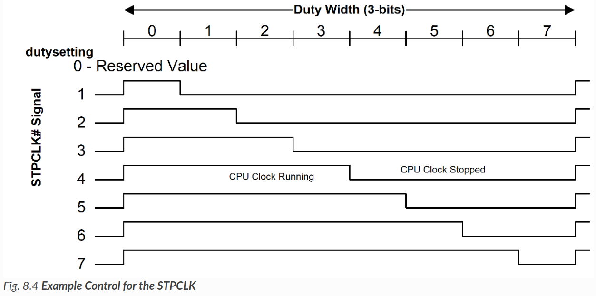{width="50%"}

スロットリングロジックを開始するには、OSPMは希望のduty settingを設定し、THT_ENビットをHIGHに設定する。duty settingを変更するには、OSPMはまずTHT_ENビットをLOWにリセットし、このレジスタの他の未使用フィールドを保持したままduty settingフィールドに別の値を書き込み、THT_ENビットを再びHIGHに設定する。

!!! note
    おそらくduty setting = duty value

ACPIプロセッサPower State制御の実装では、1つのCPUスリープ状態 (C1)のサポートが最低限必要である。以下のセクションでは、異なるACPI CPUスリープ状態を定義する。

### Processor Power State C1

全てのプロセッサは、このPower Stateをサポートしなければならない。この状態は、プロセッサのネイティブ命令 (IA 32 ビットプロセッサの HLT) によりサポートされ、チップセットからのハードウェアサポートは必要ないものとする。この状態のハードウェアレイテンシは、OSPMがこの状態を使用するかどうかを決定する際にレイテンシを考慮しない程度に低くなければならない。C1 Power Stateでは、プロセッサはシステムキャッシュのコンテキストを維持できる。

ハードウェアは、どのような理由でもこの状態を終了できるが、割り込みがプロセッサに提示される場合は、常にこの状態を終了しなければならない。

### Processor Power State C2

このプロセッサPower Stateは、システムによってオプションでサポートされる。この状態が存在する場合、C1 Stateよりも省電力であり、ローカルプロセッサの P_LVL2 コマンドレジスタを使用するか、または _CST オブジェクトによって示される別のメカニズムを使用して入力される。この状態の最悪のハードウェアレイテンシはFADTで宣言されており、OSPMはこの情報を使用して、 C2 Stateの代わりに C1 Stateを使用するタイミングを決定できる。OSPMは、C2 Power Stateは C1 Power Stateよりも消費電力が低く、終了レイテンシが高いと想定している。

C2 Power Stateは、オプションのACPIクロック状態であり、チップセットのハードウェアサポートが必要である。このクロックロジックはインタフェースで構成されており、このインタフェースを操作することで、プロセッサコンプレックスをC2 Power Stateに正確にマイグレーションさせることができる。C2 Power Stateでは、プロセッサはキャッシュのコヒーレンシを維持できると想定され、例えば、キャッシュコンテキストを破壊することなく、バスマスタやマルチプロセッサの活動を行うことができる。

C2 Stateは、プロセッサをマルチプロセッサやバスマスタシステムに最適化された低消費Power Stateにする。OSPMは、バスマスタまたはマルチプロセッサのアクティビティがある場合、アイドル状態のプロセッサコンプレックスをC2 Stateにマイグレーションさせる。プロセッサコンプレックスは、C2 Stateにある間、バスマスタまたはマルチプロセッサCPUのメモリへのアクセスをスヌープできる。

!!! note
    つまり、省電力でありつつも、データの一貫性は保たれる状態

ハードウェアはどのような理由でもこの状態を終了できるが、割り込みがプロセッサに提示されるときは常にこの状態を終了しなければならない。

### Processor Power State C3

このプロセッサPower Stateは、システムによってオプションでサポートされる。この状態は、 C1 および C2 Stateよりも省電力であり、ローカルプロセッサの P_LVL3 コマンドレジスタを使用するか、_CST オブジェクトによって示される別のメカニズムを使用して入力される。この状態の最悪のハードウェアレイテンシはFADTで宣言されており、OSPMはこの情報を使用して、C3 Stateの代わりにC1またはC2 Stateを使用するタイミングを決定できる。C3 Stateにある間、プロセッサのキャッシュは状態を維持するが、プロセッサはバスマスタやマルチプロセッサCPUのメモリへのアクセスをスヌープする必要はない。

ハードウェアはどのような理由でもこの状態を抜けることができるが、割り込みがプロセッサに提示されるとき、またはBM_RLDが設定され、バスマスタがメモリにアクセスしようとするときには、必ずこの状態を抜ける必要がある。

OSPM はキャッシュがコヒーレンシを維持することを保証する責任がある。ユニプロセッサ環境では、PM2_CNT.ARB_DISバスマスタアービトレーションディセーブルレジスタを使用して、C3 Stateの間にバスマスタサイクルが発生しないようにできる。マルチプロセッサ環境では、C3 Stateに入る前にプロセッサのキャッシュをフラッシュして無効化し、キャッシュに動的情報が残らないようにできる。

!!! question
    これでコヒーレンシを維持できる理由が分からない。コヒーレンシとはどこのコヒーレンシ？とりあえずどうやってC3Stateに変更するか調べることを優先。

C3Power Stateをサポートするメカニズムは2つある：

- C3 Stateに入る前に、OSPMがキャッシュをフラッシュし、無効にすること。
- マスタのメモリへの書き込みを防止するハードウェアメカニズムを提供する (ユニプロセッサのみのサポート)。

最初のケースでは、OSPMはC3 Stateに入る前にシステムキャッシュをフラッシュする。通常、プロセッサキャッシュのフラッシュには多くのレイテンシがあるため、OSPMはアイドルプロセッサ用のマルチプロセッサプラットフォームでのみこれをサポートすると思われる。キャッシュのフラッシュは、定義された ACPI メカニズムの1つ (キャッシュのフラッシュで後述)を介して実行される。

必要なハードウェア機能 (このセクションで定義)を提供するユニプロセッサオンリープラットフォームでは、OSPMは、プロセッサがC3 Stateにある間、システムバスマスタがメモリに書き込むのを防ぐモードにプラットフォームを配置しようとする。

これは、C3Power Stateに入る前にバスマスタを無効にすることで達成される。バスマスタがアクセスを要求すると、CPUはC3 Stateから目覚め、バスマスタアクセスを再び有効にする。

OSPM は、BM_STS ビットを使用して、C2/C3 Power Stateへのマイグレーションを検討する際に入るべきPower Stateを決定する。BM_STS は、バスマスタがいつアクティブかを示すオプションのビットである。OSPM はこのビットを使用して、 C2 Power Stateと C3 Power Stateの間の方針を決定する。バスマスタアクティビティが多い場合は CPU のPower Stateが C2  (または C2 がサポートされていない場合は C1 )に降格し、バスマスタアクティビティがない場合は CPU のPower Stateが C3 に昇格する。OSPMはBM_STSビットの実行履歴を保持し、CPUPower Stateのポリシーを決定する。

!!! question
    実装ポリシーを提案しているだけ？

C3 Power Stateで使用される最後のハードウェア機能は、BM_RLD ビットである。このビットは、バスマスタからの要求の結果として Cx Power Stateが終了するかどうかを決定する。もしセットされていれば、バスマスタからの要求により Cx Power Stateは終了する。リセットされた場合、バスマスタからの要求があってもPower Stateは解除されない。C3 Stateでは、バスマスタリクエストによって CPU を C0 Stateに戻す必要があるが (システムはキャッシュコヒーレンシを維持できるため)、C2 Stateではそのようなマイグレーションは必要ない。OSPM は、C3 Power Stateを使用する場合はこのビットをオプションで設定し、C1 または C2 Power Stateを使用する場合はこのビットをクリアできる。

### Additional Processor Power States

ACPIは、ACPI 2.0からC3を超えるオプションのプロセッサPower Stateを導入した。これらのPower State、C4...これらの追加Power Stateは、前のセクションで定義した C1 ～ C3 Power Stateと同等の動作セマンティクスによって特徴付けられるが、エントリ/エグジットのレイテンシと省電力は異なる。詳細は_CST (C State)を参照。

<!-- ## 8.2. Flushing Caches

ARB_DIS 機能を使用せずに C3 電力状態をサポートするには、ハードウェアがプロセッサのキャッシュをフラッシュして無効にする機能を提供しなければならない (IA プロセッサの場合、これは WBINVD 命令となる)。S1、S2、S3スリープ状態をサポートするには、ハードウェアがプラットフォームキャッシュをフラッシュする機能を提供する必要がある。キャッシュのフラッシュは、以下のメカニズムのいずれかによってサポートされる：

- システムキャッシュを書き戻し、無効にするプロセッサ命令 (IAプロセッサではWBINVD命令)。
- システムキャッシュを無効化せずに書き戻すプロセッサ命令 (IAプロセッサおよび部分的にサポートする一部のチップセットではWBINVD命令。)

ACPI仕様は、全てのプラットフォームがシステムキャッシュをフラッシュするためのローカルCPU命令 (CPUとチップセットの両方でサポート)をサポートすることを期待しており、現在この機能を満たしていないシステムに対して、限定的な「ベストエフォート」サポートを提供している。また
プラットフォームが使用する方法は、このセクションで示される適切なFADTフィールドとフラグによって示される。

ACPIは、システムのキャッシュ機能を記述するパラメータをFADTで指定する。プラットフォームがプロセッサのライトバックおよび無効化命令 (IAプロセッサではWBINVD)を適切にサポートしている場合、このサポートはFADTにWBINVDフラグを設定することでOSPMに示される。

プラットフォームが最初の2つのフラッシュオプションのどちらもサポートしていない場合、OSPMは以下の条件を満たせば手動でキャッシュのフラッシュを試みることができる：
- 2 $M B$ を超えない連続した物理メモリのキャッシュ対応シーケンシャル読み出しは、プラットフォームキャッシュをフラッシュする。
- キャッシュの手動フラッシュをサポートするために、2つの追加FADTフィールドが必要である：
- FLUSH_SIZE、通常はシステムで最大のキャッシュのサイズの2倍。
- FLUSH_STRIDE、通常はシステムで最小のキャッシュラインサイズ。 -->

## 8.3. Power, Performance, and Throttling State Dependencies

コストと複雑さのトレードオフを考慮した結果、消費電力、パフォーマンス、スロットリングの各状態に入る際に、論理プロセッサ間のプラットフォーム制御の依存関係が生じている。これらの依存関係は、マルチプロセッサ、マルチスレッドプロセッサ、マルチコアプロセッサベースのプラットフォームにおいて様々な形で存在する。また、これらの依存関係は階層的である場合もある。たとえば、複数のスレッドを含む複数のコアを含むプロセッサで構成されるマルチプロセッサシステムは、ハードウェア実装の結果として様々な依存関係を持つ可能性がある。

OSPMが論理プロセッサ間の依存関係を認識していない限り、ある論理プロセッサが暗黙のうちに電力、パフォーマンス、またはスロットリングの状態にマイグレーションし、それが不当または非最適なシステム動作につながるシナリオが発生する可能性がある。依存関係の知識があれば、OSPMは論理プロセッサ間の遷移を調整することができ、そうすることでシステムの動作が正しくなかったり最適でなかったりしない場合に、遷移を開始することを選択する。このOSPMの調整はソフトウェア (SW)調整と呼ばれる。別の方法として、基礎となるハードウェアが複数の論理プロセッサの状態遷移要求を調整し、遷移が不正確または非最適なシステム動作につながらないことが保証されている場合に、プロセッサをターゲット状態に遷移させることが可能な場合がある。このシナリオはハードウェア (HW)調整と呼ばれる。ハードウェアが状態遷移を調整する場合、OSPMは依存関係がない場合と同様に状態遷移を開始し続ける。しかし、この場合、正しい/最適な制御方針を実現できるように、ハードウェアが実際の状態残留を決定する手段をOSPMに提供することが要求される。

!!! question
    ハードウェア的に状態は変わってしまう？一旦無視する。

パワー、パフォーマンス、またはスロットリング状態制御領域で、プロセッサ間の依存関係がある論理プロセッサを含むプラットフォームは、ACPI定義インタフェースを使用して、依存性ドメインと呼ばれるものに論理プロセッサをグループ化する。ドメインの調整タイプ特性は、OSPMと基礎となるハードウェアのどちらが調整を担当するかを指定する。OSPMが調整を行う場合、プラットフォームはOSPMに対して、ドメインに属すプロセッサの全て (OxFC)またはいずれか1つ (OxFD)を特定のターゲット状態に遷移させることを要求できる。基礎となるハードウェアがハードウェア協調をサポートしていても、OSPMはその裁量で協調を実行することを選択できる。この場合、OSPMは依存ドメイン内の全ての論理プロセッサを特定のターゲット状態に遷移させなければならない。

| Value | Description                                                                                                                                                                                                                                                                                                                                                                                                                                                           |
| ----- | --------------------------------------------------------------------------------------------------------------------------------------------------------------------------------------------------------------------------------------------------------------------------------------------------------------------------------------------------------------------------------------------------------------------------------------------------------------------- |
| 0xFC  | SW_ALL: OSPMは、ドメイン内の全てのプロセッサの制御インタフェースに対して同じ状態リクエストを行い、ドメインの要求された状態に調整する。ALLは、ドメインに入るために全てのプロセッサがその状態に同意する必要があることを指す。                                                                                                                                                                                                                               |
| 0xFD  | SW_ANY: OSPMは、ドメイン内の任意のプロセッサの制御インタフェースに対して状態リクエストを行い、ドメイン内のプロセッサ全てが最後に要求された状態に遷移するためのハードウェア要件を調整する。ANYは、ドメイン内の任意のプロセッサで遷移を最後に要求された状態に合わせるハードウェアの要求を指す。                                                                                                                                                               |
| 0xFE  | HW_ALL: OSPMがドメイン内の任意のプロセッサの制御インタフェースに対して状態遷移を要求するとき、ハードウェアはドメイン内の全てのプロセッサの状態を調整し、調整された状態へと全プロセッサを遷移させる。ALLは、OSPMがドメイン内の任意のプロセッサに対して独立した状態リクエストを行える一方で、ハードウェアがドメイン内の全プロセッサの結果としての状態を決定するというハードウェアの調整要件を指す。なお、ハードウェアの調整ポリシーは実装によって異なる。 |

## 8.4. Declaring Processors

システム内の各プロセッサは、 $\_{-} S B$ スコープの ACPI 名前空間で宣言する必要がある。プロセッサのデバイス定義は、ACPI0007 ハードウェア識別子 (HID)を使用して宣言される。プロセッサの構成情報は、プロセッサデバイスのオブジェクトリスト内のオブジェクトによってのみ提供される。

プラットフォームがAPIC割り込みモデルを使用している場合、プロセッサデバイスのUIDオブジェクト値は、プロセッサデバイスとMADTのエントリを関連付けるために使用される。

プロセッサ固有のオブジェクトは、プロセッサデバイスのスコープ内で宣言できる。これらのオブジェクトは、プロセッサの性能状態制御を含む複数の目的に役立つ。その他のACPI定義デバイス関連オブジェクトも、プロセッサデバイスのスコープで宣言できる (例えば、前述の一意識別子object_UID)。

プロセッサにはデバイスのような特性があるため、少なくともデバイス通知を処理するために、プロセッサデバイスドライバがOSPMによってロードされる。OSPMはACPI Namespace、プロセッサ固有のネイティブ識別命令、および_HIDメソッドを使用してシステム内のプロセッサを列挙する。

プロセッサデバイスオブジェクトの宣言の詳細については、デバイス (デバイスパッケージの宣言)を参照してください。プロセッサ固有の子オブジェクトについては、以下のセクションで説明する。

ACPI 6.0 では、プロセッサコンテナの概念が導入された。プロセッサコンテナは、プロセッサコンテナデバイスを使用して宣言される。プロセッサコンテナは、共有キャッシュなどの共通リソースを共有し、コレクション内のプロセッサに影響を与えるパワーステートを持つ、関連するプロセッサのコレクションを記述するために使用できる。詳細については、プロセッサコンテナデバイスを参照してください。

??? quote "C-stateの拡張の話。一旦スルー"

    ## 8.4.1. Processor Power State Control

    !!! question
        プロセッサオブジェクトの新たな宣言までやるのか？ACPIテーブルの更新ができるのかはよくわからない。一旦デフォルトを使用する方針で良い気がする。

    ACPI は、複数のプロセッサ電源状態 ( $C$ 状態)制御インタフェースを定義している。これらは以下のとおりである：

    1. プロセッサレジスタブロック (P_BLK)のP_LVL2およびP_LVL3レジスタは、FADTのP_LVLx_LAT値と組み合わされる。

    2. プロセッサのオブジェクトリストにある_CSTオブジェクト。

    3. プロセッサとプロセッサコンテナの_LPIオブジェクト。

    P_BLK ベースの C ステート制御は、ACPI ハードウェア仕様に記載されている。CST ベースの C ステート制御は、P_BLK ベースの制御の機能を拡張し、 $\mathrm{C}$ ステートの数とタイプをダイナミックに変更できるようにし、機能固定ハードウェアアドレス空間を使用して定義されたレジスタによって示される CPU アーキテクチャ固有の $\mathrm{C}$ ステート入出力メカニズムに対応する。

    ACPI 6.0 では、低消費電力アイドル状態オブジェクトである _LPI が導入された。LPIは、より詳細な電力状態情報を提供し、プロセッサコンテナと連携して複数の階層レベルでアイドル状態を記述できる。詳細については、_LPI (Low Power Idle States)を参照してください。

    ### 8.4.1.1._CST (C States)

    CSTは、サポートされるプロセッサの電源状態 (Cステート)を宣言するための代替方法を提供するオプションのオブジェクトである。CSTオブジェクトが提供する値は、 $P_{-} B L K$ のP_LVLX値およびFADTの $P_{-}$ LVLx_LAT値をオーバーライドする。CST オブジェクトを使用すると、 $\mathrm{C} 1, \mathrm{C} 2$ および $\mathrm{C} 3$ 以外の任意の数のプロセッサ電源ステートに拡張できる。これらの拡張状態のエントリセマンティクス (言い換えれば、これらの状態に入るための考慮事項)は、以下によってOSPMに伝えられる。
    Cステートタイプフィールドであり、セクション8.1.2からセクション8.1.4で説明されるC1 C2 C3のエントリセマンティクスに対応する。CSTは、より低い電力とより高いエントリ/エグジットレイテンシを特徴とする昇順Cステートを定義する。

    **Arguments:**

    なし

    **Return Value:**

    以下のようなCステート情報パッケージのリストを含む可変長パッケージ。

    **Return Value Information**

    CSTは、以下の要素を含む可変長のパッケージを返す：

    - Count CStateに続くサブパッケージの数を含む整数。
    - CStates[] Count CStateサブパッケージのリスト。

    {width="50%"}

    各固定長Cステートサブパッケージには、以下のエレメントが含まれる：

    {width="50%"}

    | 要素     | オブジェクトタイプ | 説明                                                                                                                      |
    | -------- | ------------------ | ------------------------------------------------------------------------------------------------------------------------- |
    | Register | Buffer             | OSPMが対応するC状態にプロセッサを配置するために読む必要がある単一のRegister()ディスクリプタを含むリソースディスクリプタ。 |
    | Type     | Integer (BYTE)     | C状態タイプ (1=C1、2=C2、3=C3)。このフィールドは、OSPMがC状態の入出時に使用する意味論を伝える。ゼロは有効な値ではない。  |
    | Latency  | Integer (WORD)     | C状態の入出における最悪のレイテンシ (ミリ秒単位)。レイテンシ制限はない。                                       |
    | Power    | Integer (DWORD)    | 対応するC状態にあるプロセッサの平均消費電力 (ミリワット単位)。                                                           |

    プラットフォームは、そのプロセッサの全てまたはいずれかに対して_CSTオブジェクトを公開しなければならない。CSTオブジェクトが存在する場合、OSPMは、P_BLKで定義されたP_LVL2およびP_LVL3レジスタと、FADTで定義されたP_LVLX_LAT値の代わりに、_CSTオブジェクトで指定されたCステート情報を使用する。また、_CSTオブジェクトが存在し、_PTCオブジェクトが存在しない場合、OSPMはP_BLKに定義されたプロセッサコントロールレジスタと_CSTオブジェクト内のC_State_Registerレジスタを使用することに注意。

    プラットフォームは、プロセッサオブジェクトに対して通知値0x81のNotifyイベントを発行することで、OSPMが使用可能なCステートの数やタイプを動的に変更できる。これによりOSPMは、通知されたプロセッサオブジェクトの下に存在する_CSTオブジェクトを再評価する。例えば、プラットフォームは、非同期 AC 挿入/取り外しイベントの結果、サポートされる C ステートの数が変更されたことを OSPM に通知する。

    プラットフォームは、与えられた_CSTオブジェクト内の全エントリに対して、一意のC_State_Registerアドレスを指定しなければならない。

    CSTは、全てのプロセッサがCステートパリティを持たなければならないというACPI 1.0の制限を排除する。CSTを使用すると、各プロセッサは、他のプロセッサから独立した独自の特性を持つことができる。例えば、プロセッサ0はC1、C2、C3をサポートし、プロセッサ1は $\mathrm{C} 1$ のみをサポートできる。

    プロセッサ構造のフィールドは、後方互換性のために残っている。

    ??? example
        

        上記の例では、OSPMは、CSTオブジェクトが同じC_State_Type値を持つ複数のエントリを提供する可能性を予期しなければならないことに注意。この場合、OSPMはどのC_State_Registerを使って $\mathrm{C}$ ステートに入るかを決めなければならない。

    ??? example
        これは、ACPI 1.0で定義されている典型的な値を使用した_CSTオブジェクトの使用例である。

        

        プラットフォームは、使用可能なプロセッサ電源状態の数が変更されると、このオブジェクトを再評価するよう OSPM に通知するために Notify (_SB.CPU0, Ox81) を発行する。

    ### 8.4.1.2. _CSD (C-State Dependency)

    このオプションのオブジェクトは、OSPMにCステートコントロールクロス論理プロセッサ依存情報を提供する。CSDオブジェクトは、_CSTオブジェクトによって返されるCステート情報と相関する情報のパッケージ化されたリストとして評価される。各パッケージリストエントリは、依存関係が指定されている $\mathrm{C}$ 状態を識別する (_CSTオブジェクトへのインデックスとして)。
    CSTオブジェクトリスト)、そのCステートの依存ドメイン番号、その $\mathrm{C}$ ステートの調整タイプ、および特定のCステートのドメインに属す論理プロセッサの数。特定のC状態が複数のドメインに属す可能性がある。つまり、_CSDリストには、同じCStatelndex値を持つ複数のエントリが存在する可能性がある。

    **Arguments**:

    なし

    **Return Value**:

    後述するC-state依存Packageのリストを含む可変長のPackage。

    **Return Value Information**

    

    各 CstateDependency サブパッケージには、以下の要素が含まれる：

    

    | 要素          | オブジェクトタイプ | 説明                                                                                                                                                                   |
    | ------------- | ------------------ | ---------------------------------------------------------------------------------------------------------------------------------------------------------------------- |
    | NumEntries    | Integer            | CStateDependencyパッケージに含まれるエントリの数。現在の値は6である。                                                                                                    |
    | Revision      | Integer (BYTE)     | CStateDependencyパッケージのリビジョン番号。現在の値は0である。                                                                                                          |
    | Domain        | Integer (DWORD)    | このC状態エントリが属す依存関係ドメイン番号。                                                                                                                        |
    | CoordType     | Integer (DWORD)    | サポートされるC状態の調整タイプについては表8.1を参照。                                                                                                                 |
    | NumProcessors | Integer (DWORD)    | 特定のC状態のためのドメインに属すプロセッサの数。OSPMは、この数のプロセッサが特定のC状態のために同じドメインで検出され、開始されるまで電力状態の遷移を開始しない。 |
    | Index         | Integer (DWORD)    | 依存関係が適用される_CSTオブジェクトのC状態エントリのインデックスを示す。                                                                                          |

    利用可能なCステートの数やタイプが動的に変化する可能性があるため、ACPIはプロセッサオブジェクトのNotifyイベントをサポートしており、タイプ0x81のNotifyイベントを受け取ると、OSPMは通知された特定のプロセッサオブジェクトの下に存在する_CSTオブジェクトを再評価する。タイプ0x81のNotifyイベントを受信すると、OSPMは現在存在する_CSDオブジェクトも再評価する必要がある。

    ??? example
        これは、名前空間内の Processor 構造体における _CSD 構造体の使用例である。この例は、2 つのプロセッサ構成を表している。C1 タイプの状態は、各プロセッサで独立して入力できる。C2タイプの状態については、一方のプロセッサがC2タイプの状態に遷移すると、もう一方のプロセッサもC2タイプの状態に遷移するというように、2つのプロセッサ間に依存関係が存在する。C3タイプの状態にも同様の依存関係が存在する。OSPMは、2つのプロセッサ間のC2およびC3遷移を調整する必要がある。また、OSPMはどちらか一方のプロセッサでトランジションを開始し、両方を共通のターゲットであるCステートに遷移させることができる。

        

        使用可能なプロセッサ電源状態の数が変化したときに、OSPM に_CST の再評価を通知するためにプラットフォームが通知(\_SB.CPU0, Ox81)を発行する場合、OSPM は_CSD も評価する必要がある。

??? quote "Lower Power Idle States (LPI) 関連。ここまで考慮すると複雑すぎる"

    ## 8.4.2. Processor Hierarchy

    コンピューティングプラットフォームには、キャッシュなどの共通リソースを共有し、プロセッサ群に影響を与える共通の電力状態を持つ多数のプロセッサが存在するのが一般的である。これらは階層的に配置される。例えば、システムには、それぞれが多数のソケットを持つNUMAノードのセットが含まれることがあり、そのノードには複数のプロセッサグループが含まれることがあり、その各プロセッサコアには個別のプロセッサコアが含まれることがあり、その各プロセッサコアには複数のハードウェアスレッドが含まれることがある。アーキテクチャによって、論理的に関連付けられたプロセッサを表す用語は異なるが、パッケージ、クラスタ、モジュール、ソケットなどの用語が代表的な例である。ACPI では、プロセッサコンテナという用語を使用して、関連付けられたプロセッサのグループを表す。プロセッサは、共有キャッシュや低電力モードなど、何らかの方法で関連付けられ、その全てが影響を受ける場合に、コンテナに属すと言われる。

    {width="50%"}

    上図はシステムの例を示しており、システムレベルのプロセッサコンテナから構成され、その中に2つのクラスタプロセッサコンテナがあり、それぞれに2つのプロセッサがある。全体的なコレクションはプロセッサ階層と呼ばれ、標準的なツリー用語はその様々な部分を参照するために使用される。例えば、個々のプロセッサやコンテナはノードと呼ばれ、プロセッサコンテナ内に存在するノードはその親の子などと呼ばれる。この例は対称的であるが、これは必要条件ではない。例えば、システムが異なるコンテナに異なる数のプロセッサを含む場合や、トポロジツリーの一方が他方より深い非対称階層を含む場合がある。また、この例では、全てのプロセッサを包含する単一のトップレベルプロセッサコンテナが含まれているが、これは要件ではないことに注意すること。ツリーの集合を用いてシステムを記述することは合法である (下記注参照)。

    ### 8.4.2.1. Processor Container Device

    このオプションのデバイスは、ネームスペースのバスノードによく似た働きをするコンテナオブジェクトである。プロセッサデバイスまたは他のプロセッサコンテナである子オブジェクトを含むことができる。これにより、階層的なプロセッサトポロジを表現できる。本明細書では、階層内の各プロセッサコンテナまたはプロセッサをノードと呼ぶ。プロセッサコンテナデバイスは、ハードウェア識別子 (_HID)ACPI0010 を使用して宣言される。

    プロセッサコンテナを解析しないOSのサポートを支援するために、コンテナは汎用コンテナデバイスを表すPNPOA05の互換ID (_CID)を持つことができる (「デバイスクラス固有のオブジェクト」を参照)。

    プロセッサコンテナ宣言は、プロセッサコンテナ階層で一意であるIDを返す_UIDメソッドを提供しなければならない。プロセッサコンテナは、そのスコープ内で宣言された他のプロセッサコンテナまたは他のプロセッサデバイスを含まなければならない。さらに、プロセッサコンテナは、そのスコープ内に以下のメソッドを含むことができる：

    | オブジェクト | 説明                                                                                       |
    | ------------ | ------------------------------------------------------------------------------------------ |
    | _LPI         | プロセッサコンテナによって表される階層ノードのローカル電力状態を宣言する。               |
    | _RDI         | システムレベルの電力状態に影響を与える電源リソースの依存関係を宣言する。                 |
    | _STA         | プロセッサコンテナの状態を決定する。デバイスクラス固有のオブジェクトを参照してください。 |

    LPIはプロセッサデバイスの下に存在する可能性があり、LPI (Low Power Idle States)で説明する。RDI は、単一のトップレベルプロセッサコンテナオブジェクトの下にのみ存在することができ、以下で説明する。

    ACPIでは、複数のルートレベルプロセッサコンテナを定義できる。言い換えれば、複数のトップレベルコンテナを定義することが可能である。例えば、NUMAシステムにおいて、アイドル状態やシステムレベルでカプセル化する必要のある他のオブジェクトがない場合、複数のNUMAノードレベルのプロセッサコンテナを階層のトップレベルで定義できる。

    プロセッサコンテナデバイスオブジェクトは、ACPI 6.0以上の実装でのみ有効である。プラットフォームは、_OSCメソッドによって、OSがプロセッサコンテナオブジェクトの解析をサポートしているかどうかを確認できる (「Platform-Wide OSPM Capabilities」参照)。

    ## 8.4.3. Lower Power Idle States

    ACPI 6.0 では、LPI (Lower Power Idle states)が導入された。これは、C ステートと同様に、プロセッサがアイドルになったときに OSPM によって選択されるアイドル状態を表現できるように仕様を拡張するものであるが、複数のプロセッサに影響を与える可能性があり、他のシステムコンポーネントにも影響を与える可能性がある。本仕様における LPI 拡張は、プロセッサコンテナデバイスを活用することで、与えられた LPI 状態がシステムのどの部分に影響するかを表現できる。

    LPIの状態は、以下のオブジェクトによって定義される：

    - LPIオブジェクトは状態そのものを定義し、プロセッサまたはプロセッサコンテナデバイスの内部で宣言できる。
    - _RDIにより、デバイスの使用状況から生じるLPI使用量の制約を表現可能

    ### 8.4.3.1. Hierarchical Idle States

    プロセッサコンテナ (Processor Container Device)は、_LPI (_LPI (Low Power Idle States))と組み合わせて使用することで、アイドル状態を階層的に記述できる。プロセッサ階層内では、各ノードに固有の低消費電力状態がある。ACPIは、階層内のノードに固有の状態をローカル電力状態 (Local Power States)と呼ぶ。例えば、「プロセッサ階層の電力状態」に描かれているシステムでは、CPUOのローカル電力状態は、クロックゲート、リテンション、パワーダウンである。

    あるプロセッサ上で動作しているOSが、そのプロセッサ上でスケジューリングする作業がなくなったことを検出すると、アイドル状態を選択する必要がある。この状態は、そのプロセッサ以外にも影響する可能性がある。アイドル状態になるプロセッサは、システムの最後のプロセッサであったり、プロセッサコンテナ内のプロセッサであったりするため、複数のプロセッサに影響する電力状態を選択する可能性がある。このような状態を選択するために、OSはプロセッサ階層内の影響を受ける各レベルのローカル電源状態を選択する必要がある。

    {width="50%"}

    プロセッサ階層の電源状態 (Power states for processor hierarchy)の例で、Core 0が最後のアクティブコアである場合を考える。システムを可能な限り低いアイドル状態にできる。そのために、OSはCore0に対してローカルステート3 (パワーダウン)、Cluster0に対してローカルステート3 (パワーダウン)、システムに対してローカルステート1 (パワーダウン)を選択する。しかし、ほとんどのHWアーキテクチャは、OSからプラットフォームへの単一のパワーステート要求しかサポートしていない。つまり、プラットフォームに対して階層ノードごとに個別のローカル電源状態要求を行うことはできない。そのため、OSは各階層のローカル電源状態を1つのコンポジット電源状態にまとめなければならない。その後、プラットフォームはコンポジット電源状態の要求に基づいて動作する。

    プラットフォームは限られたコンポジットパワーステートのセットしかサポートできず、レベル間のローカルパワーステートの全ての組み合わせが有効とは限らない。この例のシステムで有効な電力状態は、以下の表に示されている。

    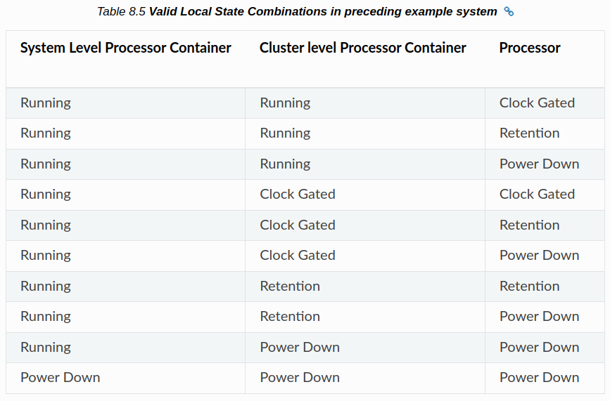{width="50%"}

    ### 8.4.3.2. Idle State Coordination

    階層型アイドル状態の場合、複数のプロセッサがリーフ階層以外のノードのアイドル状態に影響する。プロセッサ階層における電力状態の例では、クラスタ 0 が低電力状態になるには、Core 0 と Core 1 の両方がアイドル状態でなければならない。さらに、Core 0とCore 1がアイドル状態になるときに行われる電力状態の選択は、クラスタ0に使用できる状態に影響する。このため、2つのプロセッサ間でアイドル状態の要求を調整する必要がある。ACPIは2つの異なる調整方式をサポートしている (以下のサブセクションで詳述)：

    - プラットフォーム
    - OSが開始した。

    OS とプラットフォームは、「Platform-Wide OSPM Capabilities」に記載されている _OSC メソッドを使用して、OS Initiated Idle または Platform Coordinated Idle のサポートについてハンドシェイクできる。OS Initiatedモードに入るには、アーキテクチャ固有のコマンドが必要な場合があり、その場合はアーキテクチャ固有のドキュメントを参照してください。(PSCIの文書については、http://uefi.org/acpi「PCSI Specification」を参照。ARM FFHの文書については、http://uefi.org/acpi「ARM FFH Specification」を参照)。

    #### 8.4.3.2.1. Platform Coordinated

    プラットフォーム協調方式では、プラットフォームがプロセッサ間のアイドル状態の調整に責任を持つ。OSPMは各プロセッサから全階層レベルの要求を行う。つまり、各プロセッサは自分自身、その親、その親の親などのローカル電源状態を要求して投票を行う (場合によっては、特定の階層レベルに対する投票が暗黙のうちに行われることもある-詳細は後述の自動昇格の議論を参照)。より高いレベルのアイドル状態を選択する際、プロセッサ上のOSPMはより高いレベルのノードを実行状態に保つことを選ぶことができる。OSPMによって表明された投票は、プラットフォームがプロセッサと、投票によって影響を受ける全ての親ノードに対して選択できるローカルの電力状態に対する制約を設定する。特に、この投票はプラットフォームが進入してはならないことを表している：

    1. 要求された状態よりも深い (低い)ローカル状態。

    2. 要求されたウェイクアップレイテンシよりも高いローカル電源状態。

    3. 要求された状態にはない、電力リソースに依存するローカル電力状態。

    プラットフォームは、全ての基礎となるコアからの各階層ノードに対する投票を横断的に調べ、全ての投票に関連する全ての制約を満たす最も深いローカルステートを選択する。通常、これはコアの1つが投票した最も浅いステートを選択することを意味する。なぜなら、浅いステートの方がウェイクアップレイテンシが短く、最小レジデンシが小さく、電力リソース依存が少ないからである。しかし、ステートの深さとレイテンシは常に一緒に増加するとは限らないため、これは常に正しいとは限らない。効率のために、プラットフォームは一般的に、要求されたものよりも高い最小残留時間を持つパワーステートに入るべきではない。しかし、これは厳密な機能要件ではない。プラットフォームは、特定の状態と状況に基づいてそれが最も効率的な選択であると考える場合、より高い最小残留性を持つ状態に解決できる。

    プロセッサ階層のパワーステートに上記の例を使うと、単純なフローは次のようになる：

    - Core0がアイドル状態になる- OSがCore0のパワーダウン、Cluster0の保持を要求
    - プラットフォームがCore0の要求を受信- Core0をパワーダウン状態にする
    - Core1がアイドル状態になる- OSがCore1のパワーダウン、Cluster0のパワーダウンを要求
    - プラットフォームがCore1のリクエストを受信- Core1をPower Down状態にし、Cluster0に対して最も浅い投票を行い、Retention状態にする。

    もしOSPMがクラスタレベル以上の電源状態を要求したい場合、Core0とCore1は共にSystemレベルでもアイドル状態に投票し、プラットフォームはそれらの投票とSystem階層下の他のプロセッサからの投票を上記の方法で最終的な状態選択を解決する。

    前述したように、ある種のプラットフォームはオートプロモーションと呼ばれるメカニズムをサポートしている。この方式では、プラットフォームはOSPMに、より低いレベルのアイドル状態を要求するコマンドを提供する。
    これは、プロセッサ階層の各上位階層における特定のアイドル状態の要求を自動的に意味する。上位レベル状態への入力を明示的に要求するコマンドはなく、下位レベル状態に基づく暗黙の要求のみである。

    例えば、「プロセッサ階層の電源状態」で示したプラットフォームが Cluster0 Clock Gated 状態の自動促進を使用する場合、Core0 も Core1 も明示的に要求することはできない。しかし、Core0またはCore1のどちらかからコアレベルのクロックゲート要求があれば、Cluster0クロックゲート要求があることになる。したがって、両方のコアがコアクロックゲーティングを要求した場合 (またはそれ以上)、Cluster0はプラットフォームによって自動的にクロックゲーティングされる。ACPIでどのように自動昇格がサポートされるかの詳細については、「Entry Method and Composition」を参照してください。

    #### 8.4.3.2.2. OS Initiated

    OS Initiated Coordinationスキームでは、OSPMは最後のプロセッサがスリープ状態になったときのみ、特定の階層ノードに対してアイドル状態を要求する。当然ながら、プロセッサは常に自分自身のアイドル状態を選択するが、クラスタのような上位階層ノードのアイドル状態は、クラスタ内の最後のプロセッサがアイドルになったときにのみ選択される。プラットフォームはアイドル状態を決定する際に、特定のノードに対する最新のリクエストのみを考慮する。

    OS Initiated Coordinationの主な動機は以下の通りである：

    1. 他のプロセッサがまだ起きているため使用されない高レベルのアイドル状態の選択を評価するOSPMのオーバーヘッドを回避する。

    2. OSPMが、特定のノードに対する最新のリクエストのみを受け取り、過去にスリープしたプロセッサからのリクエストを無視することで、最新の情報に基づいてより高いレベルのアイドル状態の選択を行うことができるようにする。

    上記の例を簡単なフローにすると以下のようになる。

    {width="70%"}

    Core1はCore0とCore1の両方に影響するクラスタ決定を行うので、OSPMはクラスタステートを要求する際に、Core1だけでなく両方のコアについて予想されるスリープ時間、ウェイクアップレイテンシ要件、デバイス依存性などを考慮する必要があることに注意。

    プラットフォームは依然として機能的な正しさを保証する責任がある。例えば、Core 0 がウェイクアップし直した場合、上記の例で Core 1 が要求したクラスタ状態を終了するか、その状態へのエントリを中断する必要がある。OSPMには、最後にダウンしたコアが最初にアップしたコアでもあること、あるいは他のコアがより高いレベルのスリープ状態を要求しているときにコアがウェイクアップしないことを保証する責任はない。

    #### 8.4.3.2.2.1. OS Initiated Request Semantics

    OS Initiated Coordinationでは、異なるコアからのリクエストの順序が決定的に重要である。プラットフォームがOSの意図した順序でリクエストを処理しない場合、プラットフォームが間違った状態になる可能性がある。このシナリオを、プロセッサ階層のパワー状態のシステム例で考える。

    {width="50%"}

    ここでの重要な問題は、2つのコアからのリクエスト間の競合状態である。OSが作成したのと同じ順番でプラットフォームに到達するという保証はない。よくあることとは思われないが、Core0のリクエストがCore1のリクエストを「追い越す」可能性がある。周波数が低い、キャッシュの動作が異なる、OS以外の目に見えるイベントの処理など、様々な理由が考えられる。この一連のイベントの結果、プラットフォームはCore0からの最新のリクエストではなく、Core1からの古いCluster0リクエストに対して誤って動作することになる。その結果、Cluster0は次のウェイクアップまで間違った状態のままになってしまう。

    このような競合状態に対処し、プラットフォームとOSがリクエストの順序について一貫した見解を持つことを保証するために、OS Initiated idle state request semanticsは、階層的な依存性チェックを含むように強化されている。プラットフォームはリクエストを受け取ると、リクエストされたコアが本当にリクエストされたドメインで最後にダウンしたコアかどうかをチェックし、そうでなければリクエストを拒否する責任がある。OSPMとプラットフォームが正しく動作していても、様々な競合によってシステムの状態について常に一致するとは限らないことに注意。例えば、プラットフォームはあるコアがOSPMより先にウェイクアップしているのを見て、そのコアを実行中と見なするが、OSPMはまだスリープ中と見なする。プラットフォームは、コアのリクエストを見てから (他のOSリクエストに対して正しく順序付けられるように)、依存性チェックのために特定のコアを低消費電力状態として扱い始めることができる。プラットフォームは、コアがアイドル状態からウェイクアップした後、OSに制御を戻す前に、コアを実行中として扱い始めなければならない。

    この依存性チェックによって、上記の例は次のように変わる：

    {width="70%"}

    一旦OSに制御が戻ると、OSは適切と思われる処理を行うことができる (おそらく、両方のコアのアイドル状態を再評価するだけであろう)。リクエストが順番通りに受け取られない場合、コマンドを拒否してOSに再評価をさせることで、若干のオーバーヘッドが発生するが、これはまれなことだろう。OSから送信されたリクエストは、ほとんどの場合、同じ順番でプラットフォームから受信されるはずであり、この場合、アイドルコマンドは通常通り実行される。

    OSが特定の階層ノードを、その下のCPUが全てスリープ状態であっても実行し続けることを選択する可能性がある。これは別の潜在的なコーナーケースを生む。

    {width="50%"}

    根本的な問題は、どの階層が低電力モードに置かれているかに基づいて、要求がどの階層レベルに対するものかをプラットフォームが推測できないことである。これを軽減するために、各アイドル状態コマンドには、通常のアイドル状態識別子に加えて、OSが要求を行う最上位階層ノードを指定する階層パラメータを含める必要がある。OSがある上位階層ノードにアイドル状態に入ることを望まない場合でも、そのコアがそのノードの最後のコアダウンであるかどうかを示すべきである。これにより、プラットフォームはOSの階層状態の見方を理解することができ、OSが特定のノードに稼動状態を維持するよう要求した場合でも、要求の順序を確実にできる。

    この強化は以下の表に示されている。

    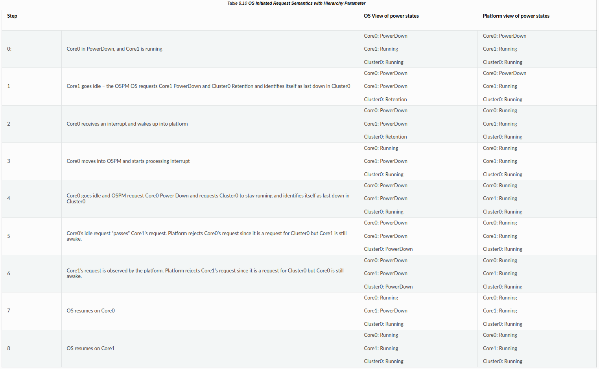{width="50%"}

    以前と同様、制御がOSに戻ると、OSは適切と思われる処理を行うことができる--おそらく、両方のコアのアイドル状態を再要求するだけだろう。

    ### 8.4.3.3. _LPI (Low Power Idle States)

    LPIは、ローパワーアイドル状態を記述する方法を提供するオプションのオブジェクトで、階層プロセッサトポロジ内の各ノードのローカルパワー状態を定義する。OSPM は、_LPI オブジェクトを使用して、システム内のプロセッサ階層の各レベルのローカル電源状態を選択する。これらのローカル状態の選択は、OSPMによってプラットフォームに提示される複合電源状態要求を生成するために使用される。

    このオブジェクトは、プロセッサコンテナまたはプロセッサ宣言の内部で使用できる。LPIは以下の形式を取る：

    **Arguments:**

    なし

    **Return Value:**

    親プロセッサまたはプロセッサコンテナーデバイスのローカル電源状態を含む可変長パッケージ。LPI 評価は以下のフォーマットを返す：

    

    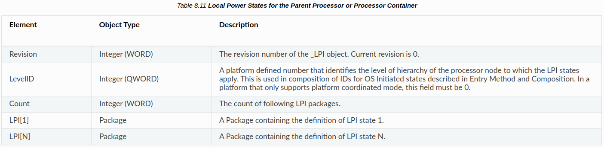{width="50%"}

    各LPIサブパッケージは、以下に説明する要素を含んでいる：

    

    {width="50%"}

    {width="50%"}

    全てのプロセッサまたはプロセッサコンテナーが_LPIオブジェクトを持つ必要はない。しかし、プロセッサコンテナーが_LPIオブジェクトを含む場合、全ての子プロセッサまたはプロセッサコンテナーは_LPIオブジェクトを持たなければならない。

    以下のセクションでは、LPIのより複雑な特性と、LPI ステートに対するウェイクアップのルールについてより詳しく説明する。

    #### 8.4.3.3.1. Disabling a State

    FlagsフィールドのEnabledビットをクリアしてローカルステートを無効にすると、そのノードのより深いステートの番号は変更されない。これにより、そのノードの状態リストへのインデックスに依存する他のプロパティ (例えば、Enabled Parent State)は変更されない。

    無効状態はOSから要求されるべきではなく、残留/使用カウンタレジスタが返す値は未定義である。

    #### 8.4.3.3.2. Enabled Parent State

    前述したように、LPIはローカルな状態を表し、それらを組み合わせて複合状態にする必要がある。しかし、全ての組み合わせが可能なわけではない。プロセッサ階層のパワーステートで説明したシステム例を考える。このシステムでは、Core0のローカル状態としてクロックゲーティングを、ClusterOのローカル状態としてパワーダウンを同時に選択することはできない。Core0 は物理的に Cluster0 内にあるため、クラスタのパワーゲーティングはコアのパワーゲーティングを意味する。このサンプルシステムの正しいローカルステートの組み合わせは、前述のサンプルシステムにおける有効なローカルステートの組み合わせに記載されている。LPI ステートは、Enabled Parent State (EPS)プロパティによって正しい組み合わせを列挙できる。

    LPIステートは1インデックスである。 $\mathrm{C}$ および $\mathrm{S}$ ステートと同様に、LPIO は実行中のステートとみなされる。ある LPI に対して、EPS はプロセッサコンテナの _LPI ステートへの 1 ベースのインデックスである。このインデックスは、次のような親プロセッサの最も深いローカル電源状態を指す。
    が有効になる。親の LPI ステートより浅いパワーステートは全てイネーブルになる。図8.7のシステムを例に、各状態と各状態に対するEPS値を以下の表8.14に示す。

    {width="50%"}

    #### 8.4.3.3.3. Power, Minimum Residency, and Worst Case Wakeup Latency

    OSPM のアイドル状態の決定には、絶対的な電力ではなく、異なる状態の相対的な電力 (遷移エネルギーを理解するための最小残留時間と共に)が用いられるため、_LPI には電力は含まれない。相対的な電力を正しく伝えるために、_LPIのローカルステートは消費電力順に宣言されなければならない。つまり、特定の階層ノードのローカルステートは、消費電力が最も大きい (浅い)ものから最も小さい (深い)ものへと並べなければならない。

    特定のローカルステートの最悪ウェイクアップレイテンシ (WCWL)とは、ウェイク割り込みがアサートされてから、階層ノードが実行に復帰できるまでの最長時間のことである。一般的に、WCWLはアイドル状態の終了レイテンシに、エントリレイテンシの一部を加えたものになる。エントリフローがどの程度含まれるかは、プラットフォームが保留中のウェイクイベントのチェックとアイドル状態エントリの中断をサポートしているか (しているか)に依存する。どのような電力状態であっても、「戻れないポイント」が存在し、そのポイントを過ぎると、アイドル状態への入力は中断される。
    電源状態を逆転させることはできない。これは以下の最悪のウェイクテンシに示されている。WCWL には、復帰不能時点からウェイクアップ割り込みを処理できるまでの時間を含める必要がある。

    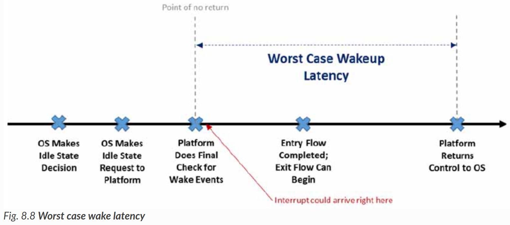{width="50%"}

    他の最悪のパスがWCWLを決定することになる可能性もあるが、上述したものが最も一般的であると予想されることに注意されたい。例えば、OSがアイドル要求を出してから、プラットフォームがウェイクアップイベントをチェックしないポイントオブノーリターンまでの間に、電源状態に入ったり出たりするのにかかる時間よりも長い別の期間が存在する可能性がある。その場合、その期間が最悪の場合のウェイクアップレイテンシとなる。

    {width="50%"}

    最小残留時間 (MR)は、ある状態がより浅い状態よりもエネルギー効率が高くなる時間である。このパラメータは基本的な問いに答えるものである。アイドル状態にマイグレーションするためのエネルギーコストを克服し、より浅い代替案と比較してその状態を選択することが正味の利益になるには、階層ノードはどのくらいの時間アイドル状態にとどまる必要があるのか？これには、アイドル状態に入らずノードを稼動し続けることとの比較も含まれることに注意。これは、状態 $A, B$ と $C$ のスリープ時間に対するエネルギーに示されており、スリープ時間の関数として3つの異なる状態選択に関連するエネルギーを示している。ノードの実行を維持した場合の状態AのMRは描かれていないことに注意。

    一般的に、最小レジデンシーと最悪のウェイクアップレイテンシは、より深いステートほど大きくなるが、必ずしもそうなるとは限らない。上記とは異なる例として、StateYとStateZの2つのシステムレベルステートを考える。抽象的なステートリストは次のようになる：

    エネルギーの観点からは、常にStateZが望ましいが、この例では、StateZは特定のデバイス依存性が満たされた場合にのみ利用可能である。このため、依存関係が満たされない場合は、StateYが魅力的な状態になる。より深い (より低い消費電力の)ステートであるにもかかわらず、StateZはStateYより低いMRを持つ。これは、エントリオーバーヘッドが同程度であり、StateZのより低い消費電力がより早くトランジションコストを償却するためである。MRを設定するクロスオーバーは通常、次に浅い状態に対して行われるべきであるが、このようなケースに対処するために、MRは浅い (より高いパワーの)状態に対して定義される。この場合、StateZのMRは、StateXとのクロスオーバーによって設定される。なぜなら、StateZは (デバイス依存関係に基づいて許可されていれば)常にStateYよりも優先されるからである。最も低いエネルギーを達成するために、OSPMは、全てのエントリ制約が満たされる最も深い (最も低い電力)状態を選択しなければならず、より浅い状態のWCWL/MR閾値が満たされなかったからといって、より深い状態が実行可能ではないと仮定してはならない。

    WCWLはOSPMがアイドル状態の選択を制限し、クリティカルな割り込みに対する応答時間を保証するために使用される可能性があるため、OSPMが規定以上の割り込み応答時間に驚かないよう、控えめに (高い側に)設定すべきである。一方、MRはOSPMが効率的な決定を下すのに役立つ。あるシナリオでMRが不正確で、OSPMが特定のアイドル期間に最適な状態よりも深いか浅い状態を選択した場合、エネルギーの浪費はある可能性があるが、システムが機能的に壊れることはない。これは、MRが重要でない-エネルギー効率は重要である-ということではなく、プラットフォームが最悪のケースではなく、典型的なケースに基づいてMRを最適化することを選択する可能性があるということである。

    ##### 8.4.3.3.3.1. Minimum Residency and Worst Case Wakeup Latency Combination Across Hierarchy Levels

    LPIのWCWLは特定のローカル状態のものである。アイドル状態の選択の一部として、複合状態の選択とシステムのレイテンシ耐性を評価する場合、OSPMは階層レベル間のウェイクアップレイテンシを追加する。例えば、システムがWCWL $=50$ usでコアパワーダウンを持ち、WCWL $=20$ usでクラスタパワーダウンを持つ場合、コアパワーダウン+クラスタパワーダウンの複合ステートレイテンシは70usとして計算される。

    LPIで定義されたMRは、特定の階層ノードに適用される。暗黙の前提は、各階層ノードは独立した電力管理可能なドメインを表し、個別に考慮できるということである。たとえば、基礎となるコアがコアパワーダウンまたはコア保持にある場合、クラスタ保持状態は合法であると仮定する。クラ スタ 保持のMR は、 コアの外にある共有ロ ジッ クを保持し たり 保持を解除し たり する こと にかかる エネ ルギーコ スト と 、 その状態にある とき に共有ロ ジッ クで達成さ れる 定常状態の消費電力削減量に基づいている。重要なのは、コアレベルで選択される特定の状態は、共有ロジックのプロパティに関連するため、クラスタレベルの決定に根本的な影響を与えないことである。
    ロジックはコアの外部にある。クラスタ状態に入る/出るためのエネルギーコストと、それによってもたらされる省電力は、コアがリテンションかパワーダウンかに依存しない。これに基づき、ACPI では MR はレベルごとに独立していると考えられる。つまり、異なるステートの MR を特定のノードの予想スリープ時間と比較する場合、OSPM はそのノードの _ LPI で定義された MR をそのまま使用し、下位階層のステートに基づく調整は行いない (もちろん、下位階層のステートの Enabled Parent State プロパティに基づくステートは合法でなければならない)。

    ##### 8.4.3.3.3.2. Known Limitations with Minimum Residency and Worst Case Wakeup Latency

    WCWLとMRのパラメータは完全なものではないことに注意されたい。例えば、周波数、電圧、温度、その他様々な要因に影響される。また、レベル間の組み合わせのルールも完全ではない。例えば、クラスタレベルの MR は、コアステートの選択に基づいてわずかに移動する可能性がある。これは、コアステートのエントリレイテンシによってクラスタステートへのエントリがレイテンシし、予想されるスリープ期間が緩和されるためである。クラスタレベルのMRはこれを理解するように調整できるが、異なるエントリレイテンシを持つ複数のコアレベルステートが同じクラスタステートを有効にする場合、そのMRはそれら全てを完全に理解することはできない。とはいえ、この一連のパラメータと組み合わせスキームは、シンプルさ/使いやすさと精度の間で良いバランスを保っていると考えられる。

    #### 8.4.3.3.4. Entry Method and Composition

    OSPM は、ローカル LPI 状態を組み合わせて、総合的な複合電力状態を作成する。各 LPI 状態は、エントリ方法フィールドを提供する。これらのフィールドは、選択されたローカル電力状態について組み合わされ、所定の複合電力状態に入るために読み出されなければならない入力方法レジスタを作成する。

    ローカルステートの入力メソッドから適切なレジスタアドレスを導き出すには、次のような方法がある：

    1. プロセッサのローカルステートは、常にレジスタベースの入力方法を宣言する。これはベースレジスタを提供する。

    2. より高いレベルでは、整数またはレジスタを使用できる。整数が使用される場合、その値はステップ 1 で得られたベースレジスタに加算されなければならない。レジスタが使用される場合、これは新しいベースレジスタとなり、以前の値を上書きする。この場合、選択されたLPIは全ての下位ノードの特定のローカルLPI選択を意味しなければならないことに注意。

    3. OS Initiated モードでは、OSPM が、呼び出し元のプロセッサがどの階層レベルで最後にアイドル状態になるかをプラットフォームに通知する必要もある。これは、階層ノードの LPI のレベル ID プロパティをベースレジスタに追加することで行われる。

    エントリステートの基本的な合成アルゴリズムを、プラットフォーム協調システムについての以下の擬似コードに示す：

    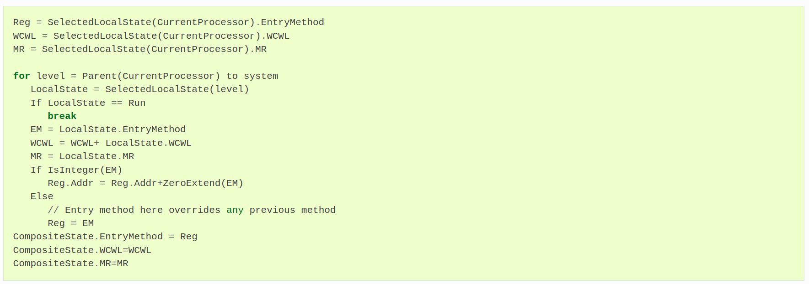{width="50%"}

    OS Initiatedモードでは、OSPMが、呼び出し元のプロセッサがどの階層レベルで最後にアイドル状態になり、電源状態を要求するかをプラットフォームに伝える必要もある。これを行うために、上記のアルゴリズムは以下のように変更される：

    

    プラットフォーム協調システムでは、プロセッサレベルより上の階層ノードに属す LPI が、そのエントリメソッドとして整数値 0 を使用することが可能である。エントリメソッドの構成は加算によって行われるため、この場合、そのステートのエントリコマンドは、子ステートのみを含む複合ステートと同じになる。エントリ値0は、基本的にステートを "自動プロモータ可能 "と識別する。これは、OSが明示的にこのステートへのエントリを要求するのではなく、全ての子ステートがEPSプロパティに基づいて親ステートを許可するステートに入ったときに、プラットフォームが自動的にこのステートに入ることができることを意味する。OSPMは、オートプロモータブルローカルステートを含むコンポジットステートを含む場合、他のパラメータ (最悪のウェイクアップレイテンシ、最小レジデンシーなど)については通常のコンポジション手順に従うべきである。

    これは次の例で説明する：

    

    

    上記の例では、CPUOとCPU1上のOSPMは以下の複合状態を選択できる：

    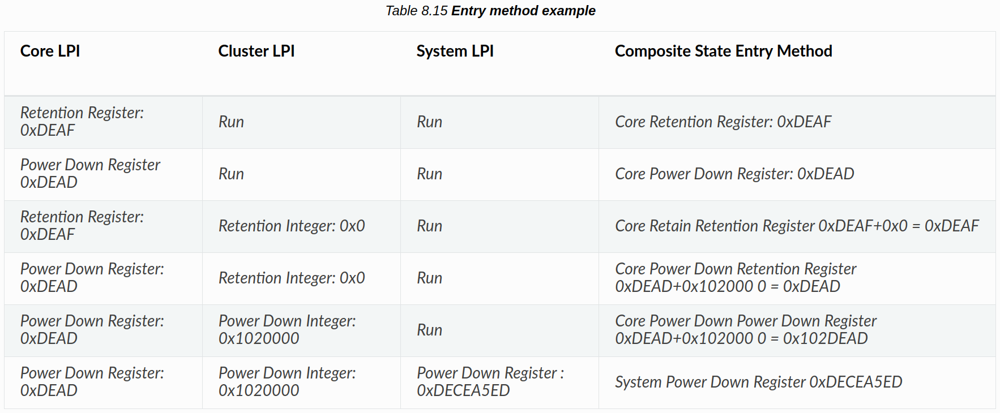{width="50%"}

    この例でわかるように、クラスタレベルのリテンション状態は、そのエントリ方法として整数値0を定義している。構成により、これは、複合状態Core Power DownとCore Power Down|Cluster Retentionのエントリメソッドが同じ (FFHレジスタOxDEAD)であることを意味する。同様に、Core RetentionとCore Retention|Cluster Retentionの複合状態は同じである (FFHレジスタOxDEAF)。その結果、CPU0とCPU1の両方がパワーダウンまたはパワーリテンションにある場合、プラットフォームはクラスタCLUOからリテンションに入る可能性がある。

    この例では、上位レベルのレジスタベースのエントリメソッドが、下位レベルのエントリメソッド定義をどのように上書きするかも示している。これは、選択されたLPIが全ての下位レベルにおいて特定のLPIを意味する場合にのみ可能である。この例では、FFH レジスタ 0xDECEA5ED から入力されたシステムパワーダウン LPI は、コアおよびクラスタレベルのパワーダウン LPI を意味する。

    #### 8.4.3.3.5. Architecture Specific Context Loss Flags

    インテルベースのシステムでは、このフラグレジスタの値は0である。

    ARMベースのシステムについては、「ARM FFH仕様」の見出しにあるACPI関連文書(http://uefi.org/acpi)へのリンクを参照してください。

    #### 8.4.3.3.6. Residency and Entry Counter Registers

    LPI ステート記述は、OSPM が特定のローカルステートのプラットフォーム使用に関する統計情報を収集できるように、 オプションで残留レジスタと使用回数レジスタを提供できる。両レジスタは、それぞれの統計の実行カウントを提供する。ある時間ウィンドウにわたって統計を測定するには、OSPMは開始時と終了時にサンプリングし、その差分を計算する必要がある。様々な種類のリセット/ステート終了時にカウンタが0から再スタートするかどうかは実装で定義されているため、OSPMはリセットまたはSx終了時にベースラインを再同期する必要がある。

    レジスタはオプションであり、その機能がない場合、プラットフォームは以下の形式のNULLレジスタを使用しなければならない：

    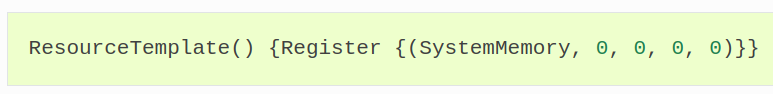{width="50%"}

    Usage Countレジスタは、ローカルステートが何回使用されたかをカウントする。エントリとエグジットのどちらをカウントするかは、実装で定義される。

    Residencyレジスタは、LPIのResidency Counter Frequencyフィールドで指定された割合で、 階層ノードが指定されたLPI状態にある時間をカウントする。頻度 0 は、カウンタがアーキテクチャ固有の頻度で動作することを示す。残留カウンタがローカル状態の間継続的に実行されるか、終了時にのみ更新されるかは、実装で定義される。OSPM が特定の状態の読み取り値が最新であることを保証したい場合は、そのプロセッサ自身 (または上位のアイドル状態の場合は下位の子プロセッサの1つ)から読み取る必要がある。

    #### 8.4.3.3.7. Wake from LPI States

    LPIでは、バスクロックや割り込みコントローラなどの基本的なリソースをオフにする可能性のある深いSOアイドル状態を記述できるため、これらの状態からプラットフォームがウェイクアップできるように特別な注意を払う必要がある。このセクションでは、デバイスが開始するウェイクの処理について説明する。タイマのようなウェイクソースは他にもあるが、それは別の場所で説明する。

    デバイスのウェイクの場合、OSPM は、ウェイクが有効なデバイスがシステムをウェイクするのを妨げるような LPI ステートに入ってはならない。これは、_RDI(アイドルのリソース依存性)の項を参照)に記載されているパワーリソースがオンである必要がある LPI 状態に入らないことを意味する。プラットフォーム協調システムでは、RDIにリストされたリソースがオンであっても、OSPMは_LPI状態を選択できる。しかし、OSPM がすでにデバイスのウェイクを有効にしており、ウェイクに必要な電源リソースがオンであることを確認している場合、プラットフォームは LPI 状態を当該リソースがオンのままである状態に降格させる。

    ウェイクデバイスは、標準の _PRx および _PRRW メソッドを使用して、その D ステートとウェイクイネーブル状態に基づいて、オンであることが必要な電源リソースを記述する。さらに、LPI 状態の一部としてオフにされる可能性のあるリソースに依存するウェイク有効デバイスは、 _PRx/_PRW =>_RDI $=>$ _LPI によってその依存関係を記述しなければならない。

    これは次の例で説明する：

    

    上記の例では、電力リソースのセット (PWRA/B/C/D)を宣言している。さらに、以下の依存関係を持つ4つのシステムレベルローカルステートがある：

    - LPI 1: 電力リソースに依存しない
    - LPI 2: PWRAとPWRBがオフであることが必要
    - LPI 3: PWRA、PWRB、PWRCがオフであることが必要
    - LPI 4: 例の全ての電源リソースをオフにする必要がある。

    デバイスBAHがシステムをウェイクアップできるのは、それがDO状態にある場合のみである。DO 状態であるためには、PWRA、PWRB、PWRC がオンである必要がある。従って、デバイス BAH は LPI 1 からしかシステムをウェイクアップできない。このデバイスがウェイクアップに有効な場合、プラットフォームは LPI 2 以上になってはならない。

    デバイス BAR は、システムが D3Cold 以外のデバイス状態にある間にウェイクインできる。ただし、そのためには PWRC がオンである必要がある。従って、LPI 1 または LPI 2 からしかシステムをウェイクアップできない。このデバイスがウェイクアップに有効になっている場合、プラットフォームは LPI 3 以上になってはいけません。

    デバイスFOOは、どのデバイスの状態であってもシステムをウェイクアップできる。ただし、そのためには PWRD がオンである必要がある。したがって、LPI 1 または LPI 2 または LPI 3 からしかシステムをウェイクアップできない。

    #### 8.4.3.3.8. Default Idle State

    階層内の各リーフノードの最も浅いアイドル状態は、そのプロセッサの「デフォルト」アイドル状態であり、常に入力可能であると仮定される。この状態の最悪の場合のウェイクアップレイテンシと最小残留時間は、OSPMがこの状態を使用するかどうかを決定する際に考慮する必要がないほど低くなければならない。プロセッサを電源状態にする以外には、この状態はソフトウェアから見える効果を持たない。例えば、OSPMが保存/復元しなければならないコンテキストを失ったり、デバイスに依存したりすることはない。

    ### 8.4.3.4._RDI (Resource Dependencies for Idle)

    プラットフォームによっては、デバイスとプロセッサの間で共有される電力リソースがある場合がある。抽象的には、これらのリソースは2段階で管理される。まず、OSは通常の電源リソースの参照カウントを行い、全てのデバイス依存が満たされ、デバイスの観点からリソースが電源管理されたことを検出する。次に、プロセッサもアイドルになると、OSは特定のLPI状態へのマイグレーションを要求し、プラットフォームはマイグレーションの一部としてリソースを物理的にパワー管理する。電源リソースと LPI 状態の間の依存関係は、_RDI に記述されている。

    RDIオブジェクトは、システムのプロセッサ階層を記述するルートプロセッサコンテナにのみ存在できる。複数のルートノードを持つシステムでは、_RDIはサポートされない。RDIは、システム内の全てのプロセッサを包含する単一のトップレベルコンテナでのみ有効である。

    OSPMはルートノード以外のノードに存在する_RDIオブジェクトを無視する。この単純化により、あるプロセッサがデバイスの状態や電力リソースを変更している間に、ある階層のプロセッサがリソース依存のアイドル状態を選択するような複雑な競合を避けることができる。

    **Arguments:**

    None

    **Return Value**

    以下のフォーマットを持つリソース依存関係を含む可変長のPackage：

    **Return Value Information**

    

    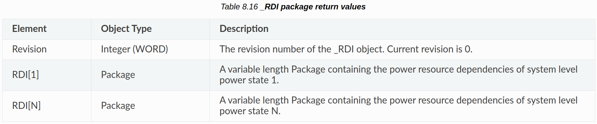{width="50%"}

    各 RDI[x]サブパッケージには、電力リソースへの参照が可変数含まれている：

    

    パッケージには、ルートプロセッサコンテナノードの_LPIオブジェクト内のシステムレベルのパワーステートの数と同じ数のRDIパッケージが含まれる。この_LPIオブジェクトのLPIパワーステートのインデックス付けは、_RDIオブジェクトのRDIパッケージのインデックス付けと一致している。したがって、システムレベルのn番目のLPI状態には、n番目のRDIにリストされたリソース依存関係がある。各 RDI パッケージは、プラットフォームが LPI 状態に入るために OFF 状態でなければならない電源リソースオブジェクト (パッシブ電源リソースまたは標準電源リソース)のリストを返す。システムレベルの LPI にリソース依存がない場合、対応する RDI は空のパッケージでなければならない。

    従来の電力リソースと受動的な電力リソースの両方を、_RDI に依存関係として列挙できる。従来の電源リソースの場合、OSPM は依存 LPI 状態を要求する前に、リソースが OFF であることを確認する。パッシブ電源リソースの場合、_ON/_OFF/_STA メソッドは存在しないため、依存 LPI 状態を要求する前に参照カウントが 0 であることを確認することだけが必要である。

    デバイス/電力リソースの遷移と電力リソースに依存する LPI 状態間の順序に関する OSPM 要件は、調整スキームによって異なる。

    プラットフォーム協調システムでは、プラットフォームは正しさを保証し、要求された電源状態を、 リソースとプロセッサの依存関係を満たすものに降格させなければならない。OSPM は、_RDI の依存情報を適切なように使用することができ、リソースがオンのままであっても、依存 LPI 状態を選択できる。

    OS が起動したシステムにおいて、OSPM は、依存 LPI ステートを要求する前に、全ての電力リソースがオフであること  (または、受動的な電力リソースの場合は参照カウントが 0 であること)を保証しなければならない。

    ??? example "_RDI Example"
        以下の ASL は、_RDI を使用して、3 つの電源リソースとシステムレベルの電源状態の間の依存関係を記述するシステムを説明する：

        

    OSPMは、参照カウントが0になるのを待ち (DEVAがDOから離れたことを意味する)、_OFFメソッドを実行することで、従来のパワーリソース (PWRA)をONまたはOFFにする。同様に、PWRBはDEVBの状態に基づいてON/OFFされる。CPUが動作している間は共有パワーレールがONである必要があるため、PWRBの_ONと_OFFはパワーレールの物理的なHW制御ではなく、投票によって駆動されることに注意されたい。この場合、_STAはPWRBの物理的な状態ではなく、投票の状態を反映する。

    OSPMは、PWRA/PWRBの_ONおよび_OFF遷移と、DEVA/DEVBのDステート遷移との間の順序を保証する。つまり、PWRAはDEVAがDOを出た後にのみOFFにすることができ、DEVAをDOに遷移させる前にONにしなければならない。ただし、電源リソースの遷移と電源リソースに依存する LPI ステート間の順序に関する OS の要件は、調整方式によって異なる。

    プラットフォーム協調システムでは、OSPMはローカルステート2または3を選択する前にPWRAの電力状態を追跡してもしなくてもよい。プラットフォームは、ローカルステート2または3に入る前にPWRAがOFFであることを独自に保証しなければならず、PWRAがまだONの時にOSPMがローカルステート2または3を選択した場合、より浅い状態に降格しなければならない。OSPM はデバイスの電源遷移と電源リソースの遷移を正しくシーケンス化する必要があるため、プラットフォームは DEVA の状態を確認する必要はなく、PWRA の状態から DEVA が適切な D ステートにあることを推測できる。

    同様に、OSPMはローカル状態3を選択する前にPWRBとPWRCの状態を追跡してもしなくてもよく、プラットフォームはいずれの状態に入る前にもPWRBがオフであることを独自に保証しなければならない。PWRCは受動的な電力リソースであるため、プラットフォームは電力リソースの参照カウントがいつ0になるかを知らない。プラットフォームがDEVCの状態を追跡する他のメカニズムを持っていない限り、プラットフォームが動作の正しさを保証するために_ONおよび_OFFメソッドを使用できるように、PWRCは従来のパワーリソースとして定義されるべきである。

    OSが起動するシステムでは、OSPMはローカルステート2または3を選択する前にPWRAがOFFであることを保証する必要がある。OSPMは、PWRAの状態を確認する前に、プロセッサがシステム内で最後のマンダウンになったと確信するまで待ち、この場合にのみローカルステート2または3を選択することで、この保証を満たすことができる。そのプロセッサが最後のマンダウンであった場合、ローカルステート2または3に入る要求は合法であり、プラットフォームはそれを尊重できる。その間に別のプロセッサが起きてPWRAをオンにした場合、これはプロセッサ間の競争になり、OS Initiated Request Semanticsのセクションで扱われる (OS Initiated Request Semantics)。同様に、OSPMはローカル状態3を選択する前に、PWRBがオフでPWRCの参照カウントが0であることを保証しなければならない。

    OS が開始するシステムでは、OSPM は、システム電源状態を選択する前に、電源リソースが正しい状態にあることを保証するため、電源リソースを OFF にすることによる実行時消費電力の削減がない限り、プラットフォームは受動電源リソースを使用すべきである。OS が開始する遷移のみをサポートするプラットフォームでは、PWRB はプロセッサと共有され、システム電源状態に入ったときのみオフにできるため、パッシブ電源リソースとして定義されるべきである。

    ### 8.4.3.5. Compatibility

    新しいアイドル管理インフラストラクチャをサポートしていない古いOSをサポートするために、_OSCメソッドを使用して、OSPMがLPIと(_LPI,_RDI)に関連付けられたプロセッサコンテナとオブジェクトの解析をサポートしているかどうかを検出できる。これについては_OSCを評価するルールに記述されている。

    プラットフォームは、_LPIをサポートしていないOSとの後方互換性のために、_CSTと_LPIの両方を公開することを選択できる。この場合、OSPMが_LPIをサポートしていれば、_CSTよりもそちらを優先して使用すべきである。実行時には、プロセッサ階層全体で_LPIまたは_CSTのどちらか1つのアイドル状態メソドロジのみを使用する。

??? quote "Processor Throttling Controls関連。P_CNTレジスタを使うので、一旦省略"

    ## 8.4.4. Processor Throttling Controls

    ACPIは、2つのプロセッサスロットル ( $T$ 状態)制御インタフェースを定義している。これらは

    - プロセッサレジスタブロック (P_BLK)のP_CNTレジスタ。
    - プロセッサのオブジェクトリストにある_PTC、_TSS、_TPCオブジェクトを合わせたもの。

    P_BLKベースのスロットリング状態制御は、ACPIハードウェア仕様に記載されている。PTC、_TSS、および_TPCベースのスロットリング状態制御を組み合わせることで、 $P_{-} B L K$ ベースの制御の機能が拡張され、 $T$ 状態の数を動的に変更できるようになり、機能固定ハードウェアアドレス空間を使用して定義されたレジスタによって示されるCPUアーキテクチャ固有の $T$ 状態制御メカニズムに対応できるようになる。PTC、_TSS、および_TPC オブジェクトのプラットフォーム定義は任意であるが、OSPM がこれらの制御によってプロセッサスロットルを正常に実行するには、3 つのオブジェクトが全てプロセッサの下に存在する必要がある。

    ### 8.4.4.1._PTC (Processor Throttling Control)

    PTCは、ACPIハードウェア仕様に記載されているI/Oアドレス間隔ベースの $\mathrm{P}_{-} B L K$ スロットリング制御レジスタ (P_CNT)に代わるプロセッサスロットリング制御インタフェースを定義するオプションのオブジェクトである。

    OSPM は、_PTC オブジェクトによって定義されたスロットリング制御レジスタ (THROTTLE_CTRL) に、スロットリング対応状態オブジェクト (_TSS) から取得したターゲットスロットリング状態 (T-state) の制御フィールド値を書き込むことで、プロセッサのスロットリング制御を実行する。OSPM は、_TPC 制御メソッドによって返される値によって利用可能であると示される、任意のプロセッサスロットリング状態を選択できる。

    プロセッサのスロットリング状態遷移の成否は、スロットリングステータスレジスタ (THROTTLE_STATUS) を読み出して、プロセッサの現在のスロットリング状態を決定することによって決定される。マイグレーションが成功した場合、THROTTLE_STATUSから読み出された値は、ターゲットとなるプロセッサのスロットリング状態に対応する_TSSエントリの「Status」フィールドと一致する。

    **Arguments:**

    なし

    **Return Value:**

    以下のパッケージ

    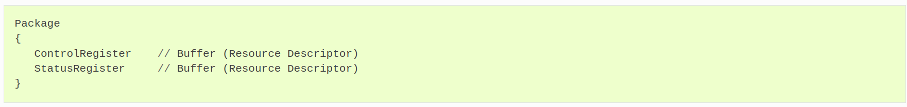{width="50%"}

    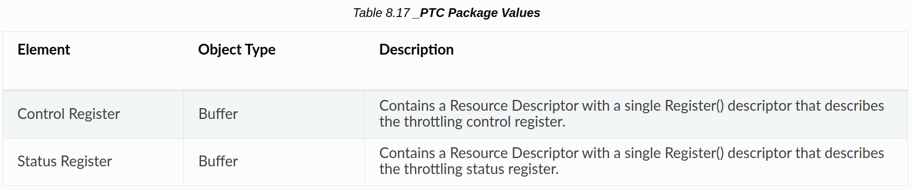{width="50%"}

    プラットフォームは、そのプロセッサの全てまたはいずれかについて _PTCオブジェクトを公開しなければならない。PTCオブジェクトが存在する場合、プロセッサ項で指定されたP_CNTレジスタの代わりに、指定されたレジスタが使用されることに注意。また、_PTCオブジェクトが存在し、_CSTオブジェクトが存在しない場合、OSPMは_PTCオブジェクトのプロセッサ制御レジスタとP_BLKのP_LVLxレジスタを使用することに注意。

    ??? example
        これは、Processorオブジェクトリストにおける_PTCオブジェクトの使用例である：

        {width="50%"}

    ??? example
        これは、ACPI 1.0で定義された値を使用した_PTCオブジェクトの使用例である。これは、よく知られた値を使ってメカニズムを示すための例示である。

        {width="50%"}

    ### 8.4.4.2. _TSS (Throttling Supported States)

    このオプションのオブジェクトは、プラットフォームがサポートするプロセッサスロットリングステートの数を OSPM に示す。このオブジェクトは、内部CPUコア周波数の最大値のパーセンテージ、最大消費電力、スロットリング状態間の遷移に必要な制御レジスタ値、OSが開始した遷移変更要求後にOSPMがスロットリング状態の遷移状態を確認できるようにするステータスレジスタ値など、利用可能なスロットリング状態に関する情報のパッケージ化されたリストとして評価される。このリストは、消費電力が小さい順にソートされている。その結果、0 番目のエントリは最高性能のスロットリング状態 (スロットリングは適用されない) を表し、「 $n$ th」エントリは最低性能のスロットリング状態 (最大スロットリングが適用される) を表す。

    TSSを提供する場合、プラットフォームはPercentフィールド値が100である_TSSエントリを提供しなければならない。これはOSPMがスロットリングを無効にして最大のパフォーマンスを得るための手段である。

    **Arguments:**

    なし

    **Return Value:**

    以下に説明するTstateサブパッケージのリストを含む可変長パッケージ。

    

    各Tstateサブパッケージには、以下の要素が含まれる。

    

    {width="50%"}

    ### 8.4.4.3. _TPC (Throttling Present Capabilities)

    このオプションのオブジェクトは、プラットフォームが現在サポートしているスロットリング状態の数を OSPM に動的に示すメソッドである。このメソッドは、ある時点で OSPM が使用できる最も高いパワーのスロットリング状態の _TSS エントリ番号を示す数値を返す。OSPM は、_TPC メソッドによって返された値によって示される _TSS の対応するステートエントリか、_TSS の中のより低いパワー (より高い番号)のステートエントリを選択できる。

    **Arguments:**

    なし

    **Return Value:**

    サポートされている状態の数を含む整数：

        0- 状態 $0 \ldots$ n番目の状態が利用可能 (全ての状態が利用可能)

        1- 状態 $1 \ldots$ n番目の状態が使用可能

        2- 状態2 ... n番目の状態が利用可能

        ..

        $n$- state $n$ available only

    TPCオブジェクトの動的な変更をサポートするために、0x82型のプロセッサオブジェクトに対するNotifyイベントは、プロセッサのオブジェクトリスト内の任意の_TPCオブジェクトをOSPMに再評価させる。これにより AML コードは、非同期イベントの結果、サポートされるスロットリング状態の数が変更された場合に OSPM に通知できる。OSPM は、プラットフォームが OSPM による P ステートの使用を最低消費電力の P ステートに制限していない限り、P ステートをサポートするプラットフォーム上の _TPC Notify イベントを無視する。OSPM は、プラットフォームが最低消費電力の P ステート以外の OSPM の使用を許可している場合、プラットフォームから伝達された T ステートの制限を無視することを選択できる。

    ### 8.4.4.4. _TSD (T-State Dependency)

    このオプションのオブジェクトは、OSPMにTステート制御の論理プロセッサ間の依存情報を提供する。TSDオブジェクトは、一連の論理プロセッサ間のTステート制御依存関係を表す1つのエントリを含むパッケージ化されたリストに評価される。

    **Arguments:**

    なし

    **Return Value:**

    以下に説明されるように、T-state依存Packageからなる一つのエントリを含むPackage。

    {width="50%"}

    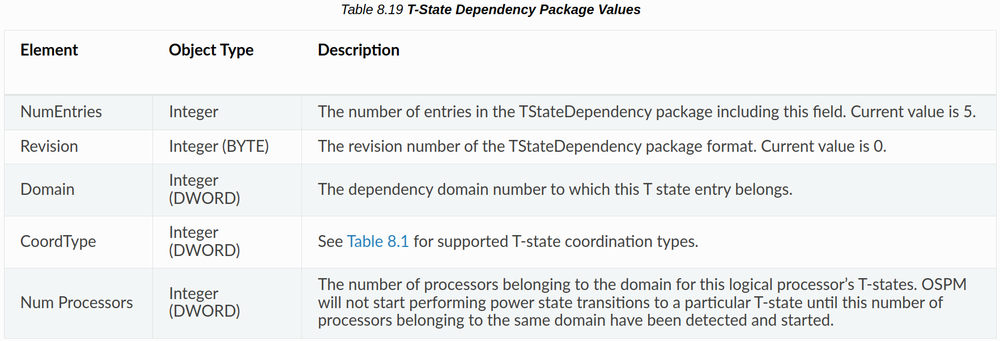{width="50%"}

    ??? example
        これは、名前空間の Processor 構造体における _TSD 構造体の使用例である。この例は、プロセッサごとに 3 つの T ステートを持つ 2 つのプロセッサ構成を表している。全てのTステートについて、2つのプロセッサ間には依存関係があり、一方のプロセッサが特定のTステートに遷移すると、もう一方のプロセッサも同じTステートに遷移する。OSPMは、2つのプロセッサ間のTステート遷移を調整する必要があり、どちらかのプロセッサ上で遷移を開始し、両方を共通のターゲットTステートに遷移させることができる。

        長いので省略

    ### 8.4.4.5. _TDL (T-state Depth Limit)

    このオプションのオブジェクトは、OSPMが使用する可能性のある最低電力スロットリング状態の_TSSエントリ番号と評価される。TDLは、OSPMが不利な熱状態を緩和するためにプロセッサのスロットリング制御を使用して実行する性能低下の量を、プラットフォームが制限することを可能にする。OSPMは、_TDLオブジェクトが返す値で示される_TSS内の対応するステートエントリ、または_TPCオブジェクトが返す_TSSエントリ番号またはテーブルの最初のエントリ (__PCが実装されていない場合)を含む、_TSS内のより高性能な (番号の小さい)ステートエントリを選択できる。TDLオブジェクトが返す値は、_TPCオブジェクトが返す値、または_TPCが実装されていない場合は_TSSの最後のエントリに対応する値以上でなければならない。TDLオブジェクトと_TPCオブジェクトの評価によって返される値が競合する場合、OSPMは_TPCオブジェクトを優先し、消費電力を制限する。

    **Arguments:**

    なし

    **Return Value:**

    Throttling Depth Limit_TSSのエントリ番号を含む整数：

        0- スロットリング無効。

        1- ステート1は、利用可能な最低電力のTステートである。

        2- ステート2は、利用可能な最低電力のTステートである。

        ..

        $n$- state $n$ is the lowest power T-state available.

    プラットフォームが OSPM で使用可能なパフォーマンス低減の限界を動的に示すために、0x82 型のプロセッサオブジェクトに対する Notify イベントは、プロセッサのオブジェクトリスト内の _TDL オブジェクトを OSPM に再評価させる。これにより AML コードは、非同期イベントの結果、サポートされるスロットリング状態の数が変更された場合に OSPM に通知できる。OSPM は、プラットフォームが OSPM による P ステートの使用を最低消費電力の P ステートに制限していない限り、P ステートをサポートするプラットフォーム上の _TDL Notify イベントを無視する。OSPMは、プラットフォームが最低消費電力のPステート以外のOSPM使用を許可している場合、プラットフォームから伝達されたTステート深度制限を無視することを選択できる。

## 8.4.5. Processor Performance Control

プロセッサパフォーマンス制御は、3つのオプションオブジェクトを通して実装され、そのオブジェクトの存在は、プラットフォームとCPUが複数のパフォーマンス状態をサポートできることをOSPMに示す。プロセッサパフォーマンス制御が実装されている場合、プラットフォームは3つのオブジェクトを全て提供しなければならない。プロセッサパフォーマンスコントロールオブジェクトは、サポートされるプロセッサのパフォーマンス状態を定義し、プロセッサを特定のパフォーマンス状態にすることを可能にし、システム上で現在利用可能なパフォーマンス状態の数を報告する。

マルチプロセッシング環境では、全てのCPUが同じ数のパフォーマンスステートをサポートし、各プロセッサのパフォーマンスステートが同一のパフォーマンスと消費電力パラメータを持っている必要がある。OSPMがこの機能を利用するためには、システム内の各プロセッサオブジェクトの下にパフォーマンスオブジェクトが存在する必要がある。

プロセッサパフォーマンスコントロールオブジェクトには、以下に詳述する'_PCT'パッケージ、'_PSS'パッケージ、および'_PPC'メソッドが含まれる。

### 8.4.5.1. _PCT (Performance Control)

このオプションのオブジェクトは、OSPM がプロセッサをパフォーマンス状態にマイグレーションさせるためのインタフェースを宣言する。OSPM は、パフォーマンスコントロールレジスタ (PERF_CTRL)にパフォーマンス状態固有の制御値を書き込むことで、プロセッサのパフォーマンス遷移を実行する。

OSPM は、_PPC メソッドによって返されるパフォーマンスステート値によって示されるプロセッサパフォーマンスステート、または任意の低電力 (高番号)ステートを選択できる。書き込む制御値は、対応する_PSSエントリの "Control "フィールドに含まれる。

プロセッサパフォーマンスマイグレーションの成否は、パフォーマンスステータスレジスタ (PERF_STATUS)を読み込んで、プロセッサの現在のパフォーマンス状態を判断することによって決定される。マイグレーションが成功した場合、PERF_STATUS から読み出された値は、希望するプロセッサパフォーマンス状態に対応する PSS エントリの「Status」フィールドと一致する。

**Arguments:**

なし

**Return Value:**

以下のパッケージ

{width="50%"}

??? example
    

### 8.4.5.2. _ PSS (Performance Supported States)

このオプションのオブジェクトは、任意のシステムがサポート可能なプロセッサパフォーマンス状態の数を OSPM に示す。このオブジェクトは、内部CPUコア周波数、標準的な消費電力、パフォーマンスステート間のマイグレーションに必要なコントロールレジスタ値、OS主導のマイグレーション変更要求後にOSPMがパフォーマンスマイグレーションステータスを確認するためのステータスレジスタ値など、利用可能なパフォーマンスステートに関する情報をパッケージ化したリストとして評価される。このリストは、標準的な消費電力の降順でソートされている。その結果、0 番目のエントリには最も高い性能状態が記述され、「 $n$ th」エントリには最も低い性能状態が記述される。

**Arguments:**

なし

**Return Value:**

以下のPstateサブパッケージのリストを含む可変長パッケージ。

{width="50%"}

各Pstateサブパッケージには、以下の要素が含まれている：

{width="50%"}

{width="50%"}

### 8.4.5.3. _PPC (Performance Present Capabilities)

このオプションのオブジェクトは、プラットフォームが現在サポートしているパフォーマンスステートの数を OSPM に動的に示すメソッドである。このメソッドは、ある時点で OSPM が使用できる最高のパフォーマンス状態の _PSS エントリ番号を示す数値を返す。OSPMは、_PPCメソッドが返す値で示される_PSS内の対応するステートエントリ、または_PSS内のより低いパワー (より高い番号)のステートエントリを選択できる。

**Arguments:**

なし

**Return Value:**

サポートされる状態の範囲を含む整数

    0- 状態0からn番目の状態が利用可能 (全ての状態が利用可能)

    1- 状態1からn番目の状態が利用可能

    2- 状態2からn番目の状態が使用可能

    $n$- State $n$ is available only

PPCオブジェクトの動的な変更をサポートするために、プロセッサオブジェクトに対するNotifyイベントが許可されている。タイプ0x80のNotifyイベントは、通知された特定のプロセッサオブジェクトの下に存在する_PPCオブジェクトをOSPMに再評価させる。これにより、非同期イベント (AC の挿入/取り外し、ドッキング、ドッキング解除など)の結果、サポートされるステートの数が変更された場合に、AML コードが OSPM に通知できるようになる。

#### 8.4.5.3.1. OSPM _OST Evaluation

PPCオブジェクトの評価処理が完了すると、OSPMは、プロセッサデバイスの下に_OSTオブジェクトが存在する場合、_OSTオブジェクトを評価し、_PPC評価ステータスをプラットフォームに伝えます。

**Arguments:**

Arg0- ソースイベント (整数) ：0x80 Arg1- ステータスコード(整数) : 以下を参照。

**Return Value:**

なし

**Argument Information:**

Arg1- ステータスコード 0: 成功- OSPMは指定されたパフォーマンス状態を使用している。

??? example
    これは、プロセッサオブジェクトリスト内のプロセッサパフォーマンスコントロールオブジェクトの例である。

    この例では、以下の3つの性能状態をサポートするプロセッサ性能機能を持つユニプロセッサプラットフォームを想定している：

    1. $500 \mathrm{MHz}(8.2 \mathrm{~W})$ は随時対応
    2. $600 \mathrm{MHz}$  (14.9W)はAC電源供給時のみ対応
    3. $650 \mathrm{MHz}(21.5 \mathrm{~W})$ はドッキング時のみ対応

    あるパフォーマンス状態から他のパフォーマンス状態にマイグレーションするのに500マイクロ秒以上かかることはない。

    パフォーマンス遷移中、バスマスタは最大300マイクロ秒間、メモリにアクセスできない。

    PERF_CTRLとPERF_STATUSレジスタは機能固定ハードウェアとして実装されている。

    システム内には以下のASLオブジェクトが実装されている：

    _SB.DOCK：システムがドッキングしていれば1、そうでなければ0と評価される。

    _SB.AC：ACが接続されていれば1、そうでなければ0と評価される。

    {width="50%"}

    プラットフォームは、利用可能なプロセッサ性能状態の数が変化したときに、このオブジェクトを再評価するように OSPM に通知するために Notify(_SB.CPU0, Ox80) を発行する。

### 8.4.5.5. _PSD (P-State Dependency)

このオプションのオブジェクトは、パフォーマンスコントロール、Pステート、またはCPPCの論理プロセッサ依存情報をOSPMに提供する。PSDオブジェクトは、論理プロセッサのセット間のパフォーマンス制御の依存関係を表す1つのエントリを含むパッケージ化されたリストに評価される。

**Arguments:**

なし

**Return Value:**

後述のP-state依存Packageからなる一つのエントリを持つPackage。

{width="50%"}

PStateDependency サブパッケージには、以下の要素が含まれる：

{width="50%"}

{width="50%"}

??? example
    これは、名前空間の Processor 構造体における _PSD 構造体の使用例である。この例は、プロセッサごとに 3 つのパフォーマンス状態を持つ 2 つのプロセッサ構成を表している。全てのパフォーマンス状態において、2つのプロセッサ間には依存関係があり、一方のプロセッサが特定のパフォーマンス状態に遷移すると、もう一方のプロセッサも同じパフォーマンス状態に遷移する。OSPMは、2つのプロセッサ間のPステートの遷移を調整する必要があり、どちらかのプロセッサで遷移を開始することで、両方を共通のターゲットPステートに遷移させることができる。

    {width="50%"}

### 8.4.5.6. _PDL (P-state Depth Limit)

このオプションのオブジェクトは、OSPMがパッシブ熱制御を実行する際に使用する可能性のある最も低い性能のPstateのPSS $^{2}$ エントリ番号に評価される。OSPMは、_PDLオブジェクトによって返される値によって示される_PSS内の対応する状態エントリ、または_PPCオブジェクトによって返される_PSSエントリ番号またはテーブル内の最初のエントリ (_PPCが実装されていない場合)を含む、_PSS内のより高い性能 (より低い番号)の状態エントリを選択できる。PDL オブジェクトによって返される値は、_PPC オブジェクトによって返される値、または _PPC が実装されていない場合は _PSS の最後のエントリに対応する値以上でなければならない。PDLオブジェクトと_PPCオブジェクトの評価によって返される値が競合する場合、OSPMは_PPCオブジェクトを優先し、消費電力を制限する。

**Arguments:**

なし

**Return Value:**

    P-state Depth Limit _ PSSエントリ番号を含む整数：

    0- POは、OSPMで使用可能な唯一のPステートである。

    1- 状態1は、利用可能な最低電力のP状態である。

    2- ステート2は、利用可能な最低電力のPステートである。

    $n$- state $n$ is the lowest power P-state available

プラットフォームが P ステート深度制限の変更を動的に示すために、0x80 タイプのプロセッサオブジェクトに対する Notify イベントは、プロセッサのオブジェクトリスト内の _PDL オブジェクトを OSPM に再評価させる。これにより、非同期イベントの結果、サポートされるパフォーマンスステートの数が変更された場合に、AMLコードがOSPMに通知できるようになる。I

??? quote "Collaborative Processor Performance Control関連。一旦スルー"

    ## 8.4.6. Collaborative Processor Performance Control

    !!! note
        なにこれ。周波数でよくね？

    協調プロセッサ性能制御は、論理プロセッサの性能を管理するためにOSPMがプラットフォーム内のエンティティと協調するための抽象化された柔軟なメカニズムを定義する。この方式では、プラットフォームエンティティが、連続的で抽象的なユニットレスの性能スケールを裏付ける性能定義の作成と維持に責任を持つ。ランタイム中、OSPMはこの抽象的なスケール上で希望するパフォーマンスを要求し、プラットフォームエンティティはOSPMの要求するパフォーマンス定義に変換する責任を負う。
    性能要求を実際のハードウェア性能状態に変換する。プラットフォームは、現在のワークロードに適したパフォーマンスレベルを自律的に選択する機能をサポートすることもできる。この場合、OSPMはプラットフォームのパフォーマンスレベル選択をガイドする情報をプラットフォームに伝える。

    先行するプロセッサ性能制御 (PステートとTステート)は、プロセッサ性能への影響をプロセッサ周波数という観点から説明してきた。プロセッサの周波数は、プロセッサが作業を完了する速度の大まかな近似値であるが、ワークロード性能は周波数によってスケールすることは保証されていない。そのため、コラボレーティブプロセッサパフォーマンスコントロールでは、プロセッサ性能の特定の指標を規定するのではなく、正確な性能指標の定義をプラットフォームに委ねます。プラットフォームは、プロセッサ周波数のような単一のメトリックを使用することを選択することもできるし、複数のハードウェアメトリックをブレンドしてパフォーマンスの総合的な尺度を作成することを選択することもできる。このように、プラットフォームは、必ずしも特定のプロセッサ周波数を提供しなくても、OSPMが要求する性能レベルを自由に提供できる。OSPMは、プラットフォームが提示する性能値の正確な意味や、プロセッサ周波数のような特定のハードウェアメトリクスとの相関関係について、一切仮定してはならない。

    プラットフォームは、システム内の全てのプロセッサに同じ性能スケールを使用しなければならない。ヘテロジニアスプロセッサを持つプラットフォームでは、全てのプロセッサの性能特性が同じとは限らない。この場合、プラットフォームはプロセッサの違いを調整する性能スケールを合成し、同じ性能レベルで同じワークロードを実行する2つのプロセッサがほぼ同じ時間で完了するようにしなければならない。プラットフォームは、各プロセッサの性能特性を正確に反映するために、プロセッサのクラスごとに異なる能力を公開する必要がある。

    制御メカニズムは_CPCオブジェクトメソッドによって抽象化されており、一般的な方法でプロセッサのパフォーマンスを制御および監視する方法が記述されている。レジスタメソッドは、プラットフォーム通信チャネル (PCC)インタフェースに実装できる (プラットフォーム通信チャネル (PCC)を参照)。これにより、OSPMが通信する相手がプロセッサ自身であったり、プラットフォームチップセットであったり、別のエンティティ (BMCなど)であったりする柔軟性が提供される。

    プロセッサ性能を周波数として報告する既存のツールとの後方互換性を提供するために、_CPC オブジェクトは、OS が使用するプロセッサ周波数範囲の値をオプションで提供できる。OSPMはプラットフォームから提示された性能値の正確な意味について仮定してはならず、プラットフォームとの全ての機能的な決定や対話は、依然として抽象的な性能スケールを使用して行われる。周波数値が_CPCオブジェクトに含まれるのは、OSが性能データを単純な周波数範囲で提示できるようにするためだけであり、周波数が他のメカニズムによってプラットフォームから発見できない場合である。

    ### 8.4.6.1. _CPC (Continuous Performance Control)

    このオプションのオブジェクトは、OSPMが連続した許容値の範囲に基づいてプロセッサをパフォーマンス状態にマイグレーションさせるためのインタフェースを宣言する。OSPMは希望する性能値をDesired Performance Registerに書き込み、プラットフォームは希望する性能を内部性能状態にマッピングする。プラットフォームがサポートしている場合、OSPMは代わりに、最小および最大性能要件を指定しながら自律的な性能レベル選択を可能にすることもできる。

    {width="50%"}

    **Arguments:**

    なし

    **Return Value:**

    パフォーマンスコントロール情報を含むパッケージ。

    パフォーマンスコントロールパッケージには、以下の要素が含まれる：

    {width="50%"}

    {width="50%"} ※長いので省略した

    CPCオブジェクトは、OSPMにプラットフォーム固有のパフォーマンス能力/閾値と、OSPMがプラットフォームのプロセッサパフォーマンス設定を制御するために使用するコントロールレジスタを提供する。これらについては以下のセクションで説明する。プラットフォームは許容範囲内でレジスタサイズを指定できるが、能力/閾値レジスタのサイズは制御レジスタのサイズと互換性がなければならない。プラットフォームがCPPCをサポートしている場合、_CPCオブジェクトは全てのプロセッサオブジェクトの下に存在しなければならない。つまり、OSPM は混合モード (CPPC ⇄レガシー PSS、_PCT、_PPC)動作をサポートしないものとする。

    ACPI仕様6.2以降、全ての_CPCレジスタは、PCC、システムメモリ、システムIO、または機能固定ハードウェアのアドレス空間に置くことができる。このより柔軟なレジスタ空間スキームに対するOSPMのサポートは、"Flexible Address Space for CPPC Registers" _OSCビットによって示される。

    #### 8.4.6.1.1. Performance Capabilities / Thresholds

    パフォーマンスベースの制御は、個別のプロセッサの状態ではなく、連続的なプロセッサのパフォーマンスレベルの範囲で動作する。その結果、プラットフォームの能力と OSPM 要求は、性能閾値で指定される。プラットフォーム性能閾値は、プラットフォームの静的性能閾値と動的性能保証閾値の概要を示す。

    {width="50%"}

    (1) Note

    全ての性能レベルが一意である必要はない。例えば、あるプラットフォームの公称性能レベルが、そのプラットフォームの最高性能レベルである場合もある*。

    ##### 8.4.6.1.1.1. Highest Performance

    

    最高性能とは、理想的な状態を想定した場合に、個々のプロセッサが到達しうる絶対的な最大性能のことである。この性能レベルは、長時間維持できない可能性があり、他のプラットフォームコンポーネントが特定の状態にある場合にのみ達成可能である。

    プロセッサデバイスオブジェクトに対する $0 \times 85$ タイプの通知イベントは、OSPMに最高性能レジスタの再評価を行わせますが、これはバッファとしてエンコードされている場合に限る。注意：通知の結果として、OSPMが_CPCオブジェクトを再評価することはない。

    ##### 8.4.6.1.1.2. Nominal Performance

    

    公称性能 (Nominal Performance)とは、理想的な動作条件を想定した場合の、プロセッサの最大持続性能レベルのこと。外部からの制約 (電力、熱など)がない場合、プラットフォームが継続的に維持できると期待される性能レベルである。全てのプロセッサが同時に公称性能状態を維持できることが期待される。

    ##### 8.4.6.1.1.3. Reference Performance

    

    プラットフォームでサポートされている場合、Reference PerformanceはReference Performance Counterがインクリメントするレートである。実装されていない場合 (またはゼロの場合)、リファレンスパフォーマンスカウンターは、ノミナルパフォーマンスレベルに対応するレートでインクリメントする。

    ##### 8.4.6.1.1.4. Lowest Nonlinear Performance

    

    最低非線形性能とは、電圧スケーリングと周波数スケーリングの複合効果などにより、非線形消費電力削減が達成される最低の性能レベルである。この閾値よ り上では、 一般に、 低い性能レベルの方が高い性能レベルよ りも エネ ルギー効率が高いはずである。従来の用語では、これは性能レベルのP-state範囲を表している。

    このレジスタは、最も効率的な性能レベルを効果的にOSPMに伝える。

    ##### 8.4.6.1.1.5. Lowest Performance

    最低性能) は、プラ ット フォームの絶対的な最低性能レベルである。非線形性能の最低値より も低い性能レベルを選択する と 、 実際は効率が低下する 可能性があり ますが、 プロ セッ サの瞬間的な消費電力は削減さ れます。従来の用語では、性能レベルのT 状態範囲を表し ます。

    ##### 8.4.6.1.1.6. Guaranteed Performance Register

    

    保証性能レジスタはOSPMに保証性能レベルを伝える。保証性能レベルとは、既知の全ての外部制約 (パワーバジェッティング、熱制約、AC対DC電源など)を考慮した、プロセッサの現在の最大持続性能レベルである。全てのプロセッサは、同時にその保証性能レベルを維持できることが期待されている。保証性能レベルは、[最低性能、公称性能]の範囲内にあることが求められる。

    このレジスタが実装されていない場合、OSPMは保証性能が常に公称性能と等しいと仮定する。

    プロセッサデバイスオブジェクトへのタイプ 0x83 の通知イベントにより、OSPM は性能保証レジスタを再評価する。保証性能の変更は、1 秒に 1 回を超える頻度で行われるべきではない。プラットフォームが一定時間 (1秒以上)所定の性能レベルを保証できない場合は、低い性能レベルを保証し、OSPMの要求に応じて、現在の動作条件で許容される高い性能レベルに臨機応変に入るべきである。

    ##### 8.4.6.1.1.7. Lowest Frequency and Nominal Frequency

    

    プラットフォームがサポートしている場合、Lowest FrequencyとNominal Frequencyの値は、それぞれプラットフォームの最低CPU周波数と公称CPU周波数をメガヘルツ $(\mathrm{MHz})$ で表す。これらは、おおよそ最低性能と公称周波数に対応する。

    CPPCアブストラクトパフォーマンススケールでのパフォーマンスだが、正確な相関は保証されない。詳細は最低性能と公称性能を参照。

    これらの値は、CPPC抽象性能尺度に基づく機能決定やプラットフォーム通信には使用しないでください。これらの値は、CPPCプラットフォームがCPU周波数として性能を報告するOSと下位互換性を持つことを可能にすることのみを目的としている。OSは、最低周波数/性能および公称周波数/性能をアンカーポイントとして使用し、CPPC抽象性能のCPU周波数への線形マッピングを作成する必要がある。CPPC アブストラクト性能は純粋に CPU 周波数に基づく必要はないため、このマッピングが正確であることは保証されないが、OS が性能を CPU 周波数として報告する必要がある場合は、データがないよりはましであることに注意すること。プラットフォームは、CPU周波数を報告する必要があるOSと動作する必要があり、この情報を発見する代替メカニズムがない場合、これらの値を提供する必要がある。

    #### 8.4.6.1.2. Performance Controls

    CPPCの下で、OSPMはプラットフォームの性能を制御/影響するために、いくつかの性能設定を併用できる。これらの制御入力の概要は下図の通りである。

    {width="50%"}

    OSPMはプラットフォームがサポートする連続的な値の範囲内で任意の性能値を選択できる。内部的には、プラットフォームは少数の離散的な性能状態を実装し、OSPMが望む正確な性能レベルで動作できない可能性がある。OSPMが希望する性能レベルに合致するプラットフォーム内部の状態が存在しない場合、プラットフォームは以下のように希望する性能を丸めるべきである：

    - OSPM が保証性能以上の希望性能レベルを選択した場合、プラットフォームは切り上げまたは切り下げを行うことができる。四捨五入の結果は保証性能を下回ってはならない。
    - OSPMが保証性能未満の希望性能レベルと保証性能を下回らない最大性能レベルを選択した場合、プラットフォームは切り上げなければならない。

    OSPMが希望性能レベルと保証性能未満の最大性能レベルの両方を選択した場合、プラットフォームは、切り上げが最大性能レベルに違反しない場合は切り上げなければならない。そうでない場合は切り捨てる。このアプローチは、プラットフォームやOSPMの制約によって性能が制限されている場合を除き、性能を優先する。

    自律選択を有効にすると、OSPMは最小性能レジスタと最大性能レジスタに適切な制約値を書き込むことで、プロセッサの性能選択を制限する。最小値と最大値を同じ値に設定すると、自律選択は事実上無効になる。

    注：プロセッサが同じ依存性ドメイン内にある場合、最大性能は、ハードウェアの調整によって許容される場合にのみ、実際に制限される可能性がある。

    ##### 8.4.6.1.2.1. Maximum Performance Register

    

    最大性能最大性能最大性能最大性能最大性能レジスタレジスタレジスタレジスタは、プラットフォームが実行できる最大性能レベルを伝える。最大性能は[Lowest Performance, Highest Performance]の範囲内の任意の性能値に設定できる。

    最大性能レジスタに書き込まれた値は、エネルギー効率または熱制御の目的で最大性能を制限する要求を伝え、プラットフォームは可能な限りそれに従って性能を制限する。しかし、プラットフォームは
    パッケージ内部の最適化により必要とされる場合、要求された制限を超える。例：相互依存性を持つ複数の論理プロセッサ間のハードウェア調整。

    OSPMが熱制御の目的で性能を制限するためにこのレジスタを使用するには、相互依存性を持つ複数の論理プロセッサを理解しなければならない。つまり、望ましい結果を得るためには、ドメイン内の全てのプロセッサに同じ値を書き込まなければならない。

    プラットフォームは最小性能レジスタと最大性能レジスタの両方を実装するか、どちらのレジスタも実装しない必要がある。どちらのレジスタも実装されておらず、Autonomous Selectionが無効になっている場合、プラットフォームは常に希望の性能を提供しなければならない。

    ##### 8.4.6.1.2.2. Minimum Performance Register

    

    最小性能レジスタにより、OSPMはプラットフォームが実行できる最小性能レベルを伝えることができる。最小性能は[Lowest Performance, Highest Performance]の範囲内の任意の性能値に設定できるが、最大性能レジスタで指定された値以下に設定されなければならない。

    物理的な制約がある場合 (例えば熱的な逸脱など)、プラットフォームは最小性能レジスタで設定された最小性能を正常に維持できないことがある。この場合、プラットフォームはプロセッサデバイスオブジェクトにタイプ0x84のNotifyイベントを発行し、パフォーマンス制限レジスタ内のMinimum_Excursionビットを設定する。

    プラットフォームは最小性能レジスタと最大性能レジスタの両方を実装するか、どちらのレジスタも実装しない必要がある。どちらのレジスタも実装されておらず、Autonomous Selectionが無効になっている場合、プラットフォームは常に希望の性能を提供しなければならない。

    ##### 8.4.6.1.2.3. Desired Performance Register

    

    Autonomous Selectionが無効の場合、Desired Performance Registerは必須であり、OSPMがプラットフォームに要求している性能レベルを伝える。希望性能は、[最小性能、最大性能]の範囲内の任意の性能値に設定できる。希望性能は、希望性能が保証性能レベルを超えるか下回るかによって、2つの意味のうちの1つを取る。
    - 保証された性能レベル以下では、希望する性能は、性能低下許容範囲に従ってプラットフォームが提供しなければならない平均性能レベルを表す。
    - 保証性能レベル以上では、プラットフォームは保証性能レベルを提供しなければならない。プラットフォームは、現在の動作条件が許せば、希望する性能レベルまでの提供を試みるべきであるが、そうする必要はない。

    自律選択が有効な場合、OSPMがプロセッサのワークロード性能要求を評価し、対応する性能提供要求をDesired Registerを介してプラットフォームに伝える必要はない。Desired Performance Registerが存在する場合、OSPMは0以外の値を書き込むことで、明示的な性能要求のヒントをプラットフォームに提供できる。この場合、配信性能は性能低下許容値レジスタによって制限されないが、OSPMはエネルギー性能優先度レジスタに適切な値を書き込むことによって、配信性能に影響を与えることができる。Desired Performance Registerにゼロ値を書き込むか、またはDesired Performance Registerが存在しない場合、プラットフォームは現在のワークロードに適した性能レベルを自律的に選択する。

    (1) Note

    OPSM がプラットフォーム全体の OSC 機能で CPPC2 のサポートを示し、かつ Autonomous Selection Enable フィールドの値が 1.* の整数としてエンコードされている場合のみ、Desired Performance Register はオプションとなる。

    ##### 8.4.6.1.2.4. Performance Reduction Tolerance Register

    

    性能低下許容誤差レジスタは、OSPMが許容できる望ましい性能からの偏差を伝えるために使用される。OSPM はこの値を性能スケールの絶対値で表す。性能許容差は望ましい性能以下でなければならない。プラットフォームがタイムウィンドウレジスタをサポートしている場合、性能低下許容誤差は性能の最小値を示す。
    このレジスタが実装されていない場合、プラットフォームは性能低下許容範囲 $=$ 望ましい性能を想定しなければならない。この レジ スタ がイ ンプリ メン トさ れていない場合、プラ ット フォームでは Performance Reduction Tolerance $=$ Desired Performance と見なされる。

    自律選択が有効な場合、性能低下許容誤差レジスタに書き込まれた値は無視される。

    ##### 8.4.6.1.2.5. Time Window Register

    

    自律選択が有効でない場合、OSPMはタイムウィンドウレジスタに値を書き込み、プラットフォームが希望する性能レベルを提供しなければならない時間ウィンドウを示すことができる (性能低下許容範囲に従う)。OSPMは新しい希望性能を選択する際にタイムウィンドウを設定する。タイムウィンドウは、OSPMがプラットフォームのデリバリー性能を評価するための最短時間を示す (OSPMがデリバリー性能を計算する方法の詳細については、性能カウンタ「性能カウンタ」を参照)。OSPMが指定された時間ウィンドウより小さい間隔でデリバリーされたパフォーマンスを評価する場合、プラットフォームがデリバリーするパフォーマンスには何の期待もしていないことになる。タイムウィンドウと同等かそれ以上の評価間隔では、プラットフォームは指定された許容範囲内でOSPMが望む性能を提供しなければならない。

    OSPMがゼロのタイムウィンドウを指定した場合、またはプラットフォームがタイムウィンドウレジスタをサポートしない場合、プラットフォームは評価インターバルの期間に関係なく、性能低減許容範囲内の性能を提供しなければならない。

    自律選択が有効な場合、タイムウィンドウレジスタに書き込まれた値は無視される。タイムウィンドウレジスタの読み出しは、プラットフォームのパフォーマンスカウンタを連続して読み出す間の最小時間 ( $\mathrm{ms}$ 単位)を示す。タイムウィンドウレジスタがサポートされていない場合、プラットフォームのパフォーマンスカウンタの連続読み出し間の最小時間要件はない。

    #### 8.4.6.1.3. Performance Feedback

    このプラットフォームは、パフォーマンスカウンターのセットとパフォーマンス限定インジケーターによってパフォーマンスフィードバックを提供する。

    ##### 8.4.6.1.3.1. Performance Counters

    時間の経過とともに実際に提供される性能レベルを決定するために、OSPMは基準性能カウンタレジスタと提供性能カウンタレジスタから一連の性能カウンタを読み出すことができる。

    OSPMは、リファレンスパフォーマンスカウンターとデリバリーパフォーマンスカウンターの両方の開始と終了のスナップショットを取り、計算することによって、与えられた期間にわたってデリバリーパフォーマンスを計算する：

    {width="50%"}

    配信された性能は常に[最低性能、最高性能]の範囲にあるべきである。OSPM は配信されたパフォーマンスカウンタを，自らが選択する望ましいパフォーマンス状態を改善するためのフィードバックメカニズムとして使用できる。

    Autonomous Selectionが有効でない場合、プラットフォームから配信されるパフォーマンスがOSPMのDesired Performanceからいつ、どのように乖離するかを規定する制約がある。OSPMがDesired Performanceを設定すると、それ以降いつでも、配信されるパフォーマンスに以下の制約が適用される。
    - プラットフォームが望ましい性能を提供する場合と同じか、より低いエネルギーでより高い性能を提供できる場合、提供される性能は、OSPMが要求する望ましい性能より高くなる可能性がある。
    - プラットフォームが離散的な性能状態を持ち、OSPM制御セクションに規定されたアルゴリズムに従って性能を最も近いサポート性能レベルに切り捨てる必要があった場合、配信される性能はOSPMの希望性能より高くても低くてもよい。
    - プラットフォームの効率最適化により、引き渡された性能が望ましい性能を下回った場合、引き渡された性能は OSPM の望ましい性能を下回ることがある。しかし、納入される性能はOSPMが指定する性能削減許容値より低くなることはない。性能削減許容範囲は、性能配信を最適化する際にプラットフォームがどの程度積極的に行えるかを示すものである。プラットフォームは、OSPMで指定されたパフォーマンス削減許容値よりも低い配信パフォーマンスを引き起こすような最適化を行うべきではない。

    **Reference Performance Counter Register**

    

    リファレンスパフォーマンスカウンタレジスタは、プロセッサがアクティブであればいつでも固定レートでカウントする。リファレンスパフォーマンスカウンタレジスタは、プロセッサがアクティブであればいつでも固定レートでカウントされ、「希望するパフォーマンス」やプロセッサのスロットリングなどの変更には影響されない。リファレンスパフォーマンスがサポートされている場合、リファレンスパフォーマンスカウンタはリファレンスパフォーマンスレベルに対応するレートで累積される。そうでない場合、リファレンスパフォーマンスカウンタは公称パフォーマンスレベルで累積される。

    **Delivered Performance Counter Register:**

    {width="50%"}

    納入済み性能カウンタレジスタは、プロセッサがアクティブであればいつでも、現在の性能レベルに比例した割合でインクリメントし、希望性能への変更を考慮する。プロセッサが基準性能レベルで動作している場合、納入性能カウンタは基準性能カウンタと同じ割合でインクリメントしなければならない。

    **Counter Wraparound Time:**

    

    Counter Wraparound Timeは、プラットフォームがReference/Deliveredパフォーマンスカウンタのロールオーバー時間を指定するための手段である。OSPM がフィードバックカウンターを照会する間にこの時間より長い時間が経過すると、カウンターは OSPM がそれを検出できないままラップする可能性がある。

    実装されていない場合 (あるいはゼロの場合)、パフォーマンスカウンターは、プラットフォームのライフタイム中、ラップしないと仮定される。

    ##### 8.4.6.1.3.2. Performance Limited Register

    

    予測不可能なイベントにより、プラットフォームが配信性能を最小性能または希望性能未満 (希望性能が保証性能より大きい場合は保証性能未満)に制限した場合、プラットフォームは性能制限インジケータをゼロ以外の値に設定する。これは OSPM に対して、予測不可能なイベントによってプロセッサの性能が制限され、提供される性能が希望性能/最低性能を下回る可能性があることを示す。プラットフォームが性能制限イベントのシグナリングをサポートしていない場合、このレジスタはリード時に常にゼロを返すことが許される。

    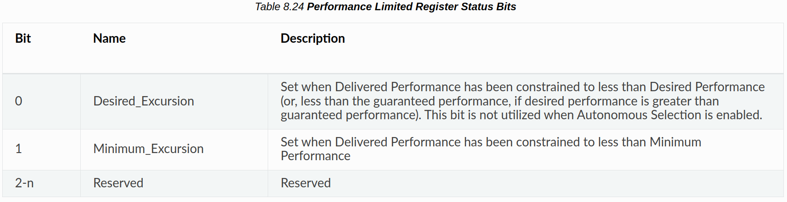{width="50%"}

    性能制限レジスタ内のビットはスティッキーであり、OSPMがビットをクリアするまで非ゼロのままである。プラットフォームは、最小エクスカージョンが0から1に遷移した時のみノーティファイを発行する必要があり、持続的または反復的な制限があるにもかかわらずOSPMが前の指示をクリアしていない場合に、イベントが繰り返されるのを防ぎます。

    (9) Note

    性能制限レジスタへの全てのアクセスは、アクセスする両方のエンティティによって、インターロックされたオペレーションを使用して行われなければならない*。

    性能制限レジスタは、短期間の予測不可能なイベント (例えば、PROCHOT がアサートされる) を報告するためにのみ使用すべきである。プラットフォームが、プロセッサの性能を制限する長期的で予測可能なイベントを特定できる場合は、性能保証レジスタを使用してこの制限を OSPM に通知すべきである。保証性能の変更は、1秒に1回を超える頻度であってはならない。プラットフォームが一定時間 (1秒以上)所定の性能レベルを保証できない場合は、低い性能レベルを保証し、OSPMの要求に応じて、現在の動作条件で許容される高い性能レベルに臨機応変に入るべきである。

    #### 8.4.6.1.4. CPPC Enable Register

    

    プラットフォームでサポートされている場合、OSPMはこのレジスタに1を書き込み、このプロセッサでCPPCを有効にする。

    実装されていない場合、OSPMはプラットフォームが常にCPPCを有効にしていると仮定する。

    #### 8.4.6.1.5. Autonomous Selection Enable Register

    

    プラットフォームでサポートされている場合、OSPM はこのレジスタに 1 を書き込み、このプロセッサで自律パフォーマンスレベル選択を有効にする。自律パフォーマンスレベル選択を有効にするには、CPPCイネーブルレジスタでCPPCを有効にする必要がある。自律選択を排他的にサポートするプラットフォームは、このフィールドに整数値で1を書き込む必要がある。

    Autonomous Selection が有効な場合、パフォーマンス状態の選択はプラットフォームが行う。OSPMは、プロセッサのワークロード性能要求を評価し、対応する性能提供要求をDesired Performance Registerを介してプラットフォームに伝える必要はない。

    #### 8.4.6.1.6. Autonomous Activity Window Register

    

    プラットフォームがサポートしている場合、OSPMはこのフィールドに時間値 ( $1 \mu \mathrm{sec}$ 単位で10^3ビットexp * 7ビット仮数：1us～ $1270 \mathrm{sec}$ )を書き込み、プラットフォームの自律選択ポリシーに対する移動利用感度ウィンドウを示すことができる。エネルギー性能優先レジスタ値と組み合わせると、アクティビティウインドウはプラットフォームの自律選択ポリシーの性能増加/減少率に影響する。OSPMは、ワークロードに応じてプラットフォームが適切なアクティビティウィンドウを決定できるように、このレジスタにゼロ値を書き込む。

    このレジスタへの書き込みは、自律選択が有効になっているときのみ意味を持つ。

    #### 8.4.6.1.7. Energy Performance Preference Register

    

    プラットフォームがサポートしている場合、OSPMは0 (性能優先)から $0 \mathrm{xFF}$  (エネルギー効率優先)までの値の範囲を書き込むことができる。この値は、性能の増減率や、ハードウェアのエネルギー効率と性能の最適化ポリシーの結果に影響する。これは、OSPMがプラットフォームの性能関連の最適化/制御ポリシーのエネルギー効率への影響と、プラットフォームのエネルギー効率関連の最適化/制御ポリシーの性能への影響を制限する手段を提供する。

    このレジスタへの書き込みは、自律選択が有効になっているときのみ意味を持つ。

    #### 8.4.6.1.8. OSPM Control Policy

    ##### 8.4.6.1.8.1. In-Band Thermal Control

    性能制御を使用するプロセッサは、サーマルゾーンの_PSLリストにリストされることがある。PSV閾値を超えた結果、サーマルゾーンがパッシブ冷却を行う場合、OSPMは $\Delta P[\%]$ を適用し、希望するパフォーマンスレジスタの値を変更する。パッシブ冷却が作動するときはいつでも、OSPMは最大性能レジスタを希望性能レジスタに等しく設定し、プラットフォームが日和見的に希望性能を超えないようにしなければならない。

    注意：SoCがプロセッサに加えて複数のデバイスコンポーネントで構成されているシステムオンチップベースプラットフォームでは、OSPMが熱制御のためにDesiredおよびMaximumレジスタを使用すると、SoCデバイスの相互作用により最適な結果が得られない場合がある。独自のパッケージレベルの熱制御 (存在する場合)を使用することで、より最適な結果が得られる可能性がある。

    #### 8.4.6.1.9. Using PCC Registers

    PCCレジスタ空間が使用される場合、同じパフォーマンスドメイン (_PSDによって定義される)内の全てのプロセッサの全てのPCCレジスタは、同じ部分空間にあるように定義されなければならない。PSDが使用されない場合、この制限は与えられた_CPCオブジェクト内の全てのレジスタに適用される。

    OSPM は、レジスタ値を入力し、PCC ライトコマンドを発行することで、レジスタを書き込む。また、リードコマンドを発行することで、静的レジスタ、カウンタ、パフォーマンスリミテッドレジスタを読み出すことができる (表 8.25 参照)。

    PCCトランザクションのコストを償却するため、OSPMは可能な限り、1つのリードまたはライトコマンドで全てのPCCレジスタをリードまたはライトすべきである。

    {width="50%"}

    #### 8.4.6.1.10. Relationship to other ACPI-defined Objects and Notifications

    CPCが存在する場合、その使用は以下の既存のACPIオブジェクトの使用に優先する：

    - The P_BLK P_CNT register
    - _PTC
    - _TSS
    - _TPC
    - _TSD
    - _TDL
    - _PCT
    - _PSS
    - _PPC
    - _PDL
    - Notify 0x80 on the processor device
    - Notify 0x82 on the processor device

    PSDオブジェクトは、プロセッサ間のドメイン依存性を指定するために使用できる。ヘテロジニアスプロセッサを持つシステムでは、1つのドメイン内の全てのプロセッサが同じ性能を持っていなければならない。

    #### 8.4.6.1.11. _CPC Implementation Example

    この例では、PCC 部分空間 2 の PCC インタフェースを介した _CPC インタフェースの 2 プロセッサ実装を示す。この実装では、プロセッサの能力を記述するためにレジスタを使用し、最小性能、最大性能、タイムウィンドウレジスタはサポートしていない。

    {width="50%"}

<!-- ### 8.4.7. _PPE (Polling for Platform Errors)

このオプションのオブジェクトが存在する場合、OSPM はプロセッサが訂正されたプラットフォームエラー情報を取得するためにポーリングされるべきかどうかを判断するために評価する。このオブジェクトは、CPEP で提供される情報を補強/上書きする。修正済みプラットフォームエラーポーリングテーブル (CPEP) を参照してください。

**Arguments:**

なし

**Return Value:**

推奨ポーリング間隔をミリ秒で表した整数。

    0- OSPM はこのプロセッサをポーリングしない。

    その他の値- OSPMはこのプロセッサを<=指定された間隔でポーリングすべきである。

OSPM は、プロセッサオブジェクトの初期化およびバスチェック通知処理中に _PPE オブジェクトを評価する。

## 8.5. Processor Aggregator Device

以下のセクションでは、オプションのプロセッサアグリゲータデバイスの定義と動作について説明する。プロセッサアグリゲーターデバイスは、プラットフォーム内の全てのプロセッサに適用される特定のプロセッサコンフィギュレーションとコントロールをプラットフォームが実行できるようにするコントロールポイントを提供する。

プロセッサアグリゲータデバイスのプラグアンドプレイIDは、ACPI000Cである。

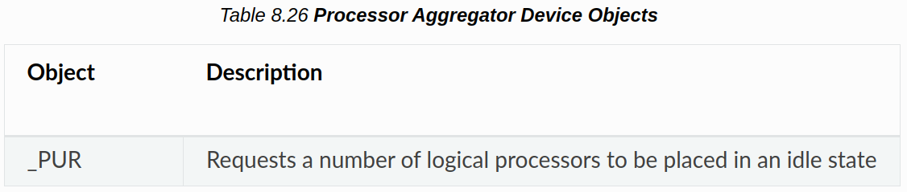{width="50%"}

### 8.5.1. Logical Processor Idling

プラットフォームの消費電力を削減するために、プラットフォームはOSPMに対して、非プロセッサアフィニタイズワークがディスパッチされるプロセッサのOSスケジューラのリストから論理プロセッサを削除するように指示すことができる。この機能は論理プロセッサアイドリングと呼ばれ、プロセッサの排出/挿入処理のオーバーヘッドを受けずにプラットフォームの消費電力を削減する手段を提供する。OSPM は、論理プロセッサがアイドル状態になったときに、この作業を再ターゲットすることを期待していないため、論理プロセッサに向けられた割り込みやプロセッサアフィニットされたワークロードは、消費電力を削減する論理プロセッサアイドリングの効果を妨げることになる。

#### 8.5.1.1. _PUR (Processor Utilization Request)

PURオブジェクトは、プロセッサアグリゲータデバイスの下で宣言されるオプションのオブジェクトで、プラットフォームがOSPMにアイドル状態にする論理プロセッサの数を示す手段を提供する。OSPM は、0x80 タイプのプロセッサアグリゲータデバイスオブジェクトの Notify イベント処理の結果として _PUR オブジェクトを評価する。

**Arguments:**

なし

**Return Value:**

以下のパッケージ。

NumProcessorsパッケージ要素は、プラットフォームがOSPMをアイドル状態にしたい論理プロセッサの数を伝える。この数値は絶対値である。OSPMはNumProcessorsの値と等しくなるように、アイドル状態に置かれる論理プロセッサの数をインクリメントまたはデクリメントする。NumProcessorsの値がゼロの場合、OSPMは可能な限り全ての論理プロセッサをアクティブ状態にする。

OSPM は、内部の論理プロセッサと物理コアおよびパッケージのトポロジ知識を使用して、アイドリング要求による電力削減効果を最大化する順序で、論理プロセッサを順次アイドリングする。たとえば、1 つの処理コア上の論理プロセッサを構成する全ての SMT スレッドをアイドル状態にして、コアが低電力状態になってから、別のコア上の論理プロセッサを構成する SMT スレッドをアイドル状態にする。

### 8.5.2. OSPM _OST Evaluation

PURオブジェクト評価の処理が完了すると、OSPMは_OSTオブジェクトを評価し、もしプロセッサアグリゲータデバイスの下に存在すれば、_PUR評価ステータスをプラットフォームに伝える。PUR評価に特有の_OST引数については後述する。

**Arguments:** (3)

    Arg0- ソースイベント (整数) ：0x80

    Arg1- ステータスコード (整数)：下記参照

    Arg2- Idled Procs (Buffer) : 以下を参照。

**Return Value:**

なし

**Argument Information:**

    Arg1 - Status Code:

    0 -success - OSPM idled the number of logical processors indicated by the value of Arg2

    1: no action was performed

    Arg2 - A 4-byte buffer that represents a DWORD that is the number of logical processors that are now idled

プラットフォームは、以下の理由により、OSPMコンテキストからアイドリング可能な論理プロセッサ数を超える数の論理プロセッサのアイドリングを要求することがある：

- 要求された数は、現在定義されている論理プロセッサの数より大きい。
- 定義された全ての論理プロセッサがOSによってオンライン化されたわけではない (例えば、ライセンス上の理由)。

OSの機能にとって重要な論理プロセッサ (例えばBSP)をアイドル状態にすることはできない。 -->
