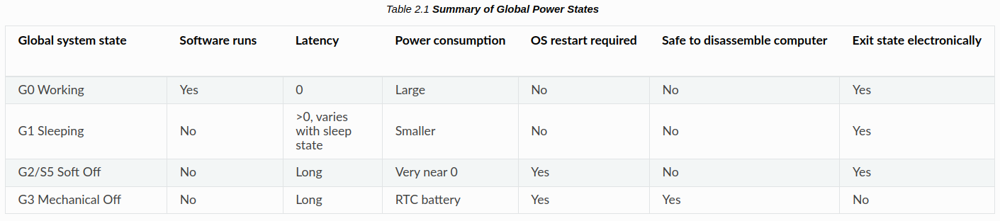
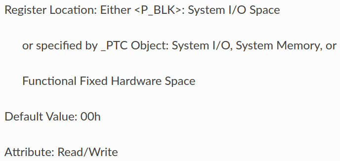
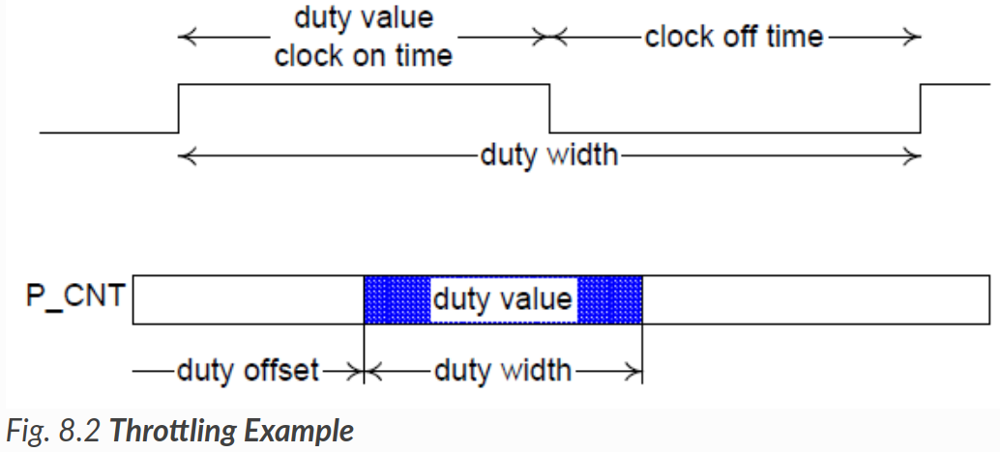

---
hide:
- navigation
- toc
---

# ACPI Processor Configuration and Control

プロセッサの電力とパフォーマンスに対する主な制御 (できること) は以下 ([出典](https://uefi.org/specs/ACPI/6.5/08_Processor_Configuration_and_Control.html#processor-configuration-and-control))

- Processor power states: C0, C1, C2, C3, … Cn
- Processor clock throttling
- Processor performance states: P0, P1, … Pn

## Operating System-directed Configuration and Power Management (OSPM) [[参考](https://uefi.org/htmlspecs/ACPI_Spec_6_4_html/01_Introduction/Introduction.html?highlight=ospm)]

OSが中心的な役割を果たし、システムのパワーマネジメントやデバイスの構成を直接制御するモデル。ACPIはOSPMを可能にする業界共通のインタフェースを確立するために開発された。

## Global Status [[参考](https://uefi.org/htmlspecs/ACPI_Spec_6_4_html/02_Definition_of_Terms/Definition_of_Terms.html?highlight=global%20states#global-system-state-definitions)]

Global Statusはシステム全体のPower Stateを定義する状態であり、ユーザに表示される。Global Statusは、6つの基準によって定義される：

- アプリケーションソフトウェアが動作している？
- 外部イベントからアプリケーションの応答までのレイテンシは？
- 消費電力は？
- 動作状態に戻るにはOSの再起動が必要？
- コンピュータを分解しても安全？
- 状態への出入りを電気的に行える？

定義されているGlobal Statusと、主な性質は以下の表の通り：

{width="90%"}

## P-state [[参考](https://uefi.org/htmlspecs/ACPI_Spec_6_4_html/02_Definition_of_Terms/Definition_of_Terms.html#device-and-processor-performance-state-definitions)]

P-stateは、アクティブ状態 (プロセッサの場合はC0 State、デバイスの場合はD0 State) 内の消費電力と能力の状態である。Px Stateの概要は以下である：

- **P0 Performance State**: 最大性能を使用し、最大電力を消費する可能性がある。
- **P1 Performance State**: 性能は最大値以下に制限され、消費電力も最大値以下になる。
- ...
- **Pn Performance State**: 性能が最小レベルになり、アクティブ状態を維持しながら消費電力が最小限に抑えられる。状態 n は最大数であり、プロセッサまたはデバイスに依存する。

## Processor Control Block (P_BLK) [[参考](https://uefi.org/specs/ACPI/6.5/04_ACPI_Hardware_Specification.html#processor-control-block-p-blk)]

{width="60%"} ([出典](https://uefi.org/htmlspecs/ACPI_Spec_6_4_html/04_ACPI_Hardware_Specification/ACPI_Hardware_Specification.html?#processor-control-registers))

システム内の各プロセッサには、Optionalのプロセッサコントロールレジスタブロックがある。これはHomogeneous Featureであるため、全てのプロセッサが同じレベルのサポートを持たなければならない。プロセッサコントロールブロックには、プロセッサコントロールレジスタ (P_CNT, P_LVL2, P_LVL3) が含まれる。32ビットのP_CNTレジスタは、そのプロセッサのプロセッサクロックロジックの動作を制御し、P_LVL2レジスタはCPUをC2 Power Stateにするために使用され、P_LVL3レジスタはプロセッサをC3 Power Stateにするために使用される。

### P_CNT Register [[参考](https://uefi.org/htmlspecs/ACPI_Spec_6_4_html/04_ACPI_Hardware_Specification/ACPI_Hardware_Specification.html?#processor-control-p-cnt-32)]

{width="35%"} {width="60%"}

CLK_VALフィールドは、FADT内のDUTY_WIDTH値とDUTY_OFFSET値によって記述される (下表) ように、スロットリングハードウェアのduty settingがプログラムされる場所である。THT_ENフィールドは、CLK_VALフィールドで設定されたクロックのスロットリングを有効化するためのbitである。

{width="50%"}
{width="50%"} ([出典](https://uefi.org/htmlspecs/ACPI_Spec_6_4_html/05_ACPI_Software_Programming_Model/ACPI_Software_Programming_Model.html?#fadt-format))

## Processor Power States [[参考](https://uefi.org/htmlspecs/ACPI_Spec_6_4_html/08_Processor_C0nfiguration_and_C0ntrol/processor-power-states.html)]

{width="50%"}

ACPIは、G0 Working StateにおけるシステムプロセッサのPower Stateをアクティブ状態またはスリープ状態のいずれかとして定義している。アクティブ状態はC0 Stateと呼ばれ、CPUが命令を実行するアクティブなPower Stateであることを示す。C1~Cn Stateはプロセッサのスリープ状態であり、プロセッサは命令を実行せず、C0 Stateよりも消費電力と放熱が少なくなる。各プロセッサのスリープ状態には、対応する入出力のレイテンシがある。一般に、入出力のレイテンシが長ければ長いほど、スリープ状態での省電力効果は大きくなる。消費電力を節約するため、OSPM はアイドル時にプロセッサをサポートされているスリープ状態のいずれかにする。C0 Stateにある間、ACPIは、定義されたスロットリングプロセスと複数のパフォーマンス状態 (P-State) への遷移を通じて、プロセッサの性能を変更できる。

!!! note
    やはり、Clock ThrottlingとP-stateの変更は別の概念ぽい

ACPIは、OSPMが異なるプロセッサPower State間のマイグレーションに使用するロジックをCPU毎に定義する。このロジックはオプションであり、FADTテーブルとプロセッサオブジェクト (階層名前空間に含まれる) を通じて記述される。FADTテーブル内のフィールドとフラグは、ハードウェアの対称機能を記述し、プロセッサオブジェクトには、特定のCPUのクロックロジック (P_BLKレジスタブロックと_CSTオブジェクトで記述) の場所が含まれる。

!!! question
    - プロセッサオブジェクト？
    - クロックロジックの場所？

??? quote "_CST [[参考](https://uefi.org/htmlspecs/ACPI_Spec_6_4_html/08_Processor_Configuration_and_Control/declaring-processors.html?highlight=_cst#cst-c-states)]"
    _CSTは、サポートされるプロセッサの電源状態 (Cステート)を宣言するための代替方法を提供するオプショナルオブジェクトである。_CSTオブジェクトが提供する値は、P_BLKのP_LVLx値とFADTのP_LVLx_LAT値を上書きする。_CSTオブジェクトを使用すると、プロセッサの電源状態の数をC1、C2、C3から任意の数に拡張できる。

P_LVL2 および P_LVL3 レジスタは、システムプロセッサを C2 または C3 Stateにするためのオプションサポートである。C3 Stateの追加サポートは、バスマスタステータスとアービターディセーブルビット (PM1_STSレジスタのBM_STSとPM2_CNTレジスタのARB_DIS) を通して提供される。システムソフトウェアは、P_LVL2 または P_LVL3 レジスタを読み出して、 C2 または C3 Power Stateに入る。ハードウェアは、適切な P_LVLx レジスタへの読み出し操作に応じて、プロセッサを適切なクロック状態にする必要がある。CST (C State)で定義されている_CSTオブジェクトを使用して、OSPMがC Stateに入るためのインタフェースを定義することもできる。

FADT および P_BLK インタフェースを通じて提示される場合、プロセッサのPower Stateのサポートは対称的である。プロセッサが非対称なPower Stateをサポートしている場合、プラットフォームランタイムファームウェアは、FADT テーブルを介して、システム内の全てのプロセッサがサポートする、最も共通性の低いPower Stateを選択し、使用する。例えば、CPU0プロセッサがC3 Stateまでの全てのPower Stateをサポートしているが、CPU1プロセッサがC1Power Stateのみをサポートしている場合、OSPMはアイドル状態のプロセッサをC1Power Stateにのみ配置する (CPU0はC2, C3 Power Stateには決して配置されない)。C1 Power Stateのサポートが必須であることに注意。C2およびC3のPower Stateはオプションである (システム記述テーブルヘッダーのFADT表記述のPROC_C1フラグを参照)。

以下のセクションでは、プロセッサのPower Stateについて詳しく説明する。

### Processor Power State C0

プロセッサが C0 Power Stateにある間は、命令を実行する。C0 Power Stateにある間、OSPM はプロセッサを最大性能以下で動作させるポリシーを生成できる。クロックスロットリングメカニズムは、熱制御に加えて、このタスクを実行する機能を OSPM に提供する。このメカニズムにより、OSPMはプロセッサの性能を最大性能のパーセンテージまで低下させる値をレジスタにプログラムできる。

{width="50%"}

FADT はduty offset値とduty width値を含む。duty offset値は、P_CNTレジスタ内のduty値のオフセットを決定する。duty width値は、duty値で使用されるビット数を決定する(スロットリングロジックの粒度を決定する)。クロックロジックによるプロセッサの性能は、以下の式で表すことができる：

\[
  \text{ Performance [%]}=\frac{\text { duty setting }}{2^{\text {duty width }}} \times 100 \quad (1)
\]

Nominal Performanceとは、"指示された性能レベルに可能な限り近いが、それを下回らないこと "と定義される。OSPM はduty offsetとduty widthを使用して、duty settingフィールドへのアクセス方法を決定する。そして OSPM は、プロセッサオブジェクトの熱条件と希望する電力に基づいてduty settingをプログラムする。OSPM は、式 1 を使用してプロセッサのNominal Performanceを計算する。例えば、クロックロジックはストップグラントサイクルを使用して、IAプロセッサ上で分割されたプロセッサクロック周波数をエミュレートできる (STPCLK#信号を使用することによって)。この信号はLOWにアサートされたときにプロセッサのクロックを内部的に停止する。8段階のクロック制御を提供するロジックを実装するために、STPCLK#ピンは次のようにアサートされる可能性がある

{width="50%"}

!!! question
    - ストップグラントサイクル?
    - IAプロセッサ?

スロットリングロジックを開始するには、OSPMは希望のduty settingを設定し、THT_ENビットをHIGHに設定する。duty settingを変更するには、OSPMはまずTHT_ENビットをLOWにリセットし、このレジスタの他の未使用フィールドを保持したままduty settingフィールドに別の値を書き込み、THT_ENビットを再びHIGHに設定する。

ロジックモデルの例を以下に示す：

{width="50%"}

ACPIプロセッサPower State制御の実装では、1つのCPUスリープ状態 (C1)のサポートが最低限必要である。システムがスリープ状態 (S1～S4)に遷移すると、これらの状態は意味を持たない。ACPIは、異なるCPU状態の属性 (セマンティクス)を定義している (4つを定義)。適切な低消費電力CPU状態を定義されたACPI CPU状態にマッピングするかどうかは、プラットフォームの実装次第である。

!!! question
    - duty settingとは結局何なんだ

ACPI クロック制御は、オプションのプロセッサレジスタブロック (P_BLK)を介してサポートされる。ACPIでは、システム内の各CPUに固有のプロセッサレジスタブロックが必要である。POプロセッサが C1, C2 および C3 Stateをサポートし、P1が C1 Stateのみをサポートする場合、OSPMはアイドル時に全てのプロセッサが C1 Stateになるように制限する。

以下のセクションでは、異なるACPI CPUスリープ状態を定義する。

### Processor Power State C1

全てのプロセッサは、このPower Stateをサポートしなければならない。この状態は、プロセッサのネイティブ命令 (IA 32 ビットプロセッサの HLT) によりサポートされ、チップセットからのハードウェアサポートは必要ないものとする。この状態のハードウェアレイテンシは、OSPMがこの状態を使用するかどうかを決定する際にレイテンシを考慮しない程度に低くなければならない。プロセッサをPower Stateにする以外には、この状態はソフトウェアから見える効果を持たない。C1 Power Stateでは、プロセッサはシステムキャッシュのコンテキストを維持できる。

ハードウェアは、どのような理由でもこの状態を終了できるが、割り込みがプロセッサに提示される場合は、常にこの状態を終了しなければならない。

### Processor Power State C2

このプロセッサPower Stateは、システムによってオプションでサポートされる。この状態が存在する場合、C1 Stateよりも省電力であり、ローカルプロセッサの P_LVL2 コマンドレジスタを使用するか、または _CST オブジェクトによって示される別のメカニズムを使用して入力される。この状態の最悪のハードウェアレイテンシはFADTで宣言されており、OSPMはこの情報を使用して、 C2 Stateの代わりに C1 Stateを使用するタイミングを決定できる。この状態は、プロセッサをPower Stateにする以外に、ソフトウェアから見える効果はない。OSPMは、C2Power Stateは C1 Power Stateよりも消費電力が低く、終了レイテンシが高いと想定している。

C2Power Stateは、オプションのACPIクロック状態であり、チップセットのハードウェアサポートが必要である。このクロックロジックはインタフェースで構成されており、このインタフェースを操作することで、プロセッサコンプレックスをC2Power Stateに正確にマイグレーションさせることができる。C2Power Stateでは、プロセッサはキャッシュのコヒーレンシを維持できると想定され、例えば、キャッシュコンテキストを破壊することなく、バスマスタやマルチプロセッサの活動を行うことができる。

C2 Stateは、プロセッサをマルチプロセッサやバスマスタシステムに最適化された低消費Power Stateにする。OSPMは、バスマスタまたはマルチプロセッサのアクティビティがある場合、アイドル状態のプロセッサコンプレックスをC2 Stateにマイグレーションさせる (これにより、OSPMはプロセッサコンプレックスをC3 Stateにマイグレーションさせない)。プロセッサコンプレックスは、C2 Stateにある間、バスマスタまたはマルチプロセッサCPUのメモリへのアクセスをスヌープできる。

ハードウェアはどのような理由でもこの状態を終了できるが、割り込みがプロセッサに提示されるときは常にこの状態を終了しなければならない。

### Processor Power State C3

このプロセッサPower Stateは、システムによってオプションでサポートされる。この状態は、 C1 および C2 Stateよりも省電力であり、ローカルプロセッサの P_LVL3 コマンドレジスタを使用するか、_CST オブジェクトによって示される別のメカニズムを使用して入力される。この状態の最悪のハードウェアレイテンシはFADTで宣言されており、OSPMはこの情報を使用して、C3 Stateの代わりにC1またはC2 Stateを使用するタイミングを決定できる。C3 Stateにある間、プロセッサのキャッシュは状態を維持するが、プロセッサはバスマスタやマルチプロセッサCPUのメモリへのアクセスをスヌープする必要はない。

ハードウェアはどのような理由でもこの状態を抜けることができるが、割り込みがプロセッサに提示されるとき、またはBM_RLDが設定され、バスマスタがメモリにアクセスしようとするときには、必ずこの状態を抜ける必要がある。

OSPM はキャッシュがコヒーレンシを維持することを保証する責任がある。ユニプロセッサ環境では、PM2_CNT.ARB_DISバスマスタアービトレーションディセーブルレジスタを使用して、C3 Stateの間にバスマスタサイクルが発生しないようにできる。マルチプロセッサ環境では、C3 Stateに入る前にプロセッサのキャッシュをフラッシュして無効化し、キャッシュに動的情報が残らないようにできる。

C3Power Stateをサポートするメカニズムは2つある：

- C3 Stateに入る前に、OSPMがキャッシュをフラッシュし、無効にすること。
- マスタのメモリへの書き込みを防止するハードウェアメカニズムを提供する (ユニプロセッサのみのサポート)。

最初のケースでは、OSPMはC3 Stateに入る前にシステムキャッシュをフラッシュする。通常、プロセッサキャッシュのフラッシュには多くのレイテンシがあるため、OSPMはアイドルプロセッサ用のマルチプロセッサプラットフォームでのみこれをサポートすると思われる。キャッシュのフラッシュは、定義された ACPI メカニズムの1つ (キャッシュのフラッシュで後述)を介して実行される。

必要なハードウェア機能 (このセクションで定義)を提供するユニプロセッサオンリープラットフォームでは、OSPMは、プロセッサがC3 Stateにある間、システムバスマスタがメモリに書き込むのを防ぐモードにプラットフォームを配置しようとする。

これは、C3Power Stateに入る前にバスマスタを無効にすることで達成される。バスマスタがアクセスを要求すると、CPUはC3 Stateから目覚め、バスマスタアクセスを再び有効にする。

OSPM は、BM_STS ビットを使用して、C2/C3 Power Stateへのマイグレーションを検討する際に入るべきPower Stateを決定する。BM_STS は、バスマスタがいつアクティブかを示すオプションのビットである。OSPM はこのビットを使用して、 C2 Power Stateと C3 Power Stateの間の方針を決定する。バスマスタアクティビティが多い場合は CPU のPower Stateが C2  (または C2 がサポートされていない場合は C1 )に降格し、バスマスタアクティビティがない場合は CPU のPower Stateが C3 に昇格する。OSPMはBM_STSビットの実行履歴を保持し、CPUPower Stateのポリシーを決定する。

C3 Power Stateで使用される最後のハードウェア機能は、BM_RLD ビットである。このビットは、バスマスタからの要求の結果として Cx Power Stateが終了するかどうかを決定する。もしセットされていれば、バスマスタからの要求により Cx Power Stateは終了する。リセットされた場合、バスマスタからの要求があってもPower Stateは解除されない。C3 Stateでは、バスマスタリクエストによって CPU を C0 Stateに戻す必要があるが (システムはキャッシュコヒーレンシを維持できるため)、C2 Stateではそのようなマイグレーションは必要ない。OSPM は、C3 Power Stateを使用する場合はこのビットをオプションで設定し、C1 または C2 Power Stateを使用する場合はこのビットをクリアできる。

### Additional Processor Power States

ACPIは、ACPI 2.0からC3を超えるオプションのプロセッサPower Stateを導入した。これらのPower State、C4...これらの追加Power Stateは、前のセクションで定義した C1 ～ C3 Power Stateと同等の動作セマンティクスによって特徴付けられるが、エントリ/エグジットのレイテンシと省電力は異なる。詳細は_CST (C State)を参照。
