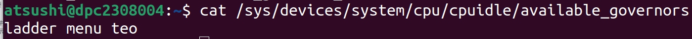
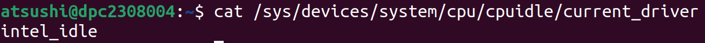
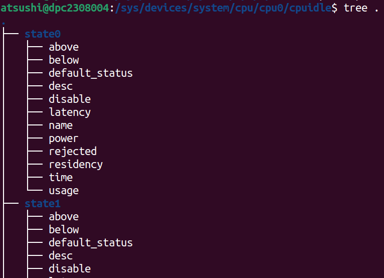

---
hide:
- navigation
- toc
---

# CPU Idle Time Management

## Concepts

最近のプロセッサは一般に、プログラムの実行が中断され、そのプログラムに属す命令がメモリからフェッチされたり実行されたりしないアイドル状態に入ることができる。アイドル状態では、プロセッサのハードウェアの一部は使用されないため、消費電力を削減できる。CPUアイドル時間管理は、プロセッサのアイドル状態を使用するエネルギー効率機能である。

<!-- ## Logical CPUs

CPUアイドル時間管理は、論理CPUに対して行われる。以下では論理CPUを単にCPUと呼ぶ。 -->

<!-- その見解では、CPUは論理ユニットである。つまり、独立した物理的な実体である必要はなく、個々のシングルコアプロセッサとしてソフトウェアに表示されるインタフェースであってもよい。言い換えれば、CPUは、メモリから1つのシーケンス (プログラム)に属す命令をフェッチして実行しているように見える実体であるが、物理的にこのように動作する必要はない。一般に、ここでは3つの異なるケースが考えられる。

まず、プロセッサ全体が一度に1つの命令シーケンス (1つのプログラム)にしか従えない場合、それはCPUである。その場合、ハードウェアがアイドル状態に入るように要求されれば、それはプロセッサ全体に適用される。

第二に、プロセッサがマルチコアである場合、その中の各コアは一度に少なくとも1つのプログラムに従うことができる。コアは互いに完全に独立している必要はないが (例えば、キャッシュを共有する場合もある)、それでもほとんどの場合、互いに物理的に並行して動作するため、各コアが1つのプログラムだけを実行する場合、それらのプログラムは同時に互いにほとんど独立して実行される。その場合、コア全体がCPUであり、ハードウェアがアイドル状態に入るよう求められた場合、それは最初にアイドル状態を求めたコアに適用されるが、そのコアが属すより大きなユニット (「パッケージ」や「クラスタ」など)にも適用されることがある (実際には、そのコアを含むより大きなユニットの階層全体に適用されることもある)。すなわち、より大きなユニットに属すコアのうち、1つを除く全てのコアが「コアレベル」でアイドル状態になっており、残りのコアがプロセッサにアイドル状態になるよう要求した場合、それが引き金となってより大きなユニット全体がアイドル状態になり、そのユニット内の他のコアにも影響が及ぶ可能性がある。

最後に、マルチコアプロセッサの各コアは、同じ時間枠内で複数のプログラムに従うことができる場合がある (つまり、各コアは、メモリ内の複数の場所から命令をフェッチし、同じ時間枠内で実行できるが、必ずしも完全に互いに並行して実行する必要はない)。この場合、コアはソフトウェアに対して、ハードウェアスレッド (インテルハードウェアではハイパースレッド)と呼ばれる、それぞれが1つのシーケンスに従うことができる複数のシングルコア「プロセッサ」からなる「バンドル」として表示される。
ストラクションを使用する。そして、ハードウェアスレッドは、CPUアイドル時間管理の観点からはCPUであり、そのうちの1つによってプロセッサがアイドル状態に入るように要求された場合、それを要求したハードウェアスレッド (またはCPU)は停止されるが、同じコア内の他のハードウェアスレッドも全てプロセッサにアイドル状態に入るように要求していない限り、それ以上は何も起こらない。そのような状況では、コアが個別にアイドル状態になるか、コアを含むより大きなユニットが全体としてアイドル状態になる (その大きなユニット内の他のコアがすでにアイドル状態になっている場合)。 -->

## Idle CPUs

LinuxカーネルによってCPUがアイドルとみなされるのは、そのCPUがアイドル状態である場合と、アイドルタスクを実行している場合である。アイドルタスクは、CPUがアイドル状態をサポートしていなかったり、次のウェイクアップイベントまでにアイドル状態で過ごす時間が十分でなかったりする場合に実行される。アイドルタスクは意味の無い命令をループで実行するだけである。

## The Idle Loop

アイドルループのコードは、2つの主要なステップから成る：

1. CPUIdleと呼ばれるCPUアイドル時間管理サブシステムに属すガバナーと呼ばれるコードモジュールを呼び出し、CPUが入るべきアイドル状態を選択する。
2. ドライバと呼ばれるCPUIdleサブシステムに属す別のコードモジュールを呼び出し、ガバナーによって選択されたアイドル状態に入るよう、プロセッサハードウェアに実際に要求する。

ガバナーの役割は、手元の条件に最も適したアイドル状態を見つけることである。この目的のために、アイドル状態は、プラットフォームやプロセッサアーキテクチャに依存しない抽象的な方法で表現され、一次元配列で整理される。この配列は初期化時にCPUIdleドライバによって準備され、実行中のカーネルのプラットフォームに合わせて提供されなければならない。これにより、CPUIdleガバナーはプラットフォームとなるハードウェアから独立し、Linuxカーネルが動作するあらゆるプラットフォームで動作できる。配列に存在する各アイドル状態は、ガバナーによって考慮されるべき2つのパラメータで特徴づけられる：

!!! success "target residency"
    ハードウェアが対象のアイドル状態にある最小時間

!!! success "exit latency"
    CPUがプロセッサハードウェアにアイドル状態からの復帰を要求してから、ウェイクアップ後に最初の命令を実行し始めるまでの最大時間。そのアイドル状態に入るために必要な時間も含まれる。

ガバナーは以下2種類の情報を考慮してアイドル状態を選択する：

!!! success "最も近いタイマイベントまでの時間"
    カーネルがタイマをプログラムし、それがいつトリガされるかを正確に知っているため、この時間は正確に分かる。この時間は、指定されたCPUが依存するハードウェアがアイドル状態で過ごすことができる最大時間であるとみなせる。

!!! success "アイドル継続時間"
    CPUがウェイクアップされた後、実際にどれだけの時間アイドル状態であったか

{width="50%"}

CPUIdleガバナーには、menu、TEO、ladder、haltpollの4種類がある。利用可能なガバナーはavailable_governorsから読み込むことができ、実行時にガバナーを変更することもできる。カーネルが現在使用しているCPUIdleガバナーの名前は、sysfsの/sys/devices/system/cpu/cpuidle/の下にあるcurrent_governor_roまたはcurrent_governorファイルから読み取ることができる。

{width="50%"}

一方、どのCPUIdleドライバを使用するかは、通常、カーネルが動作しているプラットフォームに依存する。例えば、大多数のIntelプラットフォームで動作する2つのドライバ、intel_idleとacpi_idleがあり、1つはハードコードされたアイドル状態の情報を持ち、もう1つはシステムのACPIテーブルからその情報を読み取ることができる。インテルプラットフォームでは、intel_idleが何らかの理由で無効になっているか、プロセッサを認識していない場合、acpi_idleドライバが使用される。カーネルが現在使用しているCPUIdleドライバーの名前は、sysfsの/sys/devices/system/cpu/cpuidle/にあるcurrent_driverファイルから読み取ることができる。

## Idle CPUs and The Scheduler Tick

スケジューラティックは、CPUスケジューラのタイムシェアリング戦略を実行するために、定期的にトリガされるタイマである。スケジューラティックを停止するかどうかはガバナーが何を期待しているかを考慮する必要がある。もしガバナーがtick範囲内で何らかのウェイクアップを期待しているのであれば、tickトリガを許可する方が良い。しかし、そうでない場合、ガバナーは比較的深いアイドル状態を選択するので、tickはCPUを早くウェイクアップしすぎないように停止すべきである。

カーネルは、アイドルループ内でスケジューラティックを完全に停止させないように設定できる。これはビルド時の設定 (CONFIG_NO_HZ_IDLE=false) またはコマンドライン (nohz=off) で行うことができる。アイドル状態のCPUでスケジューラのティックを停止できるように設定されたカーネルを実行するシステムは、ティックレスシステムと呼ばれ、一般に、ティックを停止できないカーネルを実行するシステムよりもエネルギー効率が高いとみなされる。

## The menu Governor [(実装)](https://elixir.bootlin.com/linux/v6.8/source/drivers/cpuidle/governors/menu.c)

メニューガバナーは、ティックレスシステムのデフォルトCPUIdleガバナーである。設計の基本原理は単純であり、呼び出されると、アイドル時間の予測を試み、アイドル状態の選択に予測値を使用する。

まず、スケジューラのティックが停止するという前提で、最も近いタイマイベントまでの時間を求める。この時間をスリープ長と呼び、次のCPUウェイクアップまでの時間の上限とする。

メニューガバナーは、スリープ長補正係数の2つの配列を保持する。そのうちの1つは、指定されたCPU上で以前に実行されていたタスクがI/O処理の完了を待っているときに使用され、もう1つは、そうでないときに使用される。各配列には、異なるスリープ長範囲に対応する複数の補正係数の値が含まれており、配列で表される各範囲は、前のものよりも約10倍広くなるように編成されている。

与えられたスリープ長範囲の補正係数 (CPUのアイドル状態を選択する前に決定される)は、CPUがスリープ解除された後に更新され、スリープ長が観測されたアイドル持続時間に近いほど、補正係数は1に近くなる (0と1の間に収まらなければならない)。スリープ長に、それが該当する範囲の補正係数を乗じることで、予測アイドル時間の第一近似値が得られる。

次に、ガバナーは単純なパターン認識アルゴリズムを用いてアイドル時間の予測を精緻化する。すなわち、過去 8 回のアイドル持続時間の観測値を保存し、次回のアイドル持続時間を予測する際に、その平均と分散を計算する。分散が小さい (400平方ミリ秒より小さい)か、平均値に対して小さい (平均値が標準偏差の6倍より大きい)場合、平均値は「典型的な間隔」値とみなされる。そうでない場合は、保存されたアイドル時間値のうち最長のものが破棄され、残りのものに対して計算が繰り返される。この場合、「典型的な間隔」は「無限大」 (符号なし整数値の最大値)に等しいと仮定される。このようにして計算された「典型的な間隔」は、スリープ長に補正係数を掛けたものと比較され、両者の最小値が予測されるアイドル持続時間とされる。

次に、ガバナーは、「対話型」ワークロードを支援するために、追加のレイテンシ制限を計算する。選択されたアイドル状態のexit latencyが、予測されたアイドル時間と同程度である場合、その状態で費やされる総時間はおそらく非常に短く、その状態に入ることで節約されるエネルギー量は比較的小さいため、その状態に入って終了することに関連するオーバーヘッドを回避する方が良い可能性が高いという観測を利用する。したがって、より浅い状態を選択する方が良い選択肢である可能性が高い。余分なレイテンシ制限の最初の近似値は、予測されるアイドル時間そのものであり、さらに、与えられたCPU上で以前に実行され、現在I/O操作の完了を待っているタスクの数に応じた値で除算される。その除算結果は、電力管理QoSフレームワークから得られるレイテンシ制限と比較され、両者の最小値がアイドル状態のexit latencyの制限値として採用される。

さて、ガバナーはアイドル状態のリストを歩き、その中から1つを選択するレディ。この目的のために、各状態のtarget residencyを予測されたアイドル時間と比較し、そのexit latencyを計算されたレイテンシ制限と比較する。予測されたアイドル持続時間に最も近いが、まだそれを下回るtarget residencyと、制限を超えないexit latencyを持つ状態を選択する。

最後のステップで、ガバナーは、まだスケジューラのティックを停止することを決定していない場合、アイドル状態の選択を改良する必要がある可能性がある。これは、ガバナーによって予測されたアイドル時間がtick期間より短く、tickが (アイドルループの前の反復で)まだ停止していない場合に起こる。その場合、以前の計算で使用されたスリープ長は、最も近いタイマイベントまでの実時間を反映していない可能性があり、もし本当にその時間より大きい場合、ガバナーは適切な目標残留時間を持つより浅い状態を選択する必要がある可能性がある。

## The Timer Events Oriented (TEO) Governor

タイマイベントオリエンテッド(TEO)ガバナーは、ティックレスシステム用の代替CPUIdleガバナーである。このガバナーもメニューガバナーと同じ基本戦略に従っている。しかし、この問題には異なるアプローチを適用する。

このガバナーのアイデアは、多くのシステムにおいてタイマイベントは他の割り込みよりも2桁以上頻繁に発生するため、アイドル状態からのCPUウェイクアップの最も重要な原因である可能性が高いという観察に基づいている。さらに、 (比較的最近の)過去に起こったことに関する情報を使用して、スリープ長 (sleep length)と呼ばれる、最も近いタイマイベントまでの (既知の)時間内に目標残留時間を持つ最も深いアイドル状態が、今後のCPUアイドル期間に適しているかどうかを推定し、適していない場合は、その代わりに、より浅いアイドル状態のどれを選択するかを決定できる。

もちろん、CPUの直近のアイドル時間間隔をいくつか考慮することでカバーできる使用例では、タイマ以外のウェイクアップソースの方が重要である。しかし、そのような場合であっても、スリープ時間よりも長いアイドル時間を考慮する必要はない。なぜなら、最も近いタイマが、より早くウェイクアップされない限り、最終的にCPUをウェイクアップするからである。

したがって、このガバナーは、CPUのアイドル時間がスリープ時間より大幅に短くなる可能性があるかどうかを推定し、それに応じてアイドル状態を選択する。

このガバナーによって実行される計算は、CPUIdleドライバによって提供されるCPUアイドル状態の目標残留パラメータ値と一致する境界を持つビンを昇順または降順で使用することに基づいている。
ダー。すなわち、最初のビンは、0から2番目のアイドル状態 (アイドル状態1)の目標滞留時間まで (ただし、アイドル状態1を含まない)、2番目のビンは、アイドル状態1の目標滞留時間からアイドル状態2の目標滞留時間まで (ただし、アイドル状態2を含まない)、3番目のビンは、アイドル状態2の目標滞留時間からアイドル状態3の目標滞留時間まで (ただし、アイドル状態3を含まない)、などのスパンである。最後のビンは、ドライバから供給された最も深いアイドル状態の目標残留数から無限大までのスパンである。

ヒット」と「インターセプト」と呼ばれる2つのメトリクスが各ビンに関連付けられている。これらは、前回起こったことに従って、与えられたCPUのアイドル状態を選択する前に、毎回更新される。

ヒット」メトリクスは、スリープ長および CPU ウェイクアップ後に測定されたアイドル時間が同じビンに入る (つまり、スリープ長に対して CPU が「時間通り」にウェイクアップする)状況の相対的な頻度を反映する。一方、「インターセプト」メトリクスは、測定されたアイドル時間がスリープ長よりも非常に短いため、スリープ長によってビンに入るアイドル状態よりも浅いアイドル状態に対応する状況の相対的な頻度を反映する (これらの状況を、以下では「インターセプト」と呼ぶ)。

上記のメトリクスに加えて、ガバナーは、各ビンの最近のインターセプト (つまり、指定されたCPUのためのそれの最後のNR_RECENT呼び出しの間に発生したインターセプト)をカウントする。

CPUのアイドル状態を選択するために、ガバナーは以下のステップを踏む (レイテンシ制約も考慮する必要がある)：

1.目標残留時間が現在のスリープ長を超えない最も深いCPUアイドル状態 (候補アイドル状態)を見つけ、以下のように3つの和を計算する：
- 候補状態および全ての深いアイドル状態の「ヒット」と「インターセプト」のメトリクスの合計 (スリープの長さが現在の長さと同じであった場合、インターセプトを回避するのに十分なほどCPUがアイドル状態であったケースを表す)。
- 候補のアイドル状態より浅い全てのアイドル状態の「インターセプト」メトリクスの合計 (スリープの長さが現在の長さと同じだった場合に、インターセプトされるのを避けるためにCPUが十分に長くアイドル状態でなかったケースを表す)。
- 候補の状態よりも浅い全てのアイドル状態の最近のインターセプト数の合計。

2.2番目の合計が1番目の合計より大きいか、3番目の合計がNR_RECENT / 2より大きい場合、CPUは早くウェイクアップする可能性が高いので、選択する別のアイドル状態を探す。
- 候補より浅いアイドル状態を降順に辿る。
- それぞれについて、「インターセプト」の指標の合計と、その候補となる候補の間の全てのアイドル状態 (前者を含み、後者を除く)における最近のインターセプトの数の合計を計算する。
- 考慮する必要があるこれらの合計の各々が (それに関連するチェックがCPUが早期に目覚める可能性があることを示したため)、ステップ1で計算された対応する合計の半分より大きい場合 (これは、該当するケースの半分以上において、当該状態の目標残留時間がアイドル持続時間を超えていなかったことを意味する)、候補のアイドル状態の代わりに所定のアイドル状態を選択する。

3.デフォルトでは、候補の状態を選択する。

ユーティリティを意識したメカニズム：

util-awareness拡張の背景にある考え方は、CPUには2つの異なるシナリオがあり、アイドル状態の選択には2つの異なるアプローチ (utilizedとnot utilized)があるはずだということだ。

この場合、「利用されている」とは、CPUの平均ランキュー利用率がある閾値を上回っていることを意味する。

CPUが利用されながらアイドルにマイグレーションする場合、より多くの作業を行うためにすぐにCPUが起動する可能性が高いため、レイテンシを最小化しパフォーマンスを最大化するために、より浅いアイドル状態を選択すべきである。CPUが使用されていないときは、電力節約を利用するために、利用可能な最も深いアイドル状態を選択する通常のメトリクスベースのアプローチを優先すべきである。

これを実現するために、ガバナーは利用率の閾値を使用する。この閾値は、CPUの容量値をビットシフトすることで、CPUの容量に対するパーセンテージとしてCPUごとに計算される。テストによると、6 (1.56%)のシフトが最良の結果を得ているようだ。

次のアイドル状態を選択する前に、ガバナーは現在のCPU利用率を事前に計算された利用率の閾値と比較する。もしそれ以下であれば、TEOメトリクスメカニズムがデフォルトとなる。それ以上の場合は、ポーリング状態でない限り、最も近い浅いアイドル状態が代わりに選択される。

## Representation of Idle States

??? quote "[struct cpuidle_state](https://elixir.bootlin.com/linux/v6.9-rc6/source/include/linux/cpuidle.h#L49)"
    ```c
    struct cpuidle_state {
        char		name[CPUIDLE_NAME_LEN]、
        char		desc[CPUIDLE_DESC_LEN]、

        s64		exit_latency_ns、
        s64		target_residency_ns、
        unsigned int	flags、
        unsigned int	exit_latency、 /* in US */
        int		power_usage、 /* in mW */
        unsigned int	target_residency、 /* in US */

        int (*enter)	(struct cpuidle_device *dev,
                struct cpuidle_driver *drv,
                int index)、

        int (*enter_dead) (struct cpuidle_device *dev, int index)、

        /*
        * CPUs execute ->enter_s2idle with the local tick or entire timekeeping
        * suspended, so it must not re-enable interrupts at any point (even
        * temporarily) or attempt to change states of clock event devices.
        *
        * This callback may point to the same function as ->enter if all of
        * the above requirements are met by it.
        */
        int (*enter_s2idle)(struct cpuidle_device *dev,
                    struct cpuidle_driver *drv,
                    int index)、
    }、
    ```

CPUのアイドル時間管理のためには、プロセッサがサポートする全ての物理的なアイドル状態を、構造体cpuidle_stateオブジェクトの1次元配列として表現する必要がある。各構造体cpuidle_stateオブジェクトは、個々の論理CPUがプロセッサハードウェアに特定のアイドル状態になるように要求できるようにする。プロセッサ内にユニットの階層がある場合、1つのstruct cpuidle_stateオブジェクトで、階層の異なるレベルのユニットがサポートするアイドル状態の組み合わせをカバーできる。その場合、その構造体のtarget residencyとexit latencyパラメータは、最も深いレベルのアイドル状態 (すなわち、他の全てのユニットを含むユニットのアイドル状態) の特性を反映しなければならない。上述したtarget residencyとexit latencyのアイドル状態パラメータに加えて、アイドル状態を表すオブジェクトはそれぞれ、アイドル状態を説明する他のいくつかのパラメータと、その状態に入るようにハードウェアに要求するために実行する関数へのポインタを含む。

<!-- 例えば、「モジュール」と呼ばれるより大きなユニットの中に2つのコアを持つプロセッサを想定し、一方のコアが「コア」レベルで特定のアイドル状態 (例えば「 \(\mathrm{X}\) 」)に入るようハードウェアに要求すると、もう一方のコアがすでにアイドル状態「 \(\mathrm{X}\) 」にある場合、モジュールがそれ自身の特定のアイドル状態 (例えば「MX」)に入ろうとするトリガになるとする。言い換えれば、「コア」レベルでアイドル状態「 \(\mathrm{X}\) 」を要求することは、「モジュール」レベルでアイドル状態「MX」まで深く入るライセンスをハードウェアに与えるが、これが起こる保証はない (アイドル状態「 \(\mathrm{X}\) 」を要求しているコアが、代わりにその状態で終わるだけ可能性がある)。その場合、アイドル状態 " \(\mathrm{X}\) " を表す struct cpuidle_state オブジェクトのtarget residencyには、モジュールのアイドル状態 " \(\mathrm{MX}\) " で過ごす最小時間 (アイドル状態に入るために必要な時間を含む)を反映させる必要がある。同様に、このオブジェクトのexit latencyパラメータは、モジュールのアイドル状態「MX」の終了時間 (通常はそのエントリ時間も)をカバーしなければならない。これは、ウェイクアップ信号からCPUが最初の新しい命令の実行を開始するまでの最大レイテンシ時間だからである (モジュール内の両方のコアが、モジュール全体として動作可能になるとすぐに命令を実行する準備が常に整っていると仮定して)。

しかし、プロセッサ内部のユニット階層の異なるレベル間で直接的な調整がないプロセッサも存在する。そのような場合、「コア」レベルでアイドル状態を要求しても、例えば「モジュール」レベルには何ら自動的に影響せず、CPUIdleドライバが階層の処理全体に責任を持つ。次に、アイドル状態オブジェクトの定義は完全にドライバに任されているが、それでもなお、プロセッサハードウェアが最終的に入るアイドル状態の物理的特性は、アイドル状態選択のためにガバナーによって使用されるパラメータに常に従わなければならない (例えば、そのアイドル状態の実際のexit latencyは、ガバナーによって選択されたアイドル状態オブジェクトのexit latencyパラメータを超えてはならない)。 -->

{width="40%"}

また、各構造体cpuidle_stateオブジェクトには、対応する構造体cpuidle_state_usageがあり、指定されたアイドル状態の使用統計情報が含まれている。この情報は、sysfsを介してカーネルによって公開される。システム内の各CPUに対して、sysfs内に/sys/devices/system/cpu/cpu<N>/cpuidle/ディレクトリがあり、初期化時に与えられたCPUに番号<N>が割り当てられる。このディレクトリには、与えられたCPUに対して定義されたアイドル状態オブジェクトの数から1を引いた数まで、state0、statelなどと呼ばれるサブディレクトリのセットが含まれる。これらのディレクトリはそれぞれ1つのアイドル状態オブジェクトに対応し、その名前に含まれる数字が大きいほど、アイドル状態が深くなる。各ディレクトリには、対応するアイドル状態オブジェクトのプロパティを表すファイルが、以下のように多数含まれている：

| ファイル名     | 説明                                                                                                               |
| -------------- | ------------------------------------------------------------------------------------------------------------------ |
| above          | このアイドル状態が要求された回数のうち、観測されたアイドル時間がtarget residencyより短かった回数。                 |
| below          | このアイドル状態が要求された回数のうち、観測されたアイドル時間がtarget residencyより長かった回数。                 |
| desc           | アイドル状態の説明。                                                                                               |
| disable        | このアイドル状態が無効化されているかどうか。                                                                       |
| default_status | この状態のデフォルトのステータス、「enabled」または「disabled」。                                                         |
| latency        | アイドル状態からのexit latencyをマイクロ秒単位で表す。                                                             |
| name           | アイドル状態の名前。                                                                                               |
| power          | このアイドル状態でハードウェアが消費する電力をミリワット単位で表す (指定されている場合はその値、そうでなければ0)。 |
| residency      | アイドル状態のtarget residencyをマイクロ秒で表す。                                                                 |
| time           | このアイドル状態に特定のCPUが費やした合計時間をカーネルによって測定したマイクロ秒単位で表す。                      |
| usage          | 特定のCPUによってこのアイドル状態に入るようにハードウェアに要求された回数の合計。                                  |
| rejected       | 特定のCPUにおいてこのアイドル状態への入力要求が拒否された回数の合計。                                              |

??? quote "プロパティの補足"

    - descファイルとnameファイルはどちらも文字列を含む。両者の違いは、nameはより簡潔であることが期待されるのに対し、descriptionはより長く、空白や特殊文字を含む可能性があることである。上記の他のファイルには整数が含まれる。

    - disable属性は書き込み可能な唯一の属性である。これは、ガバナーがこの特定のCPUに対してアイドル状態を選択することがなく、CPUIdleドライバがそのCPUに対してアイドル状態を入力するようハードウェアに要求することがないことを意味する。しかし、1つのCPUに対してアイドル状態を無効にしても、他のCPUからアイドル状態を要求されることを防ぐことはできないため、どのCPUからもアイドル状態を要求されないようにするには、全てのCPUに対してアイドル状態を無効にする必要がある。[ラダーガバナーが実装されているため、アイドル状態を無効にすると、無効化されたアイドル状態より深いアイドル状態も選択できなくなることに注意]。

    - disable属性が0を含む場合、指定されたアイドル状態はこの特定のCPUに対して有効であるが、システム内の他のCPUの一部または全てに対して同時に無効化される可能性がある。1を書き込むと、この特定のCPUに対してアイドル状態が無効になり、0を書き込むと、ドライバでその状態がグローバルに無効にされていない限り (その場合は全く使用できない)、ガバナーが指定されたCPUに対してアイドル状態を考慮し、ドライバがアイドル状態を要求できるようになる。

    - power属性は、特にプロセッサ内のユニット階層の異なるレベルにあるアイドル状態の組み合わせを表すアイドル状態オブジェクトの場合、あまりうまく定義されておらず、一般的に複雑なハードウェアのアイドル状態の電力数値を取得するのは困難であるため、電力には0 (使用不可)が含まれることが多く、0以外の数値が含まれる場合、その数値はあまり正確でない可能性があり、意味のあるものについては信頼すべきではない。なぜなら、この数値はカーネルによって測定されたものであり、ハードウェアがアイドル状態に入ることを拒否し、代わりにもっと浅いアイドル状態に入った (あるいはまったくアイドル状態に入らなかった)ケースをカバーしていない可能性があるからである。カーネルが計測できるのは、ハードウェアにアイドル状態へのマイグレーションを要求してからCPUがウェイクアップするまでの時間だけであり、その間にハードウェアレベルで実際に何が起こったかを語ることはできない。さらに、問題のアイドル状態のオブジェクトが、プロセッサ内のユニットの階層の異なるレベルでのアイドル状態の組み合わせを表している場合、カーネルは、特定のケースでハードウェアがどの程度深い階層に行ったかを言うことはできない。これらの理由から、ハードウェアがサポートする様々なアイドル状態でどれだけの時間が費やされたかを知る唯一の信頼できる方法は、ハードウェア内のアイドル状態残留カウンタが利用可能であれば、それを使用することである。

    - 一般に、アイドル状態に入ろうとしたときに割り込みを受信すると、アイドル状態入力要求が拒否される。この場合、CPUIdleドライバはそのことを示すエラーコードを返す。この場合、CPUIdleドライバはエラーコードを返すことがある。usageファイルとrejectedファイルは、それぞれ、指定されたアイドル状態の入力に成功した回数と拒否された回数を報告する。

## Power Management Quality of Service for CPUs

Linuxカーネルの電力管理QoS (Quality of Service)フレームワークは、カーネルコードとユーザ空間プロセスが、カーネルの様々なエネルギー効率機能に制約を設定し、パフォーマンスが必要なレベル以下に低下するのを防ぐことを可能にする。

CPUのアイドル時間管理は、グローバルなCPUレイテンシ制限と個々のCPUの再開レイテンシ制約の2つの方法でPM QoSの影響を受けることができる。カーネルコードはPM QoSフレームワークが提供する内部インタフェースの助けを借りてこの2つを設定できる:

!!! success "グローバルなCPUレイテンシ制限"
    /dev/ の下にある cpu_dma_latency 特殊デバイスファイルを開き、バイナリ値 (符号付き32ビットとして解釈) を書き込む

!!! success "CPUの再開レイテンシ制約"
    sysfsの/sys/devices/system/cpu/cpu<N>/の下にあるpower/pm_qos_resume_latency_usファイルに文字列 (符号付き32ビットとして解釈) を書き込む

どちらの場合も負の値は拒否され、またどちらの場合も、書き込まれた整数はマイクロ秒単位で要求された PM QoS 制約として解釈される。要求された値は自動的に新しい制約として適用されるわけではない。なぜなら、その値は以前に他の誰かによって要求された別の制約よりも制限が緩い可能性があるからである。このため、PM QoS フレームワークは個々の CPU に対してこれまでに要求されたリクエストのリストを保持し、それらを集約し、有効な (このケースでは最小の) 値を新しい制約として適用する。

CPUアイドル時間ガバナーは、与えられたCPUにおけるグローバルCPUレイテンシ制限と再開レイテンシ制約の最小値を、新たに選択するアイドル状態のexit latencyの上限とみなすことが期待される。その制限を超えるレイテンシを持つアイドル状態を決して選択すべきではない。

## Idle States Control Via Kernel Command Line

sysfsインタフェースでCPUアイドル時間管理に影響を与えるカーネルコマンドラインパラメータがある。

!!! success "`cpuidle.off=1`"
    CPUアイドル時間管理を完全に無効にできる。これは、アイドル状態のCPUでアイドルループが実行されるのを防ぐことはできないが、CPUアイドルタイムガバナーやドライバが呼び出されるのを防ぐ。つまり、アイドルループは、デフォルトのメカニズムを提供することが期待されるCPUアーキテクチャのサポートコードを介して、アイドル状態に入るようにハードウェアに要求する。しかし、そのデフォルトメカニズムはかなり粗雑で、エネルギー効率もあまりよくないため、本番での使用は推奨されない。

!!! success "`cpuidle.governor=`"
    使用するCPUIdleガバナーを指定できる。利用可能なガバナー名と一致する文字列を付加する必要があり (例：cpuidle.governor=menu)、デフォルトのガバナーの代わりにそのガバナーが使用される。

以下に説明するCPUアイドル時間管理を制御するその他のカーネルコマンドラインパラメータは、x86アーキテクチャにのみ関連し、intel_idleへの言及はインテルプロセッサのみに影響する。

!!! success "`idle=poll`, `idle=halt`"
    acpi_idleドライバとintel_idleドライバを完全に無効にする。これにより、CPUIdleサブシステム全体が事実上無効になり、アイドルループがアーキテクチャサポートコードを呼び出してアイドルCPUを処理するようになる。`idle=halt`の場合、アーキテクチャサポートコードはこの目的のためにCPUのHLT命令を使用し、`idle=poll`が使用された場合、アイドル状態のCPUはタイトループで軽量な命令シーケンスを実行する。

!!! success "`idle=nomwait`"
    CPUがアイドル状態に入るためのMWAIT命令の使用を防ぐ。このオプションが使用されると、 acpi_idleドライバは、MWAITの代わりにHLT命令を使用する。Intelプロセッサを実行しているシステムでは、このオプションはintel_idleドライバを無効にし、代わりにacpi_idleドライバを強制的に使用する。

!!! success "`intel_idle.max_cstate=<n>`, `processor.max_cstate=<n>`"
    それぞれ `intel_idle` と `acpi_idle` ドライバはアイドル状態 `<n>` より深い全てのアイドル状態を無視する。ここで `<n>` はアイドル状態のインデックスであり、sysfs の該当する状態のディレクトリ名にも使用される。

