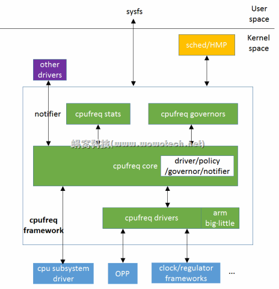

---
hide:
- navigation
- toc
---

# CPU Performance Scaling

## はじめに

本資料は [CPU Performance Scaling](https://www.kernel.org/doc/html/latest/admin-guide/pm/cpufreq.html) を要約し、補足を入れたものである。`intel_pstate` に関する情報は省略している。

## The Concept of CPU Performance Scaling

最近のプロセッサの大半は、CPUを異なる周波数/電圧構成間で切り替えたり、異なるP-stateにしたりできるハードウェアインタフェースがある。このインタフェースは通常、CPUをどのP-stateにするかを決定するために、必要なCPU能力を推定するアルゴリズムとともに使用される。システムの利用率は一般に時間とともに変化するため、これは定期的に繰り返し実行されなければならない。これを実現する活動は、CPUパフォーマンススケーリングまたはCPU周波数スケーリングと呼ばれる。

## CPU Performance Scaling in Linux

{ width="30%" }
 (引用：[linux cpufreq framework(1)_概述](https://www.google.com/url?sa=i&url=http%3A%2F%2Fwww.wowotech.net%2Fpm_subsystem%2Fcpufreq_overview.html&psig=AOvVaw2F_88QpKQobZZbLFOliaVL&ust=1710277140631000&source=images&cd=vfe&opi=89978449&ved=0CBUQjhxqFwoTCLD65P2M7YQDFQAAAAAdAAAAABAD))

Linuxカーネルは、CPUFreq core、scaling governor、scaling driverの3層のコードで構成されるCPUFreq (CPU Frequency scaling) サブシステムによって、CPUパフォーマンスのスケーリングをサポートしている。

- **CPUFreq core**：CPUパフォーマンススケーリングをサポートする全てのプラットフォームに対して、共通のコードインフラストラクチャとユーザ空間インタフェースを提供する。CPUFreq coreは、他のコンポーネントが動作するための基本的なフレームワークを定義する。

- **scaling governor**：必要なCPU能力を見積もるアルゴリズムを実装する。原則として、各governorは1つのスケーリングアルゴリズムを実装する。

- **scaling driver**：ハードウェアと通信する。scaling driverは、利用可能なP-stateに関する情報をscaling governorに提供し、プラットフォーム固有のハードウェアインタフェースにアクセスして、scaling governorの要求に応じてCPUのP-stateを変更する。

## CPUFreq Policy Objects

```mermaid
graph TB
    A[[CPUFreq core]] -- pointer --> B[cpufreq_policy]
    A -- pointer --> C[cpufreq_policy]
    A -- pointer --> D[cpufreq_policy]
    B --> E[cpu0]
    C --> F[cpu1]
    C --> G[cpu2]
    D --> H[cpu3]
```

P-state制御用のハードウェアインタフェースは複数のCPUで共有される可能性がある。例えば、同じレジスタが複数のCPUのP-stateを同時に制御するために使用される場合である。ハードウェアのP-state制御インタフェースを共有するCPUのセットは、 struct `cpufreq_policy` オブジェクトとして表現される。一貫性を保つため、指定されたセット内にCPUが1つしかない場合にも `cpufreq_policy` が使用される。

CPUFreq coreは、現在オフラインになっているCPUを含め、システム内の全てのCPUに対して `cpufreq_policy` オブジェクトへのポインタを保持する。複数のCPUが同じハードウェアP-state制御インタフェースを共有している場合、それらに対応する全てのポインタは同じ `cpufreq_policy` オブジェクトを指す。

CPUFreqは `cpufreq_policy` を基本データ型として使用し、ユーザ空間インタフェースの設計はポリシーの概念に基づいている。

## CPU Initialization

!!! note
    以下では、明示的に別段の記載がない限り、"CPU "は常に "論理CPU "を意味し、"プロセッサ "という単語は、複数の論理CPUを含む可能性のある物理的な部分を指すために使用される

```mermaid
flowchart LR
    A[CPUがready] --> B[CPUFreq core<br/>呼び出し]
    B --> IF1{cpufreq_policyポインタ<br/>が設定されている?}
    IF1 -->|Yes| D
    IF1 -->|No| C[cpufreq_policyオブジェクトの<br/>作成 & 設定] --> D
    D["driver->init(*cpufreq_policy)"]
    D --> E["governor->init(*cpufreq_policy)"]
    E --> F["governor->start()"]
```

CPUFreqが動作するためには、scaling driverが登録されていなければならない。CPUがreadyになるとscaling driverを登録するためにCPUFreq coreが呼び出される。
CPUFreq coreが呼び出されると、与えられたCPUに対してポリシーポインタがすでに設定されているかどうかをチェックし、もしそうであれば、ポリシーオブジェクトの作成をスキップする。
そうでなければ、新しいポリシーオブジェクトが作成され、初期化される。
この時、同時にsysfsに新しいポリシーディレクトリが作成される。
与えられたCPUに対応するポリシーポインタは、メモリ内の新しいポリシーオブジェクトのアドレスに設定される。

次に、scaling driverの `init()` コールバックが、引数として渡された新しいCPUのポリシーポインタとともに呼び出される。このコールバックは、指定されたCPUのパフォーマンススケーリングハードウェアインタフェースを初期化し、呼び出されたポリシーオブジェクトが新しい場合、ハードウェアによってサポートされる最小および最大周波数、利用可能な周波数のテーブル、および同じポリシーに属すCPUのマスクなどのパラメータが設定される。

その後、ポリシーオブジェクトのポインタがgovernorの `init()` コールバックに渡され、与えられたポリシーを処理するために必要な全てのデータ構造が初期化される。governorは `start()` コールバックを呼び出すことで開始される。`start()` コールバックは与えられたポリシーに属す全てのオンラインCPUのCPU毎の利用率更新コールバックをCPUスケジューラに登録する。

利用率更新コールバックは、タスクのenqueue/dequeueのような重要なイベント時や、scheduler tickの各反復時、CPUの使用状況が変わる可能性がある時などに、スケジューラによって呼び出される。
利用率更新コールバックは、ポリシーに基づいてP-stateを決定するために必要な計算を行い、ハードウェアに変更を加えるようscaling driverを呼び出す。

<!-- 同様の手順が、新しいポリシーオブジェクトではなく、以前に「非アクティブ」であったポリシーオブジェクト、つまり、それらに属す全ての CPU がオフラインであったポリシーオブジェクトに対しても取られる。この場合の唯一の実際的な違いは、CPUFreq coreがデフォルトのgovernorではなく、「非アクティブ」になった (そして現在再初期化されている)ポリシーで以前使用されていたscaling governorを使用しようとすることである。

一方、以前オフラインだった CPU をオンラインに戻すが、その CPU とポリシーオブジェクトを共有する他の CPU がすでにオンラインになっている場合、ポリシーオブジェクトを再初期化する必要はまったくない。その場合、scaling governorを再起動して、新しいオンライン CPU を考慮できるようにするだけでよい。これは、governorの->stop と->start() コールバックを、ポリシー全体に対してこの順序で呼び出すことによって達成される。

CPUの初期化中に作成されたポリシーオブジェクトと、それに関連するその他のデータ構造は、scaling driverが登録解除されたとき (例えば、それを含むカーネルモジュールがアンロードされたときに起こる)、または与えられたポリシーに属す最後のCPUが登録解除されたときに破棄される。 -->

## Policy Interface in sysfs

{width="30%"} {width="50%"}

カーネルの初期化中に、CPUFreq coreは `sys/devices/system/cpu/` の下に `cpufreq` ディレクトリを作成する。そのディレクトリには、CPUFreqコアによって管理されている各ポリシーオブジェクトに対する `policyX` サブディレクトリが含まれている。各 `policyX` ディレクトリは、 `/sys/devices/system/cpu/cpuY/` 内のポリシーに紐づくCPUからcpufreqシンボリックリンクによって指されている。

各 `policyX` ディレクトリは、それぞれ対応するポリシーオブジェクトのCPUFreq動作を制御するためのポリシースペシフィックな属性 (ファイル) を含んでいる。
以下の表はそれらの属性の概要を説明したものである：

|          Attributes           | Descriptions                                                                                                                                       |
| :---------------------------: | :------------------------------------------------------------------------------------------------------------------------------------------------- |
|        `affected_cpus`        | このポリシーに属すオンラインCPUのリスト                                                                                                            |
|         `bios_limit`          | BIOSがOSにCPU周波数に上限を適用するように指示した場合、その上限が格納される                                                                        |
|      `cpuinfo_cur_freq`       | このポリシーに属すCPUの現在の動作周波数 [$\mathrm{kHz}$]                                                                                           |
|      `cpuinfo_max_freq`       | このポリシーに属すCPUの最大動作周波数 [$\mathrm{kHz}$]                                                                                             |
|      `cpuinfo_min_freq`       | このポリシーに属すCPUの最小動作周波数 [$\mathrm{kHz}$]                                                                                             |
| `cpuinfo_transition_latency`  | このポリシーに属すCPUをあるP-stateから別のP-stateに切り替えるのにかかる時間 [ns]                                                                   |
|        `related_cpus`         | このポリシーに属す全ての(オンライン&オフライン)CPUのリスト                                                                                         |
| `scaling_available_governors` | このポリシーにアタッチできるCPUFreq scaling governorのリスト                                                                                       |
|      `scaling_cur_freq`       | このポリシーに属す全てのCPUの現在の周波数 [$\mathrm{kHz}$]                                                                                         |
|       `scaling_driver`        | 現在使用中のscaling driver                                                                                                                         |
|      `scaling_governor`       | このポリシーに現在アタッチされているscaling governor。書き込み可能で、書き込むと、このポリシーに新しいscaling governorがアタッチされる             |
|      `scaling_max_freq`       | このポリシーに属すCPUの最大動作周波数 [$\mathrm{kHz}$]。書き込み可能で、書き込むと、新しい上限が設定される                                         |
|      `scaling_min_freq`       | このポリシーに属すCPUの最小動作周波数 [$\mathrm{kHz}$]。書き込み可能で、書き込むと、新しい下限が設定される                                         |
|      `scaling_setspeed`       | この属性は、`userspace` scaling governorがこのポリシーにアタッチされている場合にのみ機能する。書き込み可能で、書き込むと、新しい周波数が設定される |

## Generic Scaling Governors

CPUFreqは、全てのscaling driverで使用できる汎用scaling governorを提供する。scaling governorはポリシーオブジェクトにアタッチされ、異なるポリシーオブジェクトを異なるscaling governorで同時に処理できる。ポリシーオブジェクトのscaling governorは、sysfs の `scaling_governor` 属性によっていつでも変更できる。

governorによっては、実装されているスケーリングアルゴリズムを制御したり、微調整したりするために sysfs 属性を公開しているものがある。governorチューナブルと呼ばれるこれらの属性は、使用するscaling driverによって、グローバルまたはポリシーごとに設定できる。ドライバがgovernorチューナブルをポリシー単位で必要とする場合、governorチューナブルは各ポリシーディレクトリのサブディレクトリに配置される。そうでない場合は、`/sys/devices/system/cpu/cpufreq/` 以下のサブディレクトリに配置される。いずれの場合も、governorチューナブルを含むサブディレクトリの名前は、それらを提供するgovernorの名前である。
以下では各汎用scaling governorの詳細を説明する。

### performance

ポリシーオブジェクトにアタッチされると、このgovernorは、そのポリシーの `scaling_max_freq` 属性の制限内で、最も高い周波数を要求する。
このリクエストは、 `scaling_max_freq` または `scaling_min_freq` ポリシーのリミットが変更される度に行われる。

### powersave

ポリシーオブジェクトにアタッチされると、このgovernorは、そのポリシーに対して、 `scaling_min_freq` ポリシー制限内の最低周波数を要求する。
このリクエストは、 `scaling_max_freq` または `scaling_min_freq` ポリシーのリミットが変更される度に行われる。

### userspace

このgovernorはそれ自身では何もしない。その代わり、ユーザがポリシーの `scaling_setspeed` 属性に書き込むことで、アタッチされているポリシーの CPU 周波数を設定できるようにする。

### schedutil

このgovernorは、CPUスケジューラから利用可能なCPU利用率データを使用する。一般にCPUスケジューラの一部とみなされるため、スケジューラの内部データ構造に直接アクセスできる。これは完全にスケジューラコンテキストで実行される。特定のCPUに対するこのgovernorの動作は、そのCPUの利用率更新コールバックを呼び出すスケジューリングクラスに依存する。

- **RTスケジューリングクラス or デッドラインスケジューリングクラス**： governorは、許容される最大値 (scaling_max_freq) まで周波数を増やす。
- **CFSスケジューリングクラス**： governorはCPU利用率の推定値として、指定されたCPUのルート制御グループの [PELT (Per-Entity Load Tracking) メトリック](https://markdown-share.pages.dev/linux_kernel/pelt/pelt/) を使用する。次に、適用する新しいCPU周波数が、以下の式に従って計算される。

    \[
    \mathrm{f}=1.25 \times \mathrm{f}_{0} \times \frac{\text { util }}{\max}
    \]

    ここで、utilはPELT数、 $\max$ はutilの理論上の最大値、 $\mathrm{f}_{0}$ は与えられたポリシーで可能なCPU周波数の最大値 (PELT数が周波数に依存しない場合)、または現在のCPU周波数 (そうでない場合)のいずれかである。

このgovernorはまた、「IO-wait boosting」と呼ばれる、直近でI/O待ちをしていたタスクのCPU周波数を一時的に引き上げるメカニズムも採用している。これは、SCHED_CPUFREQ_IOWAITフラグがスケジューラからgovernorコールバックに渡されたときに発生するもので、このフラグによって、周波数がすぐに許容最大値まで上がり、その後、時間の経過とともに上記の式で返される値に引き戻される。

このgovernorは、1つのチューナブルだけを公開する：

!!! quote "rate_limit_us"
    governor計算の2つの連続した実行の間に経過しなければならない最小時間 (マイクロ秒単位) (デフォルト：scaling driverの遷移レイテンシの1000倍)。このチューナブルにより、governorのスケジューラコンテキストオーバーヘッドを調整できる。

このgovernorは、一般に、旧来の `ondemand` governorや `conservative` governorに取って代わると考えられている。なぜなら、このgovernorは、よりシンプルでCPUスケジューラと緊密に統合されており、CPUコンテキストスイッチなどのオーバーヘッドが少なく、スケジューラ独自のCPU利用率メトリックを使用するため、原則的に、このgovernorの決定が、スケジューラの他の部分の決定と矛盾することはないからである。

!!! note
    上記理由により、本ドキュメントでは、`ondemand` 及び `conservative` governorの説明を省略する。

## Frequency Boost Support

### Background

プロセッサの中には、チップ全体が十分に利用されておらず、意図した熱や電力のバジェットを下回っている場合など、特定の条件下で、一部のコアの動作周波数を一時的に引き上げるメカニズムをサポートしているものがある。

この機能は、ベンダーによって異なる名称が使われている。インテルプロセッサでは「ターボブースト」、AMDでは「ターボコア」または「コアパフォーマンスブースト」と呼ばれている。また、ベンダーによって実装方法も異なる。ここでは簡潔に「周波数ブースト」という用語を使用する。

周波数ブーストメカニズムには、ハードウェアベースとソフトウェアベースがある。ハードウェアベース (x86など) の場合、ブーストをトリガするかどうかの判断はハードウェアが行う。ソフトウェアベース (ARMなど) の場合は、scaling driverが周波数ブーストをトリガするかどうかとそのタイミングを決定する。

### The boost File in sysfs

このファイルは `/sys/devices/system/cpu/cpufreq/boost` にあり、システム全体の周波数ブースト設定を制御する。基礎となるscaling driverが周波数ブーストメカニズムをサポートしていない、
またはサポートしているが、intel_pstateのような周波数ブーストを制御するためのドライバ固有のインタフェースを提供している場合は、このファイルは存在しない。このファイルに書き込める値は `0` と `1` だけである。

- `1` の場合：周波数ブーストメカニズムが有効になる。これは、ハードウェアがブーストをトリガできる状態 (ハードウェアベースの場合) になるか、ソフトウェアがブーストをトリガできる状態 (ソフトウェアベースの場合) になることを意味する。
- `0` の場合：周波数ブーストメカニズムは無効となり、まったく使用できない。
