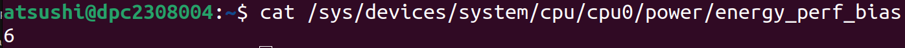

---
hide:
- navigation
- toc
---

# Power Management in Linux Kernel

## はじめに

本資料は、Linux kernelにおけるPower Managementを説明する。出典は全て[公式ドキュメント](https://www.kernel.org/doc/html/latest/admin-guide/pm/index.html)である。本資料の一番の目的はAwkernelのDVFS実装の参考にすることであるため、CPUの周波数調整に調査範囲を限定し、コードレベルまで詳細に調査はしない。

---

## [Power Management Strategies](https://www.kernel.org/doc/html/v6.6/admin-guide/pm/strategies.html)

Linuxカーネルは、以下2つの主要な高レベル電力管理戦略をサポートしている。

- **System-Wide Power Management**: ユーザ空間のコードが実行できず、システム全体の活動が大幅に低下する、システム全体のグローバルな低電力状態を使用する電力管理戦略

- **Working-State Power Management**: Working-Stateにおいて、必要に応じてシステムの個々のハードウェアコンポーネントの電力状態を調整する電力管理戦略

2つの電源管理戦略は、シナリオによって使い分けるべきである。すなわち、ユーザが、ラップトップの蓋を閉めるなどした場合、System-Wide Power Managementを使用するべきである。一方、ユーザがノートパソコンのキーボードから離れるだけであれば、Working-State Power Managementを使用すべきである。

!!! note
    本資料では[System-Wide Power Management](https://www.kernel.org/doc/html/latest/admin-guide/pm/system-wide.html)の説明は省略する。以降の説明は全てWorking-State Power Managementのものである。

??? quote "調査範囲外のため省略した情報"
    - [intel_idle CPU Idle Time Management Driver](https://www.kernel.org/doc/html/latest/admin-guide/pm/intel_idle.html)
    - [intel_pstate CPU Performance Scaling Driver](https://www.kernel.org/doc/html/latest/admin-guide/pm/intel_pstate.html)
    - [amd-pstate CPU Performance Scaling Driver](https://www.kernel.org/doc/html/latest/admin-guide/pm/amd-pstate.html)
    - [Legacy Documentation of CPU Performance Scaling Drivers](https://www.kernel.org/doc/html/latest/admin-guide/pm/cpufreq_drivers.html)
    - [Intel Uncore Frequency Scaling](https://www.kernel.org/doc/html/latest/admin-guide/pm/intel_uncore_frequency_scaling.html)
    - [Intel(R) Speed Select Technology User Guide](https://www.kernel.org/doc/html/latest/admin-guide/pm/intel-speed-select.html)

---

## [CPU Performance Scaling](https://www.kernel.org/doc/html/latest/admin-guide/pm/cpufreq.html)

[> CPU Performance Scaling](CPU_Performance_Scaling/CPU_Performance_Scaling.md)

---

## [CPU Idle Time Management](https://www.kernel.org/doc/html/latest/admin-guide/pm/cpuidle.html)

[> CPU Idle Time Management](CPU_Idle_Time_Management/CPU_Idle_Time_Management.md)

---

## [Intel Performance and Energy Bias Hint](https://www.kernel.org/doc/html/latest/admin-guide/pm/intel_epb.html)

!!! note
    EBSとP-state調整の違いはよく分かっていない。ChatGPTに聞いたところ、EBSによる調整は、プロセッサがどのようにP-stateを選択するかの傾向を調整することに相当するらしい。

Performance and Energy Bias Hint (EPB) は、プロセッサに存在する電力と性能のトレードオフに関して、ソフトウェアが優先度を指定できるようにするものである。EPBはユーザ空間によって (sysfs経由で直接的、またはx86_energy_perf_policyツールによって間接的に) 設定される。各論理CPUのEPB値は、 `sys/devices/system/cpu/cpu<N>/power/energy_perf_bias` を通じて確認または更新できる：

{width="50%"}

このファイルにはCPUの現在のEPB値が 0-15 のスケールで表示される。更新する際は、0-15の数値、または以下の文字列のいずれかを書き込める：

- performance
- balance-performance
- normal
- balance-power
- power
