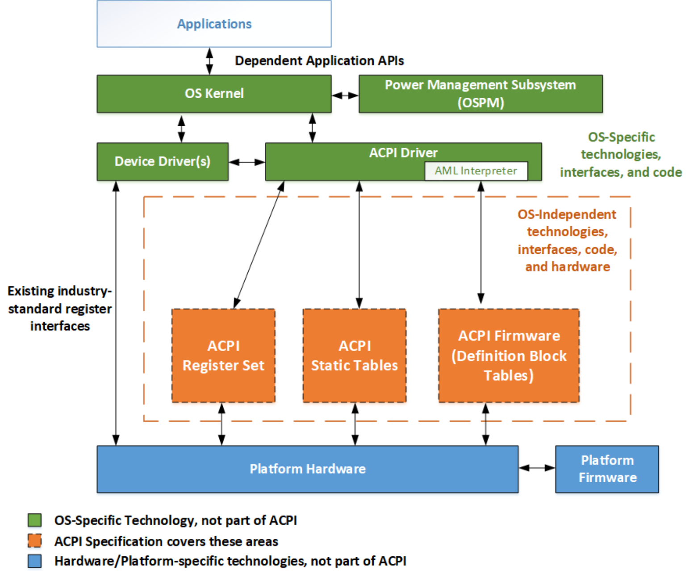

---
hide:
- navigation
- toc
---

# Introduction [[参考](https://uefi.org/specs/ACPI/6.5/01_Introduction.html)]

本書では、ACPI ハードウェアインタフェース、ACPI ソフトウェアインタフェース、および ACPI データ構造について説明する。この ACPI ソフトウェアインタフェースを実装することで、堅牢な OS 指向コンフィギュレーションおよび電源管理 (OSPM)のサポートが可能になる。

## 1.1. Principal Goals

ACPI は OSPM を実装する上で重要な要素である。ACPI 定義インタフェースは、ハードウェアおよびソフトウェアベンダーが ACPI 互換 (ひいては OSPM 互換)の実装を構築することを奨励するため、広く採用されることを意図している。

ACPIとOSPMの主な目標は以下の通りである：

- 全てのコンピュータシステムが、適切なコスト/機能のトレードオフを使用して、マザーボード構成と電源管理機能を実装できるようにする：
  - コンピュータシステムには、デスクトップ、モバイル、ワークステーション、サーバマシンが含まれる (ただし、これらに限定されない)。
  - マシンの実装者は、OSの完全サポートを維持しながら、非常にシンプルなものから非常にアグレッシブなものまで、幅広いソリューションを実装する自由がある。
  - パワーマネージメントが広く実装されることで、アプリケーションはパワーマネージメントをサポートし、活用することが実用的で説得力のあるものとなる。それは、PCの新しい用途を実用的なものにし、PCの既存の用途をより経済的なものにする。
- 電源管理機能と堅牢性を強化する：
  - プラットフォームのファームウェアに実装するには複雑すぎる電源管理ポリシーを、OSに実装してサポートできるため、安価な電源管理ハードウェアで非常に精巧な電源管理ポリシーをサポートできる。
  - ユーザ、アプリケーション、ハードウェアからの電力管理情報をOSに集めることで、より良い電力管理の決定と実行が可能になる。
  - OSにおける電源管理アルゴリズムの統一は、ファームウェアとOS間のコンフリクトを減らし、信頼性を高める。
- 電力管理の業界全体への導入を促進し、加速する：
  - OSPMとACPIは、電力管理に対する産業全体の冗長な投資を減少させる。なぜなら、この投資と機能はOSに集約されるからである。これにより、産業参加者は単なる平等を追求するよりも、努力と投資をイノベーションに集中させることができるようになる。
  - OSはハードウェアから独立して進化できるため、全てのACPI対応マシンがOSの改良と革新の恩恵を受けることができる。
- マザーボードデバイスを設定するための堅牢なインタフェースを作成する：
  - 既存のインタフェースでは不可能な、新しい高度な設計を可能にする。

## 1.2. Power Management Rationale

上記の主な目標を達成するためには、電源管理をOSに移し、OSとハードウェアの間に抽象的なインタフェース (ACPI)を使用する必要がある。ACPIは抽象的であるため、OSはハードウェアとは別に進化することができ、同様にハードウェアもOSとは別に進化できる。ACPIは、その性質上、OSやプロセッサ間でよりポータブルである。ACPIの制御方法は、特定の機能を非常に柔軟に実装することを可能にする。

旧来の電源管理アプローチの問題点には、以下のようなものがある：

- パワーマネージメントのサポートは最小限であるため、アプリケーションベンダーはパワーマネージメントをサポートしたり、利用したりすることができない。
  - パワーマネージメント機能をOSに組み込むことで、OSがインストールされている全てのマシンで利用できるようになる。機能のレベル (節電など)はマシンによって異なるが、ユーザとアプリケーションは、全てのOSPMマシンで同じ電源インタフェースとセマンティクスを見ることができる。
  - これにより、アプリケーションベンダーは、自社製品に電力管理機能を追加するための投資を行うことができるようになる。
- レガシーパワーマネジメントアルゴリズムは、それを実装するプラットフォームファームウェアが利用可能な情報によって制限されていた。そのため、実装できる機能が制限されていた。
  - ユーザ、アプリケーション、ハードウェアからの電力管理情報と指令をOSに集中させることで、より強力な機能の実装が可能になる。例えば、OSはI/O操作を通常とレイテンシに分けるポリシーを持つことができる。レイテンシI/O操作 (ワープロがバックグラウンドでファイルを保存するような操作)は、塊に集められ、必要なI/Oデバイスが何らかの理由でパワーアップしたときにのみ実行される。必要なデバイスがパワーダウンしているときに行われた非レイジーI/Oリクエストは、デバイスを直ちにパワーアップさせ、非レイジーI/Oリクエストを実行し、保留中のレイジーI/O操作を実行させる。このようなポリシーには、I/Oデバイスがいつパワーアップするかを知ること、どのアプリケーションI/O要求がレイテンシしているかを知ること、そしてそのようなレイテンシI/O操作が飢餓状態にならないことを保証できることが必要である。
- 留守番電話などのアプライアンス機能は、グローバルに首尾一貫した電力決定を必要とする。例えば、電話応答アプリケーションはOSを呼び出し、"電話の着信を待っている。システムがどのようなスリープ状態になっても、1秒以内にスリープを解除して電話に応答できなければならない。"と主張できる。その後、ユーザが「オフ」ボタンを押すと、システムは電話応対サービスのニーズに合致した最も深いスリープ状態を選ぶだろう。
  - プラットフォームファームウェアは、パワーマネジメントを扱うために非常に複雑になっている。OSと連動させるのは難しく、ハードウェアの静的コンフィギュレーションに限られている。
  - プラットフォームファームウェアが保持管理する状態情報は、 (OSが管理するため)はるかに少ない。
  - 電源管理アルゴリズムはOSに統一され、OSとハードウェア間の統合がより向上した。
  - モバイルシステムがドッキングしたときなど、追加のACPIテーブル (定義ブロック)をロードできるため、OSは動的なマシン構成に対応できる。
  - プラットフォームファームウェアは機能が少なく、シンプルであるため、実装とサポートがはるかに簡単 (したがって安価)である。

## 1.6. ACPI Specification and the Structure of ACPI

本仕様書は、ACPI ハードウェアインタフェース、ACPI ソフトウェアインタフェース、および ACPI データ構造を定義する。また、これらのインタフェースのセマンティクスも定義する。

以下の図 1.1 は、OSPM/ACPI のソフトウェアとハードウェアのコンポーネントと、それらの相互関係を示したものである。この仕様は、コンポーネント間のインタフェース、ACPI システム記述テーブルの内容、および他の ACPI コンポーネントの関連するセマンティクスを記述している。特定のプラットフォームのハードウェアを記述する ACPI システム記述テーブルが ACPI 実装の中心であり、ACPI システムファームウェアの役割は、主に ACPI テーブルを提供することである。

{width="50%"}

ACPIはソフトウェア仕様ではなく、ハードウェア仕様でもない。ACPIは、ソフトウェアとハードウェアの両方に対応し、それらがどのように動作しなければならないかを規定しているが、その代わりに、ソフトウェアとハードウェアの両方の要素で構成されるインタフェース仕様である。

ACPIには3つのランタイムコンポーネントがある：

### ACPI System Description Tables

ハードウェアへのインタフェースを記述する。一部の記述は、構築できるものを制限している (例えば、一部の制御は固定レジスタブロックに組み込まれており、テーブルはレジスタブロックのアドレスを指定する)。ほとんどの記述では、ハードウェアを任意の方法で構築でき、ハードウェアを機能させるために必要な任意の操作シーケンスを記述できる。定義ブロック」を含むACPIテーブルでは、疑似コードタイプの言語を使用することができ、その解釈はOSによって実行される。すなわち、OSPMは、擬似コード言語でエンコードされ、"Definition Blocks "を含むACPIテーブルに格納されたプロシージャを実行するインタプリタを含み、使用する。擬似コード言語は、ACPIマシンランゲージ (AML)として知られ、コンパクトでトークン化された抽象的なタイプのマシンランゲージである。

### ACPI Registers

ハードウェアインタフェースの制約部分で、ACPIシステム記述テーブルによって (少なくとも位置的には)記述される。

### ACPI Platform Firmware

ACPI 仕様と互換性のあるファームウェアの部分を指す。通常、これは (レガシーBIOSが行ってきたように)マシンを起動し、スリープ、ウェイク、および一部の再起動操作のためのインタフェースを実装するコードである。レガシーBIOSと比較して、ACPIが呼び出されることはほとんどない。ACPI記述テーブルもACPIプラットフォームファームウェアによって提供される。

## 1.7. OS and Platform Compliance

ACPI 仕様はインタフェース仕様のみを含んでいる。ACPI には、プラットフォームのコンプライアンス要件は含まれていない。以下のセクションでは、ACPIで定義されたインタフェースを参照するクラス固有のプラットフォーム実装のガイドラインと、OSがOSPM/ACPIを完全にサポートするために必要となる機能拡張のガイドラインを示す。ACPI互換OSの最小機能実装要件も示す。

### 1.7.1. Platform Implementations of ACPI-defined Interfaces

システムプラットフォームは、プラットフォームハードウェアを介して ACPI 定義ハードウェアインタフェースを実装し、ACPI システムファームウェアを介して ACPI 定義ソフトウェアインタフェースとシステム記述テーブルを実装する。特定の ACPI 定義インタフェースと OSPM コンセプトは、あるクラスのマシン (モバイルシステムなど)には適しているが、別のクラスのマシン (マルチドメインエンタープライズサーバなど)には適していない場合がある。全てのプラットフォームクラスと、プラットフォームクラスに必要とされる適切なACPI定義インタフェースを指定することは、この仕様の能力と範囲を超えている。

プラットフォーム設計ガイドの作成者は、特定の設計ガイドで扱う特定のシステムプラットフォームクラスに適した、適切なACPI定義インタフェースとハードウェア要件を要求することが推奨される。プラットフォーム設計ガイドは、ACPI仕様で定義されているものと同様の機能を提供する代替インタフェースを定義すべきではない。

## 1.7.2. OSPM Implementations

ACPIで定義された機能、コンセプト、インタフェースを、OSが実行するシステムプラットフォームクラスに適した関連イベントモデルとともにサポートするためには、OSの機能拡張が必要である。これがOSPMの実装である。以下に、ACPIで定義された全てのインタフェースをサポートするために必要なOSの機能拡張と要素の概要を示す。OSPMの実装によってACPIをサポートするには、OSを以下のように変更する必要がある：

- システムアドレスマップインタフェースを使用する。
- ACPI System Description Tablesを見つけて消費する。
- ACPIマシン語 (AML)を解釈する。
- ACPI Namespaceに記述されているマザーボードデバイスを列挙し、設定する。
- 電源管理タイマとのインタフェース。
- リアルタイムの時計の目覚ましアラームとのインタフェース。
- ACPIモードに入る (レガシーハードウェアシステムの場合)。
- デバイスの電源管理ポリシーを実装する。
- 電力リソース管理を実施する。
- スケジューラアイドルハンドラにプロセッサパワーステートを実装する。
- プロセッサとデバイスのパフォーマンス状態を制御する。
- ACPI熱モデルを実装する。
- SCI割り込みの処理、固定イベントの管理、汎用イベント、組み込みコントローラ割り込み、ダイナミックデバイスサポートを含む、ACPIイベントプログラミングモデルをサポート。
- グローバルロックの獲得とリリースをサポート。
- システムをリセットするには、リセットレジスタを使用する。
- 電源管理ポリシーに影響を与えるAPIを提供する。
- ACPI定義デバイスのドライバサポートを実装する。
- システム指標をサポートするAPIを実装する。
- 全てのシステム状態S1～S5をサポート。

## 1.7.3. OS Requirements

以下のリストは、OSPM/ACPI互換OSの最小要件を説明したものである：

- インテルアーキテクチャ (IA)プラットフォームのシステムアドレスマップを取得するには、セクション15を使用する：
- INT 15H, E820H- システムアドレスマップ照会インタフェース (セクション15を参照)
- EFI GetMemoryMap() ブートサービス関数 (セクション15参照)
- ACPI System Description Tables(セクション5参照)を見つけ、消費する。
- 定義された全てのAML文法要素をサポートするAMLインタプリタの実装 (セクション20参照)。
- SCI割り込みの処理、固定イベントの管理、汎用イベント、組み込みコントローラ割り込み、ダイナミックデバイスのサポートを含む、ACPIイベントプログラミングモデルのサポート。
- ACPI Namespaceに記述されているマザーボードデバイスを列挙し、設定する。
- この仕様で定義されている以下の ACPI デバイスのサポートを実装する：
- 組み込みコントローラデバイス (セクション12を参照)
- GPEブロックデバイス (セクション9.9参照)
- ACPI 熱モデルの実装 (セクション 3.10 参照)。
- グローバルロックの獲得とリリースをサポート。
- OS 指向の電源管理サポート (デバイスドライバは、「付録 A：デバイスクラス仕様」に記載されているデバイス電源管理クラス仕様で説明されているデバイスコンテキストを維持する責任を負う)。

## 1.9. Document Organization

## 1.9.1. ACPI Introduction and Overview

仕様書の最初の3つのセクションは、ACPIの概要を説明している。

### Chapter 1：はじめに

仕様の目的とゴールについて説明し、ACPI互換システムアーキテクチャの概要を示し、ACPI互換システムの最小要件を規定し、関連仕様への参照を提供する。

### Chapter 2 用語の定義

本仕様書で使用される主要用語を定義する。特に、グローバルシステム状態 (メカニカルオフ、ソフトオフ、スリープ、動作中、および不揮発性スリープ)は、デバイスの電源状態の定義とともに本章で定義される：オフ (D3)、D3hot、D2、D1、およびフルオン (D0)。デバイスとプロセッサの性能状態 (P0、P1、...Pn)についても説明する。

### Chapter 3: ACPI Overview

システム電源管理、デバイス電源管理、プロセッサ電源管理、プラグアンドプレイ、システムイベントの処理、バッテリー管理、熱管理など、ACPI仕様がカバーする機能分野の概要を説明。

## 1.9.2. Programming Models

Chapter 4とChapter 5は、ACPIハードウェアとソフトウェアのプログラミングモデルを定義している。本仕様書のこの部分は、主にシステム設計者、開発者、プロジェクト管理者向けである。

この後に続く仕様の実装指向の章、リファレンス章、プラットフォーム例の章 (仕様の残りの章)は全て、Chapter 4とChapter 5で定義されたモデルに基づいている。これらの章は、ACPI仕様の中心である。この2つの章の間には、広範な相互参照がある。

### Chapter 4 ACPIハードウェア仕様

この仕様の目標を満たす一連のハードウェアインタフェースを定義する。

### Chapter 5 ACPIソフトウェアプログラミングモデル

この仕様の目標を満たす一連のソフトウェアインタフェースを定義する。

## 1.9.3. Implementation Details

仕様の第3部は、ACPI互換プラットフォーム上で動作するコンポーネントを実際に構築するために必要な実装の詳細を定義している。この部分は主に開発者向けの仕様である。

デバイスの設定やリソースの割り当て、リソースの共有に使用される予約済み Plug and Play オブジェクトと、デバイスの挿入と取り外しを追跡するために使用される予約済みオブジェクトを定義する。また、ACPI 互換のリソース記述子のフォーマットも定義する。

### Chapter 7：パワーとパフォーマンスマネジメント

予約されたデバイス電源管理オブジェクトと予約されたシステム電源管理オブジェクトを定義する。

### Chapter 8: Processor Configuration and Control

システムが動作状態にある間、OSがプロセッサの消費電力やその他の制御をどのように管理するかを定義する。

### Chapter 9: ACPI-Specific Device Objects

デバイス固有の ACPI コントロールのサポートが必要な統合デバイスを、提供可能なデバイス固有の ACPI コントロールとともにリストアップする。ほとんどのデバイスオブジェクトは、汎用オブジェクトと制御メソッドで制御され、汎用デバイス ID を持っている。

### Chapter 10: Power Source Devices

予約されたバッテリデバイスと AC アダプタオブジェクトを定義する。

### Chapter 11: Thermal Management

予約された熱管理オブジェクトを定義する。

### Chapter 12: ACPI Embedded Controller Interface Specification

ACPI互換OSと組み込みコントローラ間のインタフェースを定義する。

### Chapter 13: ACPI System Management Bus Interface Specification

ACPI互換OSとシステム管理バス (SMBus)ホストコントローラ間のインタフェースを定義する。

### Chapter 14 プラットフォーム通信チャネル

OSPMがプラットフォーム内のエンティティと通信するための一般的なメカニズムを説明し、新しいアドレス空間タイプを定義する。

### Chapter 15: System Address Map Interfaces

ISA/EISA/PCIバスベースのシステムで使用する特別なINT 15コールについて説明する。このコールは予約されているアドレス範囲とマザーボード上で利用可能なアドレス範囲を示すクリーンなメモリーマップを OS に提供する。UEFI ベースのメモリーアドレスマップ報告インタフェースについても説明する。

システムの動作状態とスリープ状態の遷移、およびウェイクイベントとの関係を詳細に定義する。6,7,8章で定義された予約オブジェクトを参照。

### Chapter 16: Waking and Sleeping

システムの動作状態とスリープ状態の遷移、およびウェイクイベントとの関係を詳細に定義する。第6章、第7章、第8章で定義された予約オブジェクトを参照。

### Chapter 17 非一様メモリアクセス (NUMA)アーキテクチャプラットフォーム

ACPI 定義インタフェースを使用して NUMA アーキテクチャプラットフォームを記述する方法について詳しく説明する。Chapter 5、Chapter 6、Chapter 8、およびChapter 9で定義された予約オブジェクトを参照している。

### Chapter 18 ACPIプラットフォームエラーインタフェース

プラットフォームベースのエラー検出ハードウェアによって検出される様々なタイプのハードウェアエラーイベントをOSPMが処理できるようにするためのインタフェースを定義する。

## 1.9.4. Technical Reference

仕様書の第4部には、開発者向けの参考資料が含まれている。

### Chapter 19 ACPIソース言語リファレンス

ACPI制御メソッドを記述するために使用できる全てのASL文の構文と、構文の使用例を定義する。

### Chapter 20 ACPIマシン言語仕様

ACPI仮想マシン言語の文法を定義する。ASL トランスレータ (コンパイラ)は AML を出力する。

### Chapter 21 ACPIデータテーブルとテーブル言語の定義

任意のACPIデータテーブルを生成するために使用できる簡単な言語 (テーブル定義言語、TDL)について説明する。

### 付録 A: デバイスクラス仕様

デバイスクラス毎のデバイス固有の電源管理動作を記述する。

### 付録B：ビデオエクステンション

ビデオデバイスクラス固有のACPIインタフェースを含む
